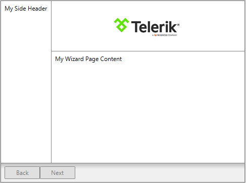

# Wizard Pages

In order to add pages to RadWizard, you have to use its __WizardPages__ collection. It consists of the following page types:
* __WizardPage__: Represents a wizard's page and by default it will have the __“Previous”, ”Next” and “Cancel”__ buttons visible. This behavior can be controlled through the __ButtonsVisibilityMode__ enumeration.
* __WelcomeWizardPage__: Represents a welcome page. It derives directly from __WizardPage__ and the only difference is that it will have the __“Next” and “Cancel”__ buttons visible by default. 
* __CompletionWizardPage__: Represents a completion page. It derives directly from __WizardPage__ and the only difference is that it will have the __“Previous”, “Cancel” and “Finish”__ buttons visible by default. 

For each wizard page you are able to define a header, title, side header and change the default footer by setting the following properties:
* __Header__ : Enables you to define anything as a header.
* __Title__ : Provides you a way to define a title for the page.
* __SideHeader__ : Enables you to define anything as a side header on the left side of the page. 
* __Content__ : Contains the page content (__WizardPage__ derives directly from __ContentControl__). 

> Despite that the __WizardPage__ is a __ContentControl__ it will propagate its DataContext to its child containers including the elements defined as a __Content__. Thus, the source of the binding has to be explicitly set if needed. 

## Setting __HeaderTemplate, SideHeaderTemplate__ and __FooterTemplate__ 

All these properties can be used to get or set the data template, respectfully, for the __header, side header__ and __footer__. So, if you want to change those default elements for a particular wizard page, you may define them as in __Example 1__.

__Example 1: Setting the HeaderTemplate, SideHeaderTemplate__ and __FooterTemplate  properties in XAML__
<snippet id='radwizard-features-pages-block_1-xaml' />

>In order to use the built-in commands, you should define the following namespace:
__xmlns:wizard="clr-namespace:Telerik.Windows.Controls.Wizard;assembly=Telerik.Windows.Controls.Navigation"__

__Figure 1:__ The wizard page defined in __Example 1__ will be displayed as follows:

## Preserve WizardPage Content

By default, __RadWizard__ reuses a single __ContentPresenter__ for holding the currently selected page. Each time the selection is changed, the content of the last active page is unloaded in order to load the content of the newly selected page, thus the content of the pages is not persisted. 

As of __Q3 2015 RadWizard__ exposes a new property - __IsContentPreserved__.  Its default value is __"False"__, meaning that the content of the selected pages would not be persisted. In order to save the content of each page, you need to set the property to __"True"__.

__Example 2: Setting IsContentPreserved property to "True"__
<snippet id='radwizard-features-pages-block_2-xaml' />

## See also

* [Navigation]()
* [Wizard Buttons]()
* [Commands]()

