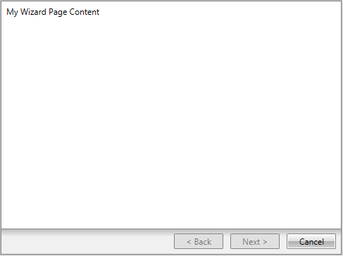

# Getting Started with {{ site.framework_name }} Wizard

This tutorial will walk you through the creation of a sample application that contains a __RadWizard__ control.

* [Adding Telerik Assemblies Using NuGet](#adding-telerik-assemblies-using-nuget)
* [Adding Assembly References Manually](#adding-assembly-references-manually)
* [Adding RadWizard to the Project](#adding-radwizard-to-the-project)
* [Adding pages to RadWizard](#adding-pages-to-radwizard)

## Adding Telerik Assemblies Using NuGet

To use __RadWizard__ when working with NuGet packages, install the `Telerik.Windows.Controls.Navigation.for.Wpf.Xaml` package. The [package name may vary]() slightly based on the Telerik dlls set - [Xaml or NoXaml]()

Read more about NuGet installation in the [Installing UI for WPF from NuGet Package]() article.

>tip With the 2025 Q1 release, the Telerik UI for WPF has a new licensing mechanism. You can learn more about it [here]().

## Adding Assembly References Manually

If you are not using NuGet packages, you can add a reference to the following assemblies:

* __Telerik.Licensing.Runtime__
* __Telerik.Windows.Controls__
* __Telerik.Windows.Controls.Navigation__  
* __Telerik.Windows.Data__  

You can find the required assemblies for each control from the suite in the [Controls Dependencies]()[Controls Dependencies]() help article.

## Adding RadWizard to the Project

You can add __RadWizard__ in XAML or in code. You can also add the control by dragging it from the [Toolbox]()[Toolbox](). 

__Example 1: Adding a RadWizard in XAML__
```XAML
	 <telerik:RadWizard x:Name="wizard" />
```

>In order to use __RadWizard__ you should define the following namespace:
__xmlns:telerik="http://schemas.telerik.com/2008/xaml/presentation"__

__Example 2: Adding a RadWizard in code__
```C#
	 RadWizard wizard = new RadWizard();
```
```VB.NET
	Private wizard As RadWizard = New RadWizard()
```
 
## Adding pages to RadWizard

 To add pages to __RadWizard__ you can use its __WizardPages__ collection, which consists of [__WizardPage__]() elements. Here is an example of defining a page in code and in xaml: 

__Example 3: Adding a WizardPage in XAML__
```XAML
	<telerik:RadWizard x:Name="radWizard" >
		<telerik:RadWizard.WizardPages>
			<telerik:WizardPage Content="My Wizard Page Content" />
		</telerik:RadWizard.WizardPages>			
	</telerik:RadWizard>
```

__Example 4: Adding WizardPages in code__
```C#
	 wizard.WizardPages.Add(new WizardPage() { Content = "My Wizard Page Content" });
```
```VB.NET
	 wizard.WizardPages.Add(New WizardPage() With {.Content ="My Wizard Page Content"})
```

#### __Figure 1: RadWizard with WizardPage__


>For more information on how to control the visualization of the buttons, check out the [Wizard Buttons]() article.

## Setting a Theme

The controls from our suite support different themes. You can see how to apply a theme different than the default one in the [Setting a Theme]() help article.

>important Changing the theme using implicit styles will affect all controls that have styles defined in the merged resource dictionaries. This is applicable only for the controls in the scope in which the resources are merged. 

To change the theme, you can follow the steps below:
* Choose between the themes and add reference to the corresponding theme assembly (ex: **Telerik.Windows.Themes.Windows8.dll**). You can see the different themes applied in the **Theming** examples from our [WPF Controls Examples](https://demos.telerik.com/wpf/)[Silverlight Controls Examples](https://demos.telerik.com/silverlight/#GridView/Theming) application.

* Merge the ResourceDictionaries with the namespace required for the controls that you are using from the theme assembly. For __RadWizard__, you will need to merge the following resources:

	* __Telerik.Windows.Controls__
	* __Telerik.Windows.Controls.Navigation__

__Example 5__ demonstrates how to merge the ResourceDictionaries so that they are applied globally for the entire application.

__Example 5: Merge the ResourceDictionaries__  
```XAML
		<Application.Resources>
			<ResourceDictionary>
				<ResourceDictionary.MergedDictionaries>
	                <ResourceDictionary Source="/Telerik.Windows.Themes.Windows8;component/Themes/System.Windows.xaml"/>
	                <ResourceDictionary Source="/Telerik.Windows.Themes.Windows8;component/Themes/Telerik.Windows.Controls.xaml"/>
	                <ResourceDictionary Source="/Telerik.Windows.Themes.Windows8;component/Themes/Telerik.Windows.Controls.Navigation.xaml"/>
				</ResourceDictionary.MergedDictionaries>
			</ResourceDictionary>
		</Application.Resources>
```

__Figure 2__ shows __RadWizard__ with the **Windows8** theme applied.
	
#### __Figure 2: RadWizard with the Windows8 theme__


## See also
* [Wizard Pages]()
* [Navigation]()
* [Commands]()


## Telerik UI for WPF Learning Resources

* [Telerik UI for WPF Wizard Component](https://www.telerik.com/products/wpf/wizard.aspx)
* [Getting Started with Telerik UI for WPF Components]()
* [Telerik UI for WPF Installation]()
* [Telerik UI for WPF and WinForms Integration]()
* [Telerik UI for WPF Visual Studio Templates]()
* [Setting a Theme with Telerik UI for WPF]()
* [Telerik UI for WPF Virtual Classroom (Training Courses for Registered Users)](https://learn.telerik.com/learn/course/external/view/elearning/16/telerik-ui-for-wpf) 
* [Telerik UI for WPF License Agreement](https://www.telerik.com/purchase/license-agreement/wpf-dlw-s)


