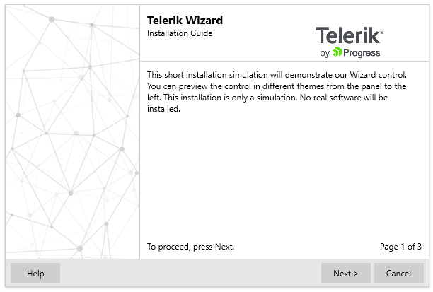

# Overview



__RadWizard__ control will help you differentiate a complex process into separate steps and provide your users with the ability to govern the process upon their decisions. It is useful for creating installation, registration and other types of wizards.

