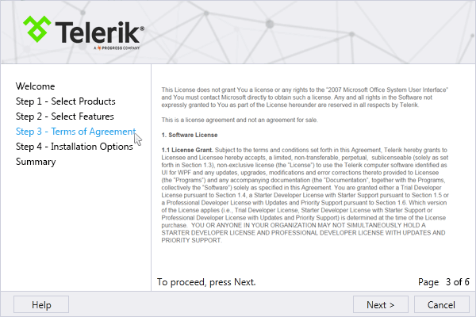

# Overview



__RadWizard__ control will help you differentiate a complex process into separate steps and provide your users with the ability to govern the process upon their decisions. It is useful for creating installation, registration and other types of wizards.

## Key Features

* __Navigation__: __RadWizard__ provides a built-in linear navigation, as well an API for implementing a conditional one. More information can be found in the [Navigation]() topic.

* __Buttons__: The control has built-in buttons: __Next, Previous, Cancel, Finish__ and __Help__. [This]() article covers the topic in details.

* __Pages__: The __WizardPages__ collection is exposed for manipulating the pages of the control. The [Wizard Pages]() topic provides more information regarding this functionality.

* __Commands__: The set of built-in commands is discussed [here]().

* __Localization__: localizing the control is illustrated in the [Localization]().

>tip Get started with the control with its [Getting Started]() help article that shows how to use it in a basic scenario.

> Check out the online demos at [demos.telerik.com](https://demos.telerik.com/silverlight/#Wizard/FirstLook)[demos.telerik.com](https://demos.telerik.com/wpf/)

## See Also

* [Visual Structure]()