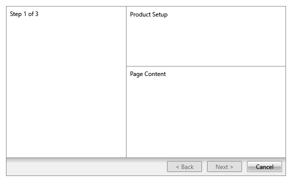

# Wizard Pages

In order to add pages to RadWizard, you have to use its __WizardPages__ collection. It consists of the following page types:
* __WizardPage__: Represents a wizard's page and by default it will have the __“Previous”, ”Next” and “Cancel”__ buttons visible. This behavior can be controlled through the __ButtonsVisibilityMode__ enumeration.
* __WelcomeWizardPage__: Represents a welcome page. It derives directly from __WizardPage__ and the only difference is that it will have the __“Next” and “Cancel”__ buttons visible by default. 
* __CompletionWizardPage__: Represents a completion page. It derives directly from __WizardPage__ and the only difference is that it will have the __“Previous”, “Cancel” and “Finish”__ buttons visible by default. 

For each wizard page you are able to define a header, title, side header and change the default footer by setting the following properties:
* __Header__ : Enables you to define anything as a header.
* __Title__ : Provides you a way to define a title for the page.
* __SideHeader__ : Enables you to define anything as a side header on the left side of the page. 
* __Content__ : Contains the page content (__WizardPage__ derives directly from __ContentControl__). 

> Despite that the __WizardPage__ is a __ContentControl__ it will propagate its DataContext to its child containers including the elements defined as a __Content__. Thus, the source of the binding has to be explicitly set if needed. 

## Setting __HeaderTemplate, SideHeaderTemplate__ and __FooterTemplate__ 

All these properties can be used to get or set the data template, respectfully, for the __header, side header__ and __footer__. So, if you want to change those default elements for a particular wizard page, you may define them as in the following example.

__Setting the HeaderTemplate, SideHeaderTemplate, and FooterTemplate Properties in XAML__
```XAML
	<telerik:RadWizard x:Name="radWizard" >
		<telerik:RadWizard.WizardPages>
			<telerik:WizardPage Content="My Wizard Page Content" SideHeaderWidth="100" HeaderHeight="100">					
				<telerik:WizardPage.HeaderTemplate>
					<DataTemplate>
						<Image Source="Images/BrandMark_Telerik_Black.png" Width="200" Height="100" />
					</DataTemplate>
				</telerik:WizardPage.HeaderTemplate>
				<telerik:WizardPage.SideHeaderTemplate>
					<DataTemplate>
						<TextBlock Text="My Side Header" />
					</DataTemplate>
				</telerik:WizardPage.SideHeaderTemplate>
				<telerik:WizardPage.FooterTemplate>
					<DataTemplate>
						<StackPanel Orientation="Horizontal">
							<telerik:RadButton Content="Back" 
												   Width="70" Height="25"
												   Command="wizard:RadWizardCommands.MoveCurrentToPrevious"  
												   CommandParameter="{Binding}" />
							<telerik:RadButton Content="Next" Width="70" Height="25"
												   Command="wizard:RadWizardCommands.MoveCurrentToNext" 
												   CommandParameter="{Binding}" />
						</StackPanel>
					</DataTemplate>
				</telerik:WizardPage.FooterTemplate>
			</telerik:WizardPage>				
		</telerik:RadWizard.WizardPages>			
	</telerik:RadWizard>
```

>In order to use the built-in commands, you should define the following namespace:
__xmlns:wizard="clr-namespace:Telerik.Windows.Controls.Wizard;assembly=Telerik.Windows.Controls.Navigation"__

__Wizard page with custom header, side header, and footer templates__


## Setting Header and Side Header Size

The __WizardPage__ exposes two size-related properties that control the header areas:

* __HeaderHeight__ - Sets the height of the top header area. The default value is __80__.
* __SideHeaderWidth__ - Sets the width of the left side header area. The default value is __190__.

> The visual effect of __HeaderHeight__ depends on the header area being visible. If both __IsHeaderVisible__ and __IsTitleVisible__ are `False`, the header container is collapsed.

> The visual effect of __SideHeaderWidth__ depends on __IsSideHeaderVisible__. If __IsSideHeaderVisible__ is `False`, the side header container is collapsed.

__Setting HeaderHeight and SideHeaderWidth in XAML__
```XAML
<telerik:RadWizard>
	<telerik:RadWizard.WizardPages>
		<telerik:WizardPage Content="Page Content"
							Header="Product Setup"
							SideHeader="Step 1 of 3"
							IsHeaderVisible="True"
							IsSideHeaderVisible="True"
							HeaderHeight="120"
							SideHeaderWidth="240" />
	</telerik:RadWizard.WizardPages>
</telerik:RadWizard>
```

The custom values enlarge the top header area and the left side header area for this page only.

__Changing HeaderHeight and SideHeaderWidth in Code-Behind__
```C#
WizardPage page = new WizardPage();
page.Header = "Summary";
page.SideHeader = "Review";
page.IsHeaderVisible = true;
page.IsSideHeaderVisible = true;

page.HeaderHeight = 100;
page.SideHeaderWidth = 220;
```

This approach is useful when you need to apply size changes dynamically based on runtime conditions.

__Wizard page with custom header and side header size__



## Preserve WizardPage Content

By default, __RadWizard__ reuses a single __ContentPresenter__ for holding the currently selected page. Each time the selection is changed, the content of the last active page is unloaded in order to load the content of the newly selected page, thus the content of the pages is not persisted. 

As of __Q3 2015 RadWizard__ exposes a new property - __IsContentPreserved__.  Its default value is __"False"__, meaning that the content of the selected pages would not be persisted. In order to save the content of each page, you need to set the property to __"True"__.

__Setting the IsContentPreserved Property to True__
```XAML
	<telerik:RadWizard x:Name="radWizard" IsContentPreserved="True">
	    <telerik:RadWizard.WizardPages>
	        <telerik:WizardPage Content="My First Wizard Page Content" />
	        <telerik:WizardPage Content="My Second Wizard Page Content" />
	    </telerik:RadWizard.WizardPages>
	</telerik:RadWizard>
```

## See also

* [Navigation]()
* [Wizard Buttons]()
* [Commands]()


