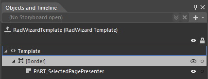
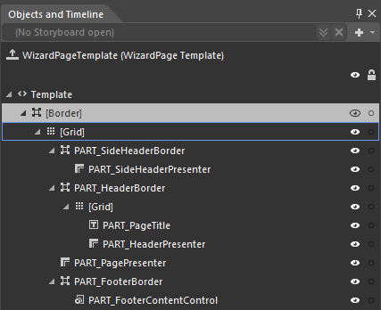

# Templates Structure #

Using [Implicit styles]() gives you the ability to easily extract and edit the default __ControlTemplates__ of the controls. You can follow [this]() documentation article on how to extract the __ControlTemplates__.

Like most WPF controls, __RadWizard__ also allows you to template it in order to change the control from the inside. Except for templating the whole control, you can also template particular parts of it. This topic will make you familiar with the template structures of:

* [RadWizard Template Structure](#radwizard)

* [RadWizardPage Template Structure](#radwizardpage)

## RadWizard ##

* __Border__ - represents the border and the background of RadWizard and is of type Border.

* __PART_SelectedPagePresenter__ - hosts the selected page and is of type ContentPresenter.

## RadWizardPage ##

* __Border__ - represents the border and the background of __WizardPage__ and is of type __Border__.

* __Grid__ - hosts the elements of the template and is of type __Grid__.

* __PART_SideHeaderBorder__ - represents the border of __WizardPage’s SideHeader__ and is of type 
__Border__.

* __PART_SideHeaderPresenter__ – displays the content of __WizardPage’s SideHeader__ and is of type 
__ContentPresenter__. 

* __PART_HeaderBorder__ - represents the border of __WizardPage’s Header__ and is of type __Border__.
* __Grid__ - hosts the elements of the header and is of type __Grid__.

* __PART_PageTitle__ – displays the title of a __WizardPage__ and is of type __TextBlock__.

* __PART_HeaderPresenter__ – displays the content of __WizardPage’s Header__ and is of type 
__ContentPresenter__. 

* __PART_PagePresenter__ – displays the content of a __WizardPage__ and is of type __ContentPresenter__. 

* __PART_FooterBorder__ - represents the border and the background of __WizardPage’s Footer__ and 
is of type __Border__.

* __PART_FooterContentControl__ - displays the footer of __WizardPage__ and is of type 
__ContentPresenter__. 

