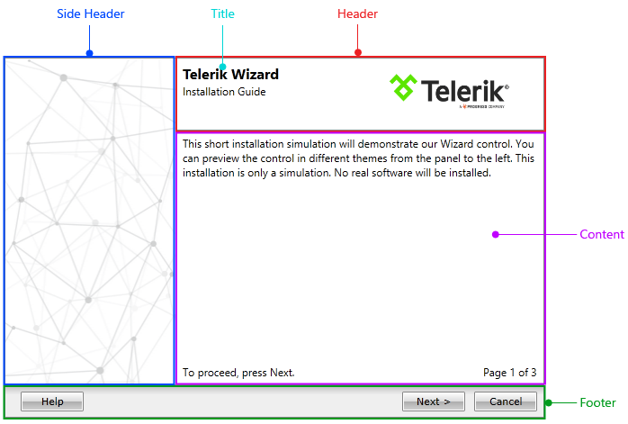

# Visual Structure

Below you can see the structure of a standard __WizardPage__ in a wizard control. 

The structure of a __WizardPage__ is pretty simple; it consists of five main elements:

* __Side Header__ – represents the left area of the page. Read More
* __Header__ – represents the top area of the page. Read More
* __Title__ – represents the title of the page in the top area. Read More
* __Content__ – represents the main content area of the page. Read More
* __Footer__ – represents the bottom area of the page, which is used to display all the buttons __Next__, __Previous__, __Finish__, etc. Read More
