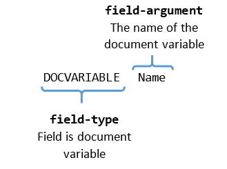

# Document Variables

Document variables provide a mechanism to store information in the document in a key-value format. The Document Variable field is a [field]() element used to access and display the value which corresponds to the given field-argument. The argument is the name of the variable.
      

## DocumentVariableCollection

[RadFlowDocument]() has a __DocumentVariableCollection__ property which holds document variable records. The collection maps string keys to string values. You can add a record in it through an indexer or with the collection's __Add()__ method. __Example 1__ demonstrates both approaches.
        

#### __[C#] Example 1: Add Document Variable Record__

{{region radwordsprocessing-concepts-document-variables_0}}
    RadFlowDocument document = new RadFlowDocument();
    document.DocumentVariables["Job"] = "Software Engineer";
    document.DocumentVariables.Add("Name", "Nancy Davolio");
{{endregion}}

The code in __Example 1__ adds two document variables – *"Name"*, which will be evaluated to *"Nancy Davolio"*, and *"Job"* with *"Software Engineer"* value.
        

The same two methods can be used to modify the value of an existing variable in the collection.
        

Removing defined variables can be achieved by using the __Remove()__ method of the variables collection. It accepts the name of the variable as a parameter.
        

#### __[C#] Example 2: Remove Document Variable Record__

{{region radwordsprocessing-concepts-document-variables_1}}
    document.DocumentVariables.Remove("Job");     
{{endregion}}

## Syntax

The syntax of a document variable field code is pretty simple as demonstrated on __Figure 1__.
        

Figure 1: Document Variable Field Code Syntax

## Inserting

A __DocumentVariable__ field can be inserted through [RadFlowDocumentEditor]()'s __InsertField()__ method. More information on fields is available in the [Fields]() article. __Example 3__ shows insertion of the field created in __Example 1__.
        

#### __[C#] Example 3: Insert Document Variable Field__

{{region radwordsprocessing-concepts-document-variables_2}}
    editor.InsertField("DOCVARIABLE Name", "Nancy Davolio");
{{endregion}}

# See Also

 * [Fields]()

 * [RadFlowDocument]()
