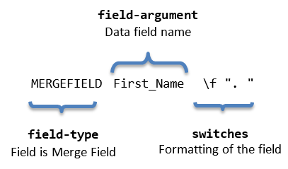

# Merge Field

Merge field is a [Field]() element containing a reference to a data field by its name. When a template document is mail merged with the values from a data source, the data field information replaces the merge field. More information on the mail merge feature is available in the respective article: [Mail Merge]().
      

## Syntax

The syntax of a merge field is demonstrated in __Figure 1__.
        

Figure 1: Merge Field Code Syntax

## Inserting

Inserting a merge field is easily achieved through the [RadFlowDocumentEditor]()'s __InsertField()__ method. It accepts code as first argument and result as second argument.
        

__Example 1__ demonstrates how you can insert a merge field.
        

#### __[C#] Example 1: Insert Merge Field__

{{region radwordsprocessing-concepts-merge-field_0}}
    RadFlowDocumentEditor editor = new RadFlowDocumentEditor(new RadFlowDocument());
    editor.InsertField("MERGEFIELD First_Name", "Nancy Davolio");
{{endregion}}

## Switches

Switches are a way for the code fragment to specify formatting for the result of the field. More information is available in the *Syntax and Switches* section of the [Fields]() article.
        

The possible switches for a merge field are:
        

* __\b "text":__ Specifies text which shall be inserted before the Merge Field in case the field is not blank.
            

* __\f "text":__ Specifies text which shall be inserted after the Merge Field in case the field is not blank.
            

__Example 2__ shows a possible use of merge field's switches.
        

#### __[C#] Example 2: Insert Merge Field With Switches__

{{region radwordsprocessing-concepts-merge-field_1}}
    editor.InsertField("MERGEFIELD First_Name \\b \"Mr. \" \\f \". \"", "");
{{endregion}}

# See Also

 * [Fields]()

 * [Mail Merge]()

 * [RadFlowDocumentEditor]()
