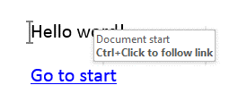

# Hyperlinks

__Hyperlinks__ are [Fields]() elements which point to a specific location. The location can be a web page or a bookmark inside the document.
      

## Hyperlink Properties

The __Hyperlink__ field exposes the following properties:
        

* __Uri__: Specifies the URI of the hyperlink.
            

* __IsAnchor__: Specifies whether the hyperlink points to a bookmark. The value is __true__ if the hyperlink is pointing to a bookmark inside the document. Default value is __false__.
            

* __ToolTip__: Specifies the hyperlink tooltip.
            

## Inserting a Hyperlink

The suggested way to insert hyperlink is by using [RadFlowDocumentEditor](). The __InsertHyperlink()__ method accepts the hyperlink text, URI, IsAnchor value and tooltip as parameters. Here is how to insert a hyperlink to *www.telerik.com*:
        

#### __C#__

{{region radwordsprocessing-concepts-hyperlinks_0}}
    editor.InsertHyperlink("telerik", "http://www.telerik.com", false, "Telerik site");
{{endregion}}

The result looks like this:

>tipThe  __InsertHyperlink()__ method also automatically applies the Hyperlink style to the result fragment of the inserted  field. More information about styles is available in the [Styles]() article.
          

Hyperlinks can also point to a [Bookmark]() inside the document. Here is how to create a document containing a bookmark and a hyperlink pointing to that bookmark:
        

#### __C#__

{{region radwordsprocessing-concepts-hyperlinks_1}}
    RadFlowDocumentEditor editor = new RadFlowDocumentEditor(new RadFlowDocument());

    // Insert bookmark.
    editor.InsertBookmark("DocumentStart");
    editor.InsertLine("Hello word!");

    // Insert hyperlink pointing to the bookmark.
    editor.InsertHyperlink("Go to start", "DocumentStart", true, "Document start");
{{endregion}}

The result of the above snippet can be found below.

  

# See Also

 * [Fields]()

 * [RadFlowDocumentEditor]()

 * [Bookmark]()
