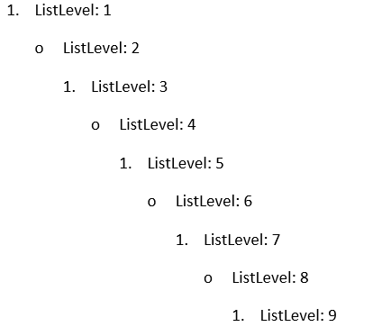

# Lists

A list represents a set of properties which are used to describe the appearance and behavior of a set of numbered paragraphs. All lists are stored in __ListCollection__ accessible through [RadFlowDocument]()'s __Lists__ property.
      

* [List Overview](#list-overview)

* [List Types](#list-types)

* [ListLevel Overview](#listlevel-overview)

* [List Templates](#list-templates)

* [Create a List](#create-a-list)

* [Apply List](#apply-list)

## List Overview

The class containing the structure corresponding to a list is __List__ and exposes the following properties:
        

* __StyleId__: A string property which specifies the [numbering style]() associated with the list.
            

* __Levels__: Represents a collection of [ListLevel](#listlevel-overview) objects. Every list can contain up to 9 levels.
            

* __MultilevelType__: The type of the list, described with the [MultilevelType](http://www.telerik.com/help/wpf/t_telerik_windows_documents_flow_model_lists_multileveltype.html) enumeration. It defines the behavior of the list.
            

## List Types

The type of the list type is used by an application to determine the user interface behavior for a list and in __RadWordsProcessing__'s model is represented by the __MultilevelType__ enumeration. The possible types are:
        

* __HybridMultilevel__: Specifies that the list can contain multiple levels, each from potentially different type – bullet, decimal, letter, etc. This is the default MultilevelType value.
            

* __Multilevel__: Specifies that the list can contain multiple levels, each of the same type.
            

* __SingleLevel__: Specifies that only level 1 of the list should be used, all other levels are ignored. When a list has MultilevelType.SingleLevel , you should apply the desired list level properties only on the first list level in the List's __Levels__ collection.
            

## ListLevel Overview

[ListLevel](http://www.telerik.com/help/wpf/t_telerik_windows_documents_flow_model_lists_listlevel.html) is the class containing the structure of the list levels. It describes a set of properties which specify the appearance and behavior of the associated numbered paragraph.
        

* __StartIndex__: Specifies the starting number of a ListLevel. The value should be equal or greater than 0.
            

* __RestartAfterLevel__: Indicates the list level which should restart the current level to its start index. The value must be higher (earlier than this level), the possible values are between 0 and 8 inclusive.
            

* __NumberTextFormat__: Specifies the number format string for a list level.
            

* __NumberingStyle__: The numbering style of a list level, described with the [NumberingStyle](http://www.telerik.com/help/wpf/t_telerik_windows_documents_flow_model_lists_numberingstyle.html)  enumeration. It can be a number, bullet, letter, etc. The default value is __NumberingStyle.Bullet__.
            

* __IsLegal__: : Specifies if all inherited number formats should be displayed as NumberingStyle.Decimal format. If the value is true, then all numbering levels in the current ListLevel shall be converted to their corresponding decimal values. If the value is false, they shall be displayed in the string format set by the NumberTextFormat property.
            

* __StyleId__: Specifies the name of the [paragraph style]() associated with the list level. ListLevel can be associated only with a paragraph style.
            

* __Alignment__: Specifies the alignment of content in this level.
            

* __CharacterProperties__: Represents the associated [character properties]().
            

* __ParagraphProperties__: Represents the associated [paragraph properties]().
            

## List Templates

There are a set of commonly used lists which are predefined for conveniece and are called list templates. All available templates are within the [ListTemplateType](http://www.telerik.com/help/wpf/t_telerik_windows_documents_flow_model_lists_listtemplatetype.html) enumeration.
        

In order to add one of the list templates to the document you need to pass a __ListTemplateType__ value to the __ListCollection.Add__ method. This would add the required template to the document and return the resulting list.
        

__Example 1__ adds a default bulleted list to a predefined RadFlowDocument.
        

#### __[C#] Example 1: Add List Template__

{{region radwordsprocessing-concepts-lists_0}}
    List list = document.Lists.Add(ListTemplateType.BulletDefault);
{{endregion}}

## Create a List

The next tutorial will get you through the creation of a list.
        

1. Define a new __RadFlowDocument__ and add a __Section__ in it.
            

#### __[C#] Step 1: Create RadFlowDocument__

{{region radwordsprocessing-concepts-lists_1}}
    RadFlowDocument document = new RadFlowDocument();
    Section section = document.Sections.AddSection();
{{endregion}}

1. Create a __List__ object and associate it with the document by adding it to the __Lists__ collection.
            

#### __[C#] Step 2: Create List__

{{region radwordsprocessing-concepts-lists_2}}
    List list = new List();
    document.Lists.Add(list); // Adding the list in the document.
{{endregion}}

In this case the default __HybridMultilevel__ type of list would be created.
            

1. Iterate over the collection of __Levels__ the list has.
            

#### __[C#] Step 3: Iterate Levels__

{{region radwordsprocessing-concepts-lists_3}}
    for (int level = 0; level < list.Levels.Count; ++level)
{{endregion}}

1. Specify some properties for each level.
            

#### __[C#] Step 4: Customize ListLevels__

{{region radwordsprocessing-concepts-lists_4}}
    bool isEven = (level % 2) == 0;

    list.Levels[level].StartIndex = 1;
    // We set Decimal numbering style to a list level if it is even level, otherwise Bullet.
    list.Levels[level].NumberingStyle = isEven ? NumberingStyle.Decimal : NumberingStyle.Bullet;
    // Accordingly to the above rule, we set the corresponding NumberTextFormat.
    list.Levels[level].NumberTextFormat = isEven ? "%" + (level + 1) + "." : "o";
    // Set the desired indentation of the ListLevel can be done through its ParagraphProperties:
    list.Levels[level].ParagraphProperties.LeftIndent.LocalValue = 48 + (level * 24);
{{endregion}}

With this step the list is ready-to-use.
            

## Apply List

The tutorial in the [previous section](#) demonstrates how you can create a __List__. Once the list has been created you can apply it to a set of [paragraphs]() by setting the __ListId__ property of the paragraphs to the __Id__ of the list.
        

__Example 2__ demonstrates how you can apply the list created in Steps 1-4 above.
        

#### __[C#] Example 2: Apply List__

{{region radwordsprocessing-concepts-lists_5}}
    for (int level = 0; level < list.Levels.Count; level++)
    {
        Paragraph paragrah = section.Blocks.AddParagraph();
        paragrah.Inlines.AddRun(string.Format("ListLevel: {0}", level + 1));
        paragrah.ListId = list.Id;
        paragrah.ListLevel = level;
    }
{{endregion}}

Figure 1: Result of Example 2

# See Also

 * [RadFlowDocument]()

 * [Styles]()

 * [Style Properties]()
