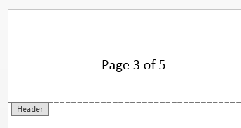
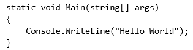

# RadFlowDocumentEditor

Although __RadFlowDocument__ can be created and modified by using the style properties and child collections of the document elements this can be quite cumbersome. __RadFlowDocumentEditor__ is utility class that is intended to simplify this process and achieve the same results with less amount of code. It is also useful when a couple of document elements should be inserted in the right order to ensure the document integrity – for example when inserting fields, hyperlinks, images etc.
      

* [Creating and Positioning](#creating-and-positioning)

* [Inserting Document Elements](#inserting-document-elements)

* [Changing Current Styles](#changing-current-styles)

## Creating and Positioning

__RadFlowDocumentEditor__ is always associated to a single document which it takes as a constructor parameter when it is created:
        

#### __C#__

{{region radwordsprocessing-editing-radflowdocumenteditor_0}}
    RadFlowDocument document = new RadFlowDocument();
    RadFlowDocumentEditor editor = new RadFlowDocumentEditor(document);
{{endregion}}

The editor maintains an internal position inside the document. This position points either inside a paragraph (to an inline) or directly after the end of a table element. Here are the available methods for changing the position of the editor within a document:
        

#### __C#__

{{region radwordsprocessing-editing-radflowdocumenteditor_1}}
    public void MoveToInlineStart(InlineBase inline)
    public void MoveToInlineEnd(InlineBase inline)
    public void MoveToParagraphStart(Paragraph paragraph)
    public void MoveToTableEnd(Table table)
{{endregion}}

Here is an example of how to position the editor after the second inline in the first paragraph of the document:
        

#### __C#__

{{region radwordsprocessing-editing-radflowdocumenteditor_2}}
    Paragraph firstParagraph = document.EnumerateChildrenOfType<Paragraph>().First();
    editor.MoveToInlineEnd(firstParagraph.Inlines[1]);
{{endregion}}

Note that it is possible to create a __RadFlowDocumentEditor__ for an empty document (one with no sections). In this case a section and paragraph are automatically created when you call an insert method. The following code creates a document with one section, containing one paragraph with the text "Hello word!":
        

#### __C#__

{{region radwordsprocessing-editing-radflowdocumenteditor_3}}
    RadFlowDocumentEditor editor = new RadFlowDocumentEditor(new RadFlowDocument());
    editor.InsertText("Hello word!");
    return editor.Document;
{{endregion}}

## Inserting Document Elements

Most of the insert methods of the __RadDocumentEditor__ return the newly inserted element. This way you can set some additional properties of the element if desired.
        

### Inserting Text

Inserting text [Runs]() can be done with the following methods:
            

* public Run InsertText(string text): Inserts a new __Run__ with the given text in the current paragraph.

* public Run InsertLine(string text): Inserts a new __Run__ with the given text in the current paragraph and starts new paragraph.

Both methods return the newly inserted __Run__ element. If, however, there are new lines in the text parameter – a new paragraph is also inserted for each new line. In this case the returned run is the last one that is inserted.

The next snippet insert a run containing a new line:
            

#### __C#__

{{region radwordsprocessing-editing-radflowdocumenteditor_4}}
    editor.InsertText("First" + Environment.NewLine + "Second");
{{endregion}}

The result looks like this:

>The current [CharacterFormatting](#changing-current-styles) and [ParagraphFormatting](#changing-current-styles) is applied for each Run and Paragraph that is created.
              

### Inserting Paragraph

You can start a new [Paragraph]() with the __InsertParagraph()__ method. The current __ParagraphFormatting__ is applied to the new paragraph and the paragraph is returned.
            

#### __C#__

{{region radwordsprocessing-editing-radflowdocumenteditor_5}}
    editor.InsertText("First paragraph");
    editor.InsertParagraph();
    editor.InsertText("Second paragraph");
{{endregion}}

The result looks like this:

If you call __InsertParagraph()__ method while the editor is positioned in the middle of a paragraph all the inlines after the position are moved inside the new paragraph. The effect is the same as pressing Enter key while the cursor is in the middle of a paragraph in a text editor application.

### Inserting Sections

Inserting [Section]() elements can be achieved with the __InsertSection()__ method. A paragraph with the new section’s properties will be added and the new __Section__ element will be returned.

#### __C#__
{{region radwordsprocessing-editing-radflowdocumenteditor_12}}
	editor.InsertSection();
{{endregion}}

>If you call the __InsertSection()__ method while the editor is positioned in a TableCell, the Table will be split at the current row. This means that if the table contains 3 rows, and the editor is positioned in a cell which is on the second row, the table will be split into two tables – one with one row, which will be added to the previous section and one with 2 rows (containing the TableCell where the editor position was). The later will be added to the newly inserted Section.

### Inserting Hyperlinks

__Hyperlinks__ in the __RadFlowDocument__ model are actually [Fields](), which means they have code and result parts separated by [FieldCharacter]() inlines. Inserting hyperlinks is simplified with __RadFlowDocumentEditor.InsertHyperlink()__  method:
            

public Hyperlink InsertHyperlink(string text, string uri, bool isAnchor, string toolTip)

It automatically applies "Hyperlink" built-in style to the inserted hyperlink if there is no explicitly set style in the __CharacterFormatting__ options of the editor.
            

#### __C#__

{{region radwordsprocessing-editing-radflowdocumenteditor_6}}
    editor.InsertHyperlink("telerik", "http://www.telerik.com", false, "Telerik site");
{{endregion}}

### Inserting Code Fields

Inserting fields can be done with the __InsertField()__ method, which accepts code and result fragments:
            

public Field InsertField(string code, string result)

Here is how to add page numbering in the header of document:
            

#### __C#__

{{region radwordsprocessing-editing-radflowdocumenteditor_7}}
    // Create header and move the editor
    Header header = document.Sections[0].Headers.Add();
    editor.MoveToParagraphStart(header.Blocks.AddParagraph());

    editor.InsertText("Page ");
    editor.InsertField("PAGE", "1");
    editor.InsertText(" of ");
    editor.InsertField("NUMPAGES", "1");
{{endregion}}

The result is:
            

Note that in this case the result is automatically updated when a document is opened in MS Word, because the page fields are in the header of the document.
            

>tipYou can find an extensive list of field codes in the Office Open XML standard documentation - [ECMA-376](http://www.ecma-international.org/publications/standards/Ecma-376.htm) 4th edition, December 2012, Chapter 17.16.6 Field Definitions.
              

### Inserting Images

__RadFlowDocumentEditor__ provides several methods for inserting [ImageInline]() and [FloatingImage](). All of them return the inserted image element, so that additional manipulations can be done with it:
            

#### __C#__

{{region radwordsprocessing-editing-radflowdocumenteditor_8}}
    public ImageInline InsertImageInline(ImageSource source, Size size)
    public ImageInline InsertImageInline(Stream stream, string extension, Size size)
    public FloatingImage InsertFloatingImage(ImageSource source, Size size)
    public FloatingImage InsertFloatingImage(Stream stream, string extension, Size size)
{{endregion}}

Here is how an image can be inserted using a stream:
            

#### __C#__

{{region radwordsprocessing-editing-radflowdocumenteditor_9}}
    editor.InsertText("Image:");
    using (Stream stream = this.GetResourceStream("Telerik_logo.png"))
    {
        editor.InsertImageInline(stream, "png", new Size(118, 28));
    }
{{endregion}}

The result is as follows:
            

### Inserting Tables

The following methods can be used to insert [Table]() in the document:
            

public Table InsertTable(): Inserts an empty table in the document.
            

public Table InsertTable(int rows, int columns): Inserts table with specified number of rows and columns.
            

>The formatting specified with the [TableFormatting](#changing-current-styles) property is applied to the inserted table. After the insert operation the editor is automatically placed directly __after__ the inserted table (not inside it).
              

Here is how to insert a table with the "TableGrid" built-in style:
            

#### __C#__

{{region radwordsprocessing-editing-radflowdocumenteditor_10}}
    document.StyleRepository.AddBuiltInStyle(BuiltInStyleNames.TableGridStyleId);
    editor.TableFormatting.StyleId = BuiltInStyleNames.TableGridStyleId;

    editor.InsertText("Before table.");
    editor.InsertTable(2, 4);
    editor.InsertText("After table.");
{{endregion}}

## Changing Current Styles

When you use the insert methods of the __RadFlowDocumentEditor__ the editor creates different document elements. You can control the formatting of the newly created elements with the following properties:
        

* __CharacterFormatting__: This formatting is applied to all newly created __Run__ elements. When inserting hyperlinks the "Hyperlink" built-in style is applied to the resulting fragment only if no style is set in the __CharacterFormatting__.
            

* __ParagraphFormatting__: This formatting is applied to all newly created __Paragraph__ elements. This also includes paragraphs that are inserted through __InsertText()__ and __InsertLine()__ methods.
            

* __TableFormatting__: This formatting is applied to all newly created __Table__ elements.
            

Formatting options are most useful when inserting multiple elements that should have consistent styling. For example the following code inserts multiple paragraphs with no spacing between them and with text (Runs) in "Consolas" font:
        

#### __C#__

{{region radwordsprocessing-editing-radflowdocumenteditor_11}}
    // Set code block formatting
    var codeFont = new ThemableFontFamily(new FontFamily("Consolas"));
    editor.CharacterFormatting.FontFamily.LocalValue = codeFont;
    editor.ParagraphFormatting.SpacingAfter.LocalValue = 0;

    editor.InsertLine("static void Main(string[] args)");
    editor.InsertLine("{");
    editor.InsertLine("    Console.WriteLine(\"Hello World\");");
    editor.InsertLine("}");
{{endregion}}

# See Also

 * [RadFlowDocument API Reference](http://www.telerik.com/help/wpf/t_telerik_windows_documents_flow_model_editing_radflowdocumenteditor.html)

 * [Document model]()
