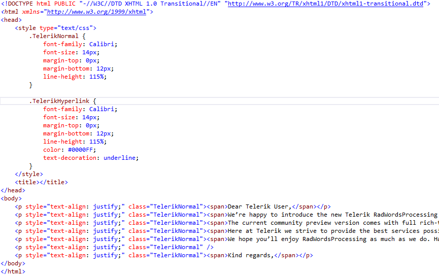

# Html

[HTML](http://en.wikipedia.org/wiki/HTML) (HyperText Markup Language) is a markup language used to create web pages.

__HtmlFormatProvider__ is compliant with [HTML5 specification](http://www.w3.org/TR/html5/), developed by W3C.
      
