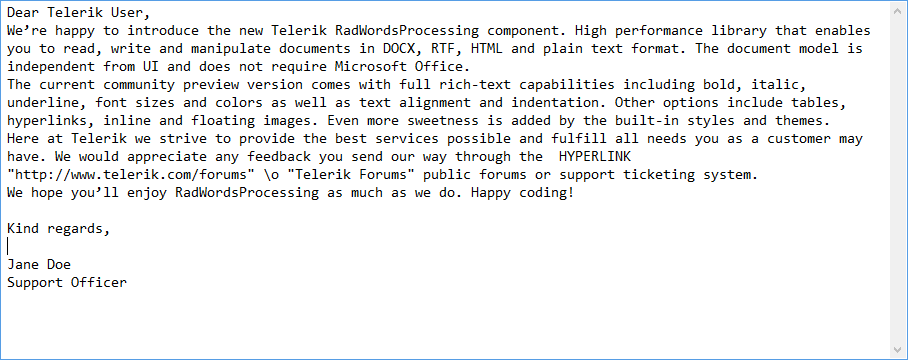

# Plain text

Plain text is the contents of an ordinary sequential document readable as textual material without much processing.
 

__TxtFormatProvider__ allows you to extract the text content of a document.
      
