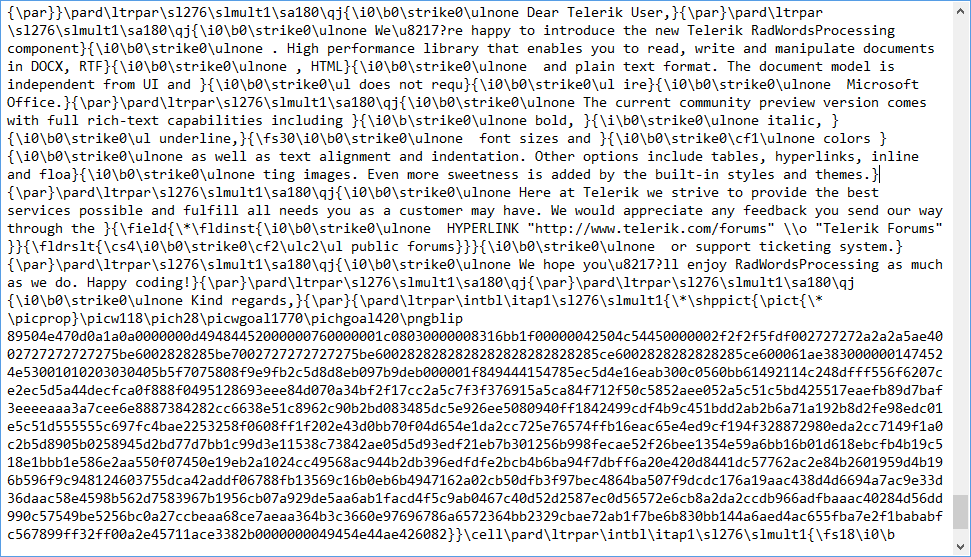

# Rtf

The [Rich Text Format](http://en.wikipedia.org/wiki/Rich_Text_Format)(RTF) is a proprietary document file format developed by Microsoft for creating cross-platform documents. This format can be read by most of the word processing applications. 

__RtfFormatProvider__ is compliant with [ Rich Text Format (RTF) specification version 1.9](http://coolthingoftheday.blogspot.com/2007/01/rtf-19-specification-word-2007.html)
        .
      
