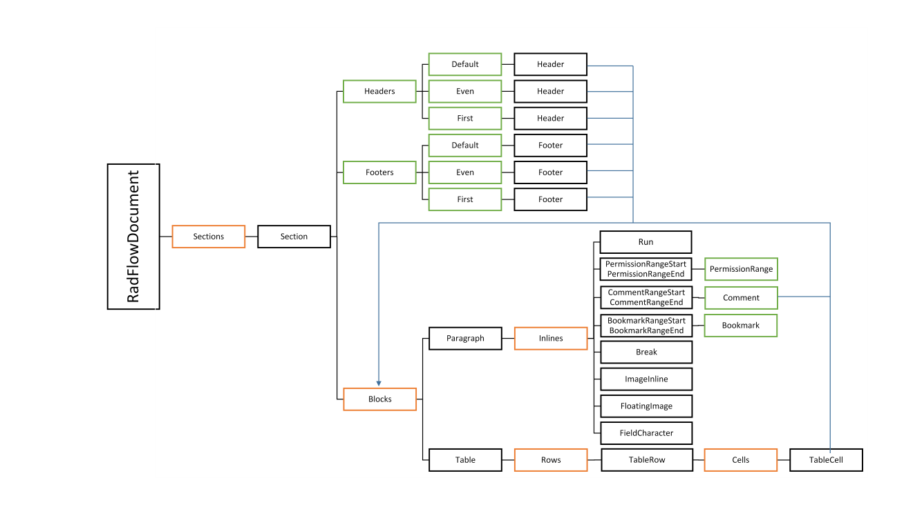

# Model

[RadFlowDocument]() describes flow document (document designed to dynamically adjust its layout according to the available size). This article explains in details the structure of __RadFlowDocument__'s document model.
      

## Document Elements

__RadFlowDocument__ can contain various types of document elements, all of them inheriting [DocumentElementBase ](http://www.telerik.com/help/wpf/t_telerik_windows_documents_flow_model_documentelementbase.html) abstract class. The hierarchy is presented in the following diagram, where abstract classes are denoted in blue:        

Every document element is associated with an instance of __RadFlowDocument__ since its creation. This link is permanent and attempts to move document elements from one document to another result in exception; [cloning]() can be used instead to create deep copy of an element associated to another instance of RadFlowDocument. Current associated document is stored in the [Document](http://www.telerik.com/help/wpf/p_telerik_windows_documents_flow_model_documentelementbase_document.html) property.
        

## Composition of Document Elements

__RadFlowDocument__ represents a tree of document elements containing each other through a set of properties and collections. Possible containments are described in the following diagram, where document elements are denoted in black, collections in orange, and properties in green:

* RadFlowDocument contains collection of [Sections](http://www.telerik.com/help/wpf/p_telerik_windows_documents_flow_model_radflowdocument_sections.html).
            

* [Section]() contains collection of [Blocks](http://www.telerik.com/help/wpf/properties_t_telerik_windows_documents_flow_model_blockbase.html) (Paragraphs and Tables), as well as three Headers and three Footers – one default, one for even pages and one for first section page.
            

* [Paragraph]() contains collection of [Inlines](http://www.telerik.com/help/wpf/properties_t_telerik_windows_documents_flow_model_inlinebase.html) – [Runs](), [ImageInlines](), [FloatingImages]() and [FieldCharacters]().
            

* [Table]() contains collection of TableRows.
            

* [TableRow]()  contains collection of TableCells.
            

* [TableCell]() contains collection of Blocks.
            

* [Headers and Footers]() contain collection of Blocks.
            

### Common ways for traversing the links between document elements

Relationships between document elements can be additionally traversed using:
            

* [Parent](http://www.telerik.com/help/wpf/p_telerik_windows_documents_flow_model_documentelementbase_parent.html) property. This property contains reference to document's parent and is automatically set when element is added/removed as a child of another element.
                

* [EnumerateChildrenOfType<T>](http://www.telerik.com/help/wpf/methods_t_telerik_windows_documents_flow_model_documentelementbase.html) method. This method can be used to recursively traverse document tree and return all children of given type __T__.
                

# See Also

 * [RadFlowDocument]()
 * [RadFlowDocument API Reference](http://www.telerik.com/help/wpf/t_telerik_windows_documents_flow_model_radflowdocument.html)
 * [Clone and Merge]()
