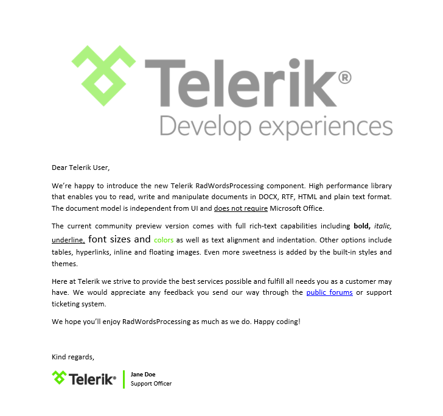

# Overview

Thank you for choosing Telerik __RadWordsProcessing__!
      

## 

RadWordsProcessing is a processing library that allows to create, load, modify and export documents to variety of formats.
        

Some of the features are:
        

* Import/export to several file formats.
            

* Rich document model support, including tables, images, hyperlinks, headers and footers.
            

* Coprehensive and easy-to-use API allowing for generation and manipulation of documents.
            

* Variety of built-in themes and styles.
            

