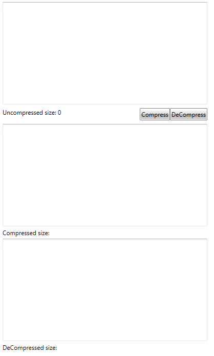
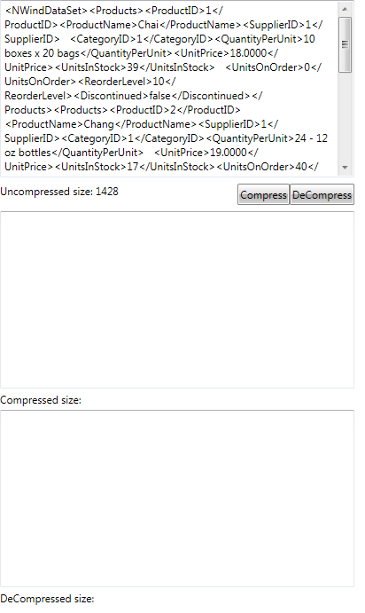
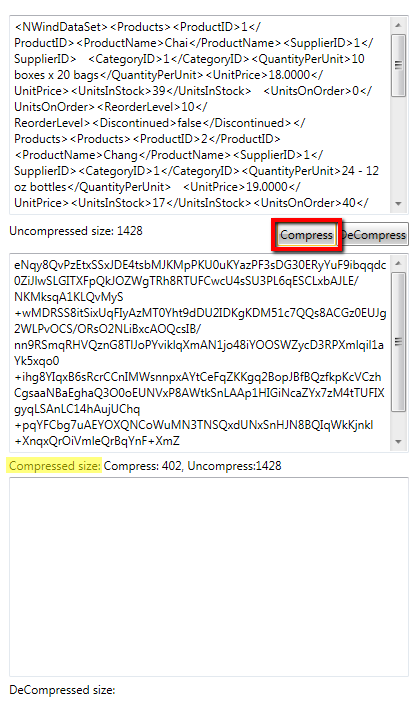
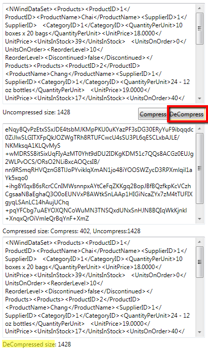

# How to compress and decompress a stream

This tutorial demonstrates how to compress a string in a stream and then restore the original string by decompressing the stream. 

For the purpose of this tutorial, let's create the following sample XAML structure:

#### __XAML__

{{region radziplibrary-howto-compress-decompress-0}}
	     <Grid Background="White">
	        <StackPanel HorizontalAlignment="Left">
	            <TextBox x:Name="UncompressedText"
	                     Width="400"
	                     Height="200"
	                     Margin="0 2"
	                     TextWrapping="Wrap"
	                     VerticalScrollBarVisibility="Auto" />
	            <Grid Margin="0 5">
	                <StackPanel HorizontalAlignment="Left" Orientation="Horizontal">
	                    <TextBlock Text="Uncompressed size: " />
	                    <TextBlock Text="{Binding Text.Length, ElementName=UncompressedText}" />
	                </StackPanel>
	                <StackPanel HorizontalAlignment="Right" Orientation="Horizontal">
	                    <telerik:RadButton Height="24"
	                                       Click="Compress"
	                                       Content="Compress" />
	                    <telerik:RadButton Height="24"
	                                       Click="DeCompress"
	                                       Content="DeCompress" />
	                </StackPanel>
	            </Grid>
	            <TextBox x:Name="CompressedText"
	                     Width="400"
	                     Height="200"
	                     Margin="0 2"
	                     TextWrapping="Wrap"
	                     VerticalScrollBarVisibility="Auto" />
	            <StackPanel Margin="0 2" Orientation="Horizontal">
	                <TextBlock Text="Compressed size: " />
	                <TextBlock x:Name="CompressedSize" />
	            </StackPanel>
	            <TextBox x:Name="DeCompressedText"
	                     Width="400"
	                     Height="200"
	                     Margin="0 2"
	                     TextWrapping="Wrap"
	                     VerticalScrollBarVisibility="Auto" />
	            <StackPanel Margin="0 2" Orientation="Horizontal">
	                <TextBlock Text="DeCompressed size: " />
	                <TextBlock Name="DeCompressedSize" />
	            </StackPanel>
	        </StackPanel>
	    </Grid>
	{{endregion}}

It basically describes three __TextBox__ controls - the first one will display the original string, in the second one we will display the string representation of the compressed stream and in the last one we will display the uncopressed result which should match the content of first __TextBox__. We've also defined a few buttons and we will place all compress/decompress logic in the __Click__ event handlers of these buttons.
			

Let's get to the code-behind implementation. First, let's set the following sample string in the
			  __UncompressedText__:
			

#### __C#__

{{region radziplibrary-howto-compress-decompress-1}}
	        public MainPage()
	        {
	            InitializeComponent();
	
	            UncompressedText.Text = "<NWindDataSet><Products><ProductID>1</ProductID><ProductName>Chai</ProductName><SupplierID>1</SupplierID>   <CategoryID>1</CategoryID><QuantityPerUnit>10 boxes x 20 bags</QuantityPerUnit><UnitPrice>18.0000</UnitPrice><UnitsInStock>39</UnitsInStock>   <UnitsOnOrder>0</UnitsOnOrder><ReorderLevel>10</ReorderLevel><Discontinued>false</Discontinued></Products><Products><ProductID>2</ProductID>   <ProductName>Chang</ProductName><SupplierID>1</SupplierID><CategoryID>1</CategoryID><QuantityPerUnit>24 - 12 oz bottles</QuantityPerUnit>   <UnitPrice>19.0000</UnitPrice><UnitsInStock>17</UnitsInStock><UnitsOnOrder>40</UnitsOnOrder><ReorderLevel>25</ReorderLevel><Discontinued>false</Discontinued>  </Products><Products><ProductID>3</ProductID><ProductName>Aniseed Syrup</ProductName><SupplierID>1</SupplierID><CategoryID>2</CategoryID><QuantityPerUnit>12 - 550 ml bottles</QuantityPerUnit><UnitPrice>10.0000</UnitPrice><UnitsInStock>13</UnitsInStock><UnitsOnOrder>70</UnitsOnOrder><ReorderLevel>25</ReorderLevel>   <Discontinued>false</Discontinued></Products><Products><ProductID>4</ProductID><ProductName>Chef Anton's Cajun Seasoning</ProductName><SupplierID>2</SupplierID><CategoryID>2</CategoryID><QuantityPerUnit>48 - 6 oz jars</QuantityPerUnit><UnitPrice>22.0000</UnitPrice><UnitsInStock>53</UnitsInStock>  <UnitsOnOrder>0</UnitsOnOrder><ReorderLevel>0</ReorderLevel><Discontinued>false</Discontinued></Products></NWindDataSet>";
	        }
	{{endregion}}



#### __C#__

{{region radziplibrary-howto-compress-decompress-0}}
	        public MainWindow()
	        {
	            InitializeComponent();
	
	            UncompressedText.Text = "<NWindDataSet><Products><ProductID>1</ProductID><ProductName>Chai</ProductName><SupplierID>1</SupplierID>   <CategoryID>1</CategoryID><QuantityPerUnit>10 boxes x 20 bags</QuantityPerUnit><UnitPrice>18.0000</UnitPrice><UnitsInStock>39</UnitsInStock>   <UnitsOnOrder>0</UnitsOnOrder><ReorderLevel>10</ReorderLevel><Discontinued>false</Discontinued></Products><Products><ProductID>2</ProductID>   <ProductName>Chang</ProductName><SupplierID>1</SupplierID><CategoryID>1</CategoryID><QuantityPerUnit>24 - 12 oz bottles</QuantityPerUnit>   <UnitPrice>19.0000</UnitPrice><UnitsInStock>17</UnitsInStock><UnitsOnOrder>40</UnitsOnOrder><ReorderLevel>25</ReorderLevel><Discontinued>false</Discontinued>  </Products><Products><ProductID>3</ProductID><ProductName>Aniseed Syrup</ProductName><SupplierID>1</SupplierID><CategoryID>2</CategoryID><QuantityPerUnit>12 - 550 ml bottles</QuantityPerUnit><UnitPrice>10.0000</UnitPrice><UnitsInStock>13</UnitsInStock><UnitsOnOrder>70</UnitsOnOrder><ReorderLevel>25</ReorderLevel>   <Discontinued>false</Discontinued></Products><Products><ProductID>4</ProductID><ProductName>Chef Anton's Cajun Seasoning</ProductName><SupplierID>2</SupplierID><CategoryID>2</CategoryID><QuantityPerUnit>48 - 6 oz jars</QuantityPerUnit><UnitPrice>22.0000</UnitPrice><UnitsInStock>53</UnitsInStock>  <UnitsOnOrder>0</UnitsOnOrder><ReorderLevel>0</ReorderLevel><Discontinued>false</Discontinued></Products></NWindDataSet>";
	        }
	{{endregion}}



#### __VB.NET__

{{region radziplibrary-howto-compress-decompress-0}}
	Public Sub New()
		InitializeComponent()
	
		UncompressedText.Text = "<NWindDataSet><Products><ProductID>1</ProductID><ProductName>Chai</ProductName><SupplierID>1</SupplierID>   <CategoryID>1</CategoryID><QuantityPerUnit>10 boxes x 20 bags</QuantityPerUnit><UnitPrice>18.0000</UnitPrice><UnitsInStock>39</UnitsInStock>   <UnitsOnOrder>0</UnitsOnOrder><ReorderLevel>10</ReorderLevel><Discontinued>false</Discontinued></Products><Products><ProductID>2</ProductID>   <ProductName>Chang</ProductName><SupplierID>1</SupplierID><CategoryID>1</CategoryID><QuantityPerUnit>24 - 12 oz bottles</QuantityPerUnit>   <UnitPrice>19.0000</UnitPrice><UnitsInStock>17</UnitsInStock><UnitsOnOrder>40</UnitsOnOrder><ReorderLevel>25</ReorderLevel><Discontinued>false</Discontinued>  </Products><Products><ProductID>3</ProductID><ProductName>Aniseed Syrup</ProductName><SupplierID>1</SupplierID><CategoryID>2</CategoryID><QuantityPerUnit>12 - 550 ml bottles</QuantityPerUnit><UnitPrice>10.0000</UnitPrice><UnitsInStock>13</UnitsInStock><UnitsOnOrder>70</UnitsOnOrder><ReorderLevel>25</ReorderLevel>   <Discontinued>false</Discontinued></Products><Products><ProductID>4</ProductID><ProductName>Chef Anton's Cajun Seasoning</ProductName><SupplierID>2</SupplierID><CategoryID>2</CategoryID><QuantityPerUnit>48 - 6 oz jars</QuantityPerUnit><UnitPrice>22.0000</UnitPrice><UnitsInStock>53</UnitsInStock>  <UnitsOnOrder>0</UnitsOnOrder><ReorderLevel>0</ReorderLevel><Discontinued>false</Discontinued></Products></NWindDataSet>"
	End Sub
	{{endregion}}

In order to compress this string in a stream we need to add a __MemoryStream__ property in our class definition. And as we will be using the __RadZipLibrary__ to compress and decompress the stream, we will need a property of type __ZipOutputStream__ as well:
			

	
		MemoryStream msCompress;
		ZipOutputStream zipOut;			  
			  

	
		Private msCompress As MemoryStream
		Private zipOut As ZipOutputStream		  
			  

Now that we have these properties defined, we have to initilialize them and use a __StreamWriter__ to write the original string in the __ZipOutputStream__ property. Then we can get the size of the compressed stream from the __ZipOutputStream.CompressedSize__ value. And if you want to make sure that the __zipOut__ property has properly calculated the uncompressed size of the stream correctly, you can check the __ZipOutputStream.UncompressedSize__ value. In our sample, we will write all these data in the view, so let's wrap our logic in a sample method:
			

#### __C#__

{{region radziplibrary-howto-compress-decompress-2}}
	public string CompressString(string arg)
	{
	    msCompress = new MemoryStream();
	    ZipCompression method = ZipCompression.Deflate64;
	    zipOut = new ZipOutputStream(msCompress, method);
	    StreamWriter sWriter = new StreamWriter(zipOut);
	
	    sWriter.Write(arg);
	    sWriter.Flush();
	
	    CompressedText.Text = Convert.ToBase64String(msCompress.ToArray());
	
	    return ("Compress: " + zipOut.CompressedSize.ToString() + ", Uncompress:" + zipOut.UncompressedSize.ToString());
	}
	{{endregion}}

#### __VB.NET__

{{region radziplibrary-howto-compress-decompress-1}}
	Public Function CompressString(ByVal arg As String) As String
		msCompress = New MemoryStream()
		Dim method As ZipCompression = ZipCompression.Deflate64
		zipOut = New ZipOutputStream(msCompress, method)
		Dim sWriter As New StreamWriter(zipOut)
	
		sWriter.Write(arg)
		sWriter.Flush()
	
		CompressedText.Text = Convert.ToBase64String(msCompress.ToArray())
	
		Return ("Compress: " & zipOut.CompressedSize.ToString() & ", Uncompress:" & zipOut.UncompressedSize.ToString())
	End Function
	{{endregion}}

We need to call the __CompressString__ method in the __Click__ event handler of the __Compress__ button:
			

	
		private void Compress(object sender, RoutedEventArgs e)
		{
			CompressedSize.Text = CompressString(UncompressedText.Text);
		}			  
			  

	
		Private Sub Compress(sender As System.Object, e As System.Windows.RoutedEventArgs)
			CompressedSize.Text = CompressString(UncompressedText.Text)
		End Sub			  
			  

Next, we can decompress the stream by creating a new __ZipInputStream__ property. We will then use a __StreamReader__ to read its value and get the original string. And in order to make sure that the decompressed stream has the same length as the original string, we can check the value of the __ZipInputStream.UncompressedSize__ property:
			

#### __C#__

{{region radziplibrary-howto-compress-decompress-3}}
	public string DecompressStream()
	{
	    System.Text.UTF8Encoding encoding = new System.Text.UTF8Encoding();
	    msCompress.Position = 0;
	
	    ZipInputStream inputStream = new ZipInputStream(msCompress, false);
	
	    string str = null;
	    StreamReader reader = new StreamReader(inputStream, encoding);
	    str = reader.ReadToEnd();
	    DeCompressedSize.Text = inputStream.UncompressedSize.ToString();
	    return str;
	}
	{{endregion}}

#### __VB.NET__

{{region radziplibrary-howto-compress-decompress-2}}
	Public Function DecompressStream() As String
		Dim encoding As New System.Text.UTF8Encoding()
		msCompress.Position = 0
	
		Dim inputStream As New ZipInputStream(msCompress, False)
	
		Dim str As String = Nothing
		Dim reader As New StreamReader(inputStream, encoding)
		str = reader.ReadToEnd()
		DeCompressedSize.Text = inputStream.UncompressedSize.ToString()
		Return str
	End Function
	{{endregion}}

As we've wrapped the decompressing logic in a method as well, let's call it from the __Click__ event handler of the __DeCompress__ button:
			

	
        private void DeCompress(object sender, RoutedEventArgs e)
        {
            DeCompressedText.Text = DecompressStream();
        }			  
			  

	
		Private Sub DeCompress(ByVal sender As Object, ByVal e As RoutedEventArgs)
			DeCompressedText.Text = DecompressStream()
		End Sub			  
			  

Finally, if you run the sample and hit the *Compress* button, you should get the following result:

And then when you hit the *DeCompress* button, you should get the original string back:
		  

 * [Compressing a Stream]()
