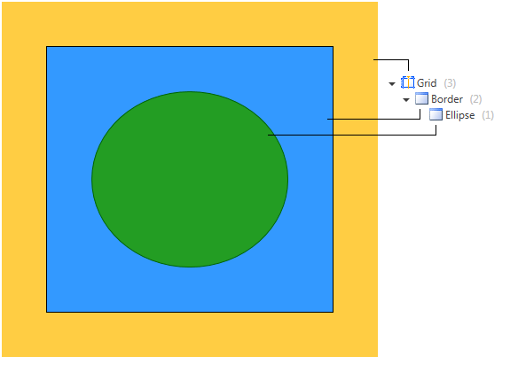
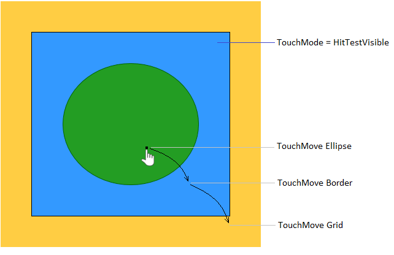
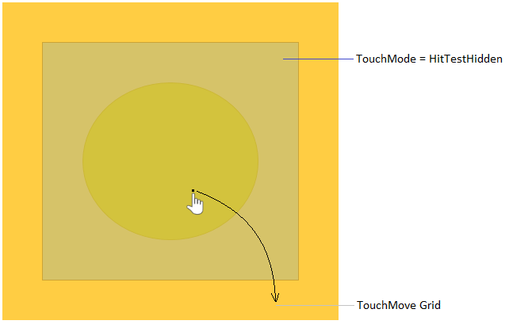
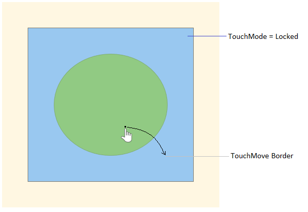
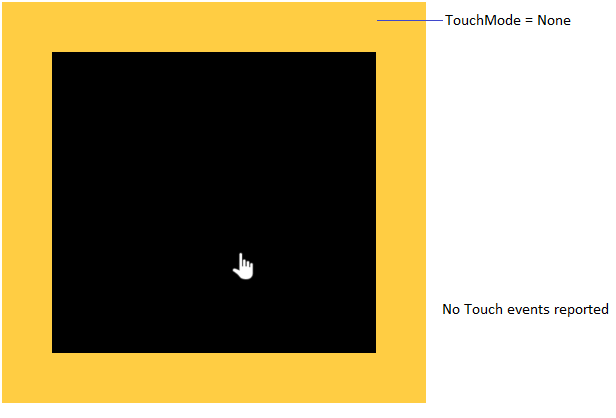

# TouchManager Touch Modes

__TouchManager__ allows you to control the touch mode of the UIElement in the visual tree. You can do this using the __TouchMode__ attached property of the manager. 

>important The __IsTouchHitTestVisible__ and __ShouldLockTouch__ properties of TouchManager are __obsolete__ and __replaced__ by the __TouchMode__ property.

__TouchMode__ is an enumeration that contains the following values:
* __HitTestVisible__ (default value): The element is visible for touch input and events will route normally.
* __HitTestHidden__: The element is not visible for touch input. Touch events will be raised for the parents of the element, as if this element is not in the visual tree.
* __Locked__: The element is visible for touch input and it will capture the touch device on touch down. All touch events will be marked as handled, thus preventing event routing.
* __None__: The element will suppress all touch events. No touch events will be raised for touch input within the boundaries of the element.

__Example 1: Setting TouchMode in XAML__
```XAML
	<Border x:Name="element" telerik:TouchManager.TouchMode="HitTestVisible" />
```

__Example 2: Setting TouchMode in code__
```C#
	TouchManager.SetTouchMode(this.element, TouchMode.HitTestVisible);
```
```VB.NET
	TouchManager.SetTouchMode(Me.element, TouchMode.HitTestVisible)
```

## TouchMode examples

This section demonstrates the TouchModes with an example containing a few nested UIElements.

__The logical tree of the example - parent Grid, a Border inside the grid and an Ellipse inside the border__



__TouchMode.HitTestVisible__



__TouchMode.HitTestHidden__



__TouchMode.Locked__



__TouchMode.None__



## See Also
* [Overview]()
* [Events]()
* [Features]()
