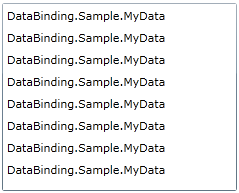
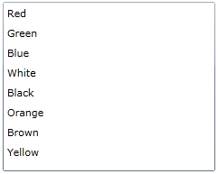

# Data Templates

Usually the data source to which you are binding your controls will contain not just simple primitive types, but also data objects. By default the items’ text will be the result of the __ToString()__ method of each data object. To display the value of a property of the data object you have to set the __DisplayMemberPath__ property, or the __ItemTemplate__ property of the control. This topic will cover both scenarios:

* [Using DisplayMemberPath](#Using_DisplayMemberPath)

* [Using ItemTemplate](#Using_DataTemplate)

Consider the following situation. You have a __ListBox__ which is populated with a collection of business objects.

#### __XAML__

{{region common-data-binding-data-templates_0}}
	<ListBox x:Name="listBox"/>
	{{endregion}}

#### __C#__

{{region common-data-binding-data-templates_1}}
	this.listBox.ItemsSource = this.CreateSampleData();
	{{endregion}}

#### __VB.NET__

{{region common-data-binding-data-templates_2}}
	Me.listBox.ItemsSource = Me.CreateSampleData()
	{{endregion}}

In this example the following business object is used:

#### __C#__

{{region common-data-binding-data-templates_3}}
	public class MyData
	{
	    public MyData( string color )
	    {
	        this.Color = color;
	    }
	    public string Color
	    {
	        get;
	        set;
	    }
	}
	{{endregion}}

#### __VB.NET__

{{region common-data-binding-data-templates_4}}
	Public Class MyData
	    Public Sub New(ByVal color As String)
	        Me.Color = color
	    End Sub
	
	Private _Color As String
	    Public Property Color() As String
	        Get
	            Return _Color
	        End Get
	        Set(ByVal value As String)
	            _Color = value
	        End Set
	    End Property
	End Class
	{{endregion}}

Without specifying neither the __DisplayMemberPath__ nor the __ItemTemplate__, the result will be similar to the one on the snapshot below.

         
      

The __ListBox__ doesn't know what to do and how to represent the passed business objects.

## Using DisplayMemberPath

The following example demonstrates you the usage of the __DisplayMemberPath__ property.

#### __XAML__

{{region common-data-binding-data-templates_5}}
	<ListBox x:Name="listBox" DisplayMemberPath="Color"/>
	{{endregion}}

And the result will be correctly displayed business objects.

         
      

## Using DataTemplate

Another way to specify which properties should be displayed is to create a __DataTemplate__. The next example demonstrates how to use the __ItemTemplate__ property of the ListBox:

#### __XAML__

{{region common-data-binding-data-templates_6}}
	<ListBox x:Name="listBox">
	    <ListBox.ItemTemplate>
	        <DataTemplate>
	            <TextBlock Text="{Binding Color}"/>
	        </DataTemplate>
	    </ListBox.ItemTemplate>
	</ListBox>
	{{endregion}}

# See Also

 * [Hierarchical Data]()

 * [Style Selectors]()

 * [Template Selectors]()
