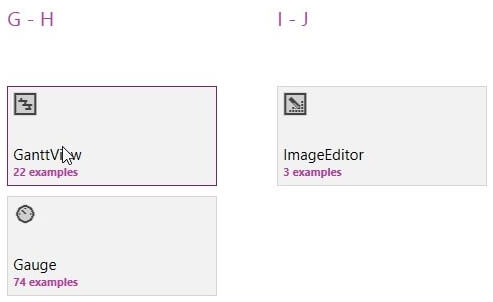
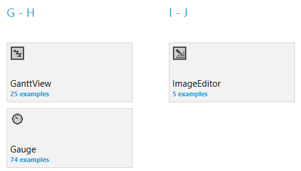
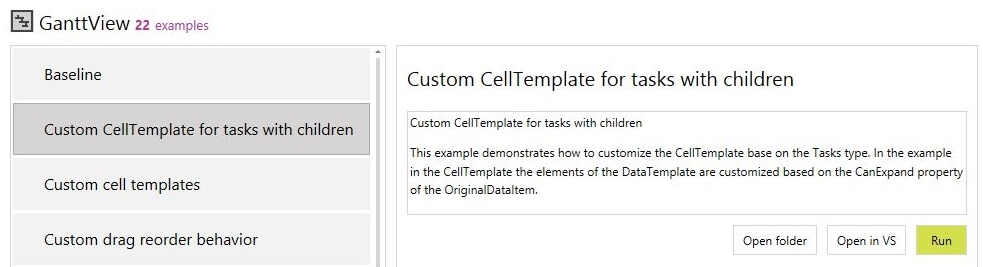
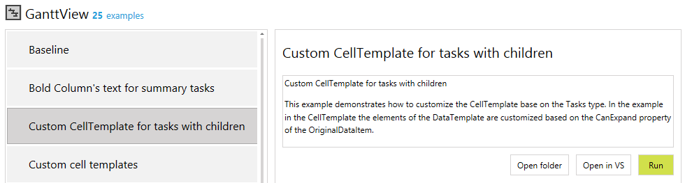
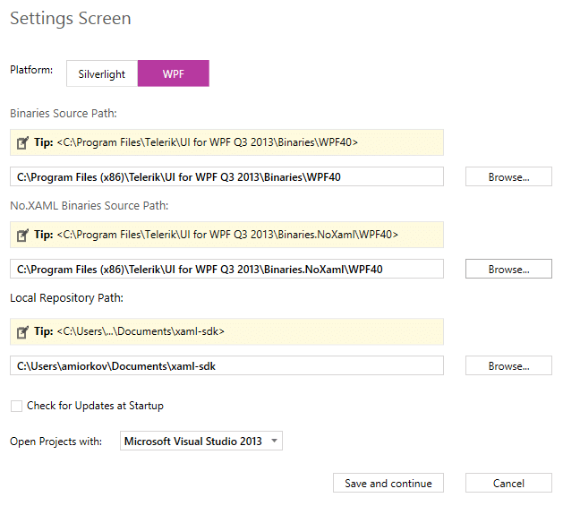
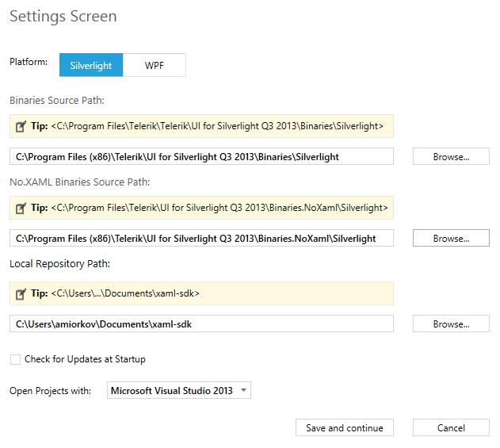

# SDK Samples Browser 

The SDK Samples Browser is an application that automatically connects to GitHub and downloads the [XAML SDK repository](https://github.com/telerik/xaml-sdk/) locally to a location that could be set by the user. After download is complete the application gives a very convenient navigation between all the available examples and a search functionality which doesn’t simply search by control’s names but also through the example’s names and descriptions.
            
You can download the application from [here](https://demos.telerik.com/xaml-sdkbrowser/).
           
Some of its __key features__ are:            

* Automatic repository download functionality                    

* Manual and automatic checking for new and updated SDK examples                    

* Search functionality through the controls names, example's titles and example's descriptions
                    
* One click examples running

* One click examples opening in Visual Studio                    

## Getting Started with SDK Samples Browser
           
Using the SDK Samples Browser has very limited __requirements__ in order to make all of the examples runnable out of the box. You will need to make sure to either:
                
* Have the latest [ Telerik UI for WPF ](http://www.telerik.com/products/wpf/download.aspx)[ Telerik UI for Silverlight ](http://www.telerik.com/products/silverlight/download.aspx) are installed in the environment
                
* Or if already have it installed, provide a valid path to where all of the Telerik WPF Telerik Silverlight assemblies can be found.                        

## Browsing the Available Controls
            
In the main screen of the SDK Samples Browser you can easily navigate through the available controls in the SDK repository. The controls are represented by tiles in a RadTileList control. Each tile gives a quick glance information about the number of available examples.


## Browsing Through Control Examples
            
After selecting a control from the main screen of the application you will be navigated to the examples screen. In this screen you can easily navigate through the available examples for that control which are displayed on the left side in a RadListBox control. On the other side is the corresponding __example’s description__, __Open Folder__, __Open in VS__ and __Run buttons__.

## Building/Running an Example
            
By clicking the __Run__ button the application will show an indicator that says “Building example’s project”. After a few seconds it will disappear and a new Window will open of the built example.
                
## Changing the Settings
            
After the browser application has been started and the repository has been downloaded you can access the settings screen by clicking the settings (the gear) icon on the top right corner. After clicking it you will be navigated to the Settings screen. In that screen you can change:
                
* __Platform__&mdash;The platform for which the SDK examples should be loaded
                        
* __Binaries Source__&mdash;The location that contains all __Telerik WPF____Telerik Silverlight__ assemblies
                        
* __No.XAML Binaries Source__&mdash;The location that contains all __No.XAML Telerik WPF____No.XAML Telerik Silverlight__ assemblies
                        
* __Local Repository Path__&mdash;The location where the examples are locally placed by the automatic download                        

* __Check for Updates at Startup__&mdash;Determines if the application should automatically check for available SDK example updates                        

* __Open Projects with__&mdash;Determines which installed Visual Studio should be used to open SDK example projects with the "Open in VS" button                        

Checking for updated could be done at any time while the SDK Samples Browser application is running by clicking the __Check for Updates__ button in the navigation bar.   


