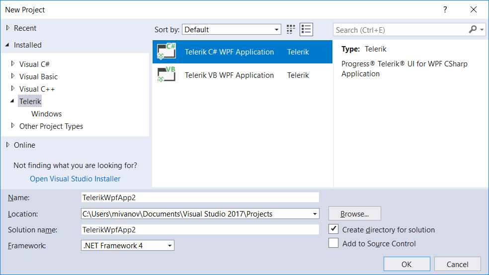
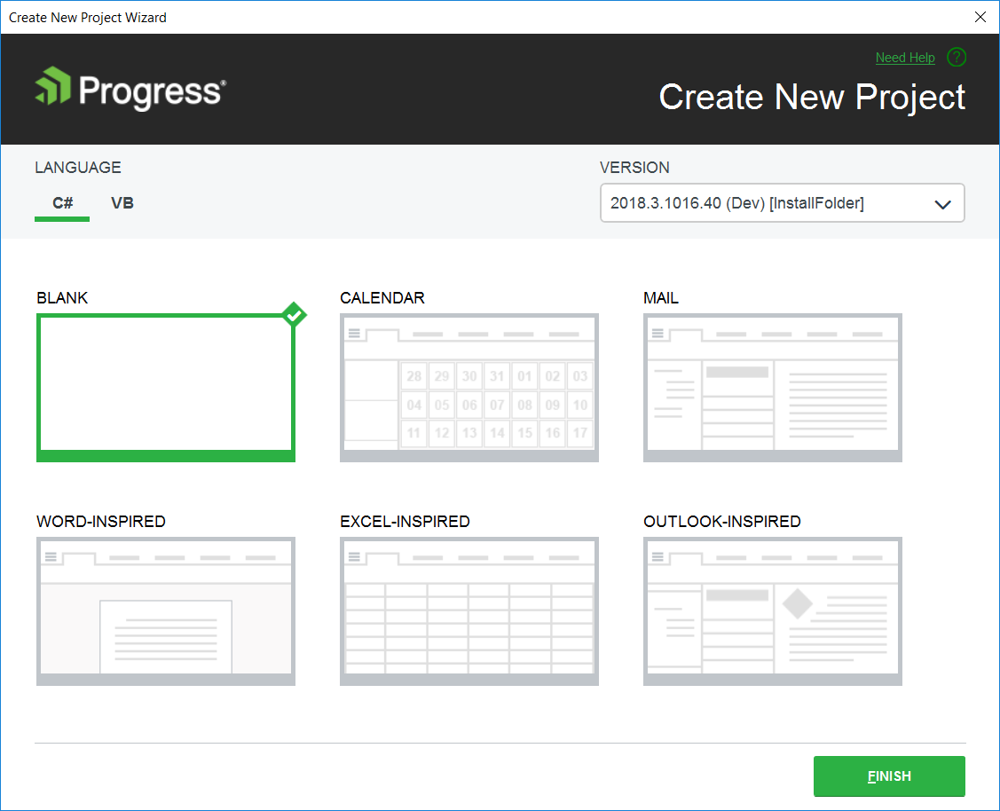
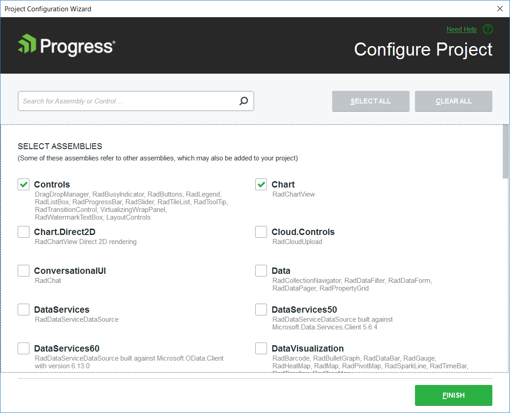
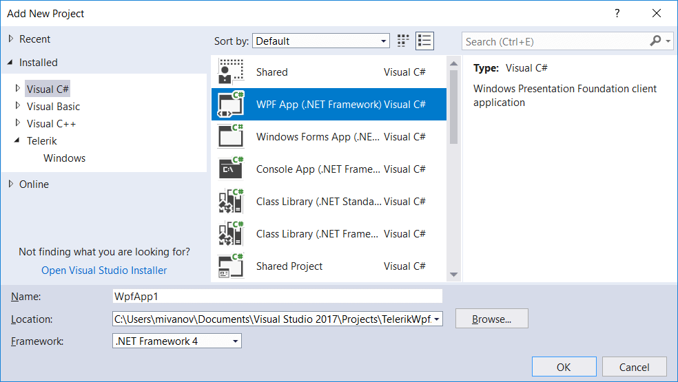
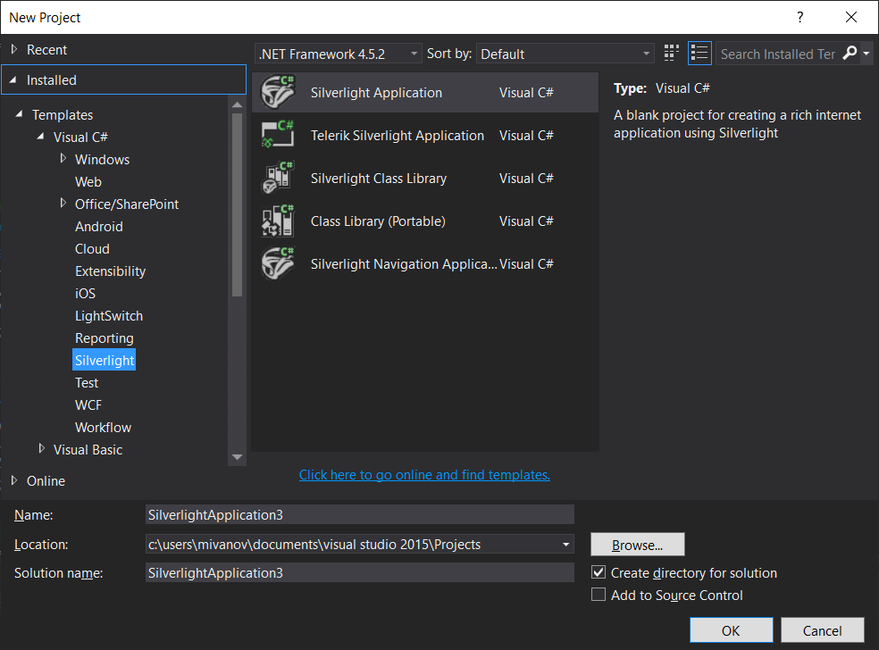
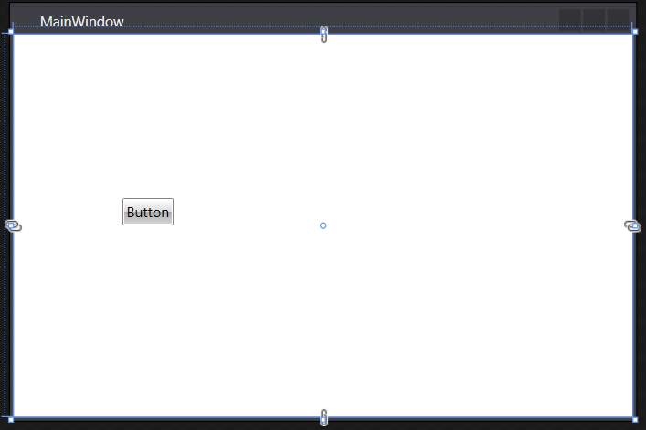

# Creating an Application and Adding Telerik Controls

The following topic describes what steps you should perform in order to add the Telerik UI for {{ site.site_name }} in your application. 

There are two ways to do this - the first one is to install [Progress Telerik WPF Extension]() for VisualStudio. The second one is to add the necessary assemblies as [references in your application manually](https://docs.microsoft.com/en-us/visualstudio/ide/managing-references-in-a-project?view=vs-2019). No matter which of the two manners you will choose, you will be able to use the Visual Studio Toolbox to create your application.

## Creating Application with the Telerik Visual Studio Extension

1. Open Visual Studio and createa create a new Telerik {{ site.site_name }} project. Read more in the [Create Project]() article.
	
	#### __Figure 1: Creating new Telerik application__	
	
	
	
		
	

2. Choose the project template. The options are a blank template or one of the MS Office inspired project templates. Choose the Blank option.
	
	#### __Figure 2: Choosing a project template__
	

	At this point the project references only the common Telerik.Windows.Controls.dll. 

3. [Configure the project]()[Configure the project]() using the Project Configuration Wizard. This will add the dlls required by the controls you want to use. When you open the wizard you can select the control you are going to use from the list (or search them in the search box). Clicking OK will add all required references for the controls.

	#### __Figure 3: Adding references to the charting controls__
		

	> This step is optional and you will need it only if use controls that are not defined in Telerik.Windows.Controls.dll.

## Creating Application and Manually Referencing the Telerik Assemblies

1. Open Visual Studio and create a new {{ site.site_name }} application.
	
	#### __Figure 4: Creating new {{ site.site_name }} application__  	
	
	
	
	
	
	
	

2. Add references to the Telerik assemblies. There are two options to do this.
	
	* [Drag a Telerik control from the toolbox](#dragging-controls-from-visual-studio-toolbox). When the control gets dropped onto the Visual Studio designer's surface, Visual Studio will automatically add the corresponding references.
	
	* Manually reference the Telerik dlls from the UI for {{ site.site_name }} installation folder.	The binaries are located in the *UI for {{ site.site_name }} installation folder/Binaries/ or *UI for {{ site.site_name }} installation folder/Binaries.NoXaml/*. To learn about the differences between the dlls in the **Binaries** and the **Binaries.NoXaml** folders, check out the [Xaml vs NoXaml]() article.
	
## Dragging Controls from Visual Studio Toolbox

1. Add the Telerik {{ site.site_name }} controls to the [Visual Studio Toolbox]()[Visual Studio Toolbox]().

	>tip See the assemblies required by each Telerik control in the [Controls Dependencies]()[Controls Dependencies]() article.

2. Open MainWindow.xamlMainPage.xaml of the project you have previously created (in the [Creating Application and Manually Referencing the Telerik Assemblies](#creating-application-and-manually-referencing-the-telerik-assemblies) section).

3. Select any Telerik control in the Visual Studio Toolbox.

	#### __Figure 5: Telerik controls in the Visual Studio Toolbox__  	
	

4. Drag and drop the control in the Visual Studio XAML designer. 

	
	#### __[XAML] Example 1: RadButton XAML automatically generated by dropping the control onto the Visual Studio designer__
	{{region installation-adding-to-application-create-application-and-adding-control-0}}
		<Window x:Class="WpfApplication1.Window1"
				xmlns="http://schemas.microsoft.com/winfx/2006/xaml/presentation"
				xmlns:x="http://schemas.microsoft.com/winfx/2006/xaml"
				xmlns:telerik="http://schemas.telerik.com/2008/xaml/presentation">
			<Grid>
				<telerik:RadButton Content="Button" HorizontalAlignment="Left" Height="Auto" VerticalAlignment="Top" Width="Auto"/>
			</Grid>
		</Window>
	{{endregion}}
	
	#### __[XAML] Example 1: RadButton XAML automatically generated by dropping the control onto the Visual Studio designer__
	{{region installation-adding-to-application-create-application-and-adding-control-1}}
		<UserControl x:Class="Test.MainPage"
					 xmlns="http://schemas.microsoft.com/winfx/2006/xaml/presentation" 
					 xmlns:x="http://schemas.microsoft.com/winfx/2006/xaml"
					 xmlns:d="http://schemas.microsoft.com/expression/blend/2008" 
					 xmlns:mc="http://schemas.openxmlformats.org/markup-compatibility/2006"
					 xmlns:telerik="http://schemas.telerik.com/2008/xaml/presentation"    
					 mc:Ignorable="d" d:DesignWidth="640" d:DesignHeight="480">
		  <Grid x:Name="LayoutRoot">
				<telerik:RadButton Content="Button" HorizontalAlignment="Left" Height="Auto" VerticalAlignment="Top" Width="Auto"/>
		  </Grid>
		</UserControl>
	{{endregion}}
	
	
	#### __Figure 6: RadButton dragged from the Visual Studio toolbox__  	
	

> After dropping a control, Visual Studio automatically creates a namespace that points to the appropriate assembly. If you want to manually set up a namespace take a look at the [Namespace Declaration]() topic.

## See Also  
 * [Namespace Declaration]()
 * [Xaml vs NoXaml]()
 * [Create Project with Visual Studio Extension)()  
 
 * [Upgrading Telerik UI Trial to Telerik UI Developer License or Newer Version]() 
 * [Convert Project with Visual Studio Extension)() 
 
