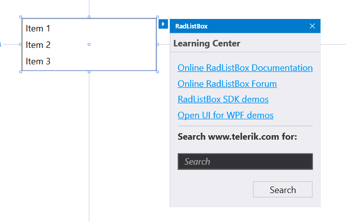

# Explore UI for WPF Control Features

Once you have the controls [working in your project](), it's time to see what they can do. This article provides a short overview of how to get started with finding control functionality so you can use it.

## Demos

To get an overview of what each control offers, the fastest approach is download the [WFP Demos Application](http://demos.telerik.com/wpf).

You can also [download the source code of the demo application](#getting-the-source-code) from your [telerik.com account](https://www.telerik.com/account/downloads/product-download?product=RCWPF) as a Visual Studio project and play around with the demos in the comfort of your IDE.

## Properties and Tags

You can **explore** the available properties, events and inner tags of any control through the VS **intellisense** to get a quick glimpse of their concepts and availability.

## Documentation

In addition to that, the **documentation** provides a section for each control that contains help articles **on distinct features and API reference**.

__Typical control documentation structure__  

## Design-time

Some of the most common tasks and configuration options are available in the control's [Smart Tag in Design Mode](). You will also find **design-time wizards** and **links** that can be useful when you are getting started with a feature, or even for advanced users who want to save time with setting up collections, data sources or properties.

__Smart Tag features__  

## SDK Examples

The SDK Examples (also known as Developer Focused Examples) are a good source with runnable project showing different features of the Telerik UI for WPF controls. Find the SDK Examples in the [corresponding GitHub repository](https://github.com/telerik/xaml-sdk).

## Next Steps

Now that you have the Telerik UI for WPF controls running in your project, you may want to explore their features, customize their behavior or change their appearance. Below you can find guidance on getting started with such tasks:

* [Change Control Appearance]()
* [Further Information]()

