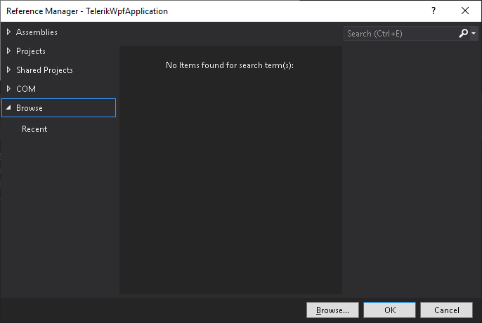
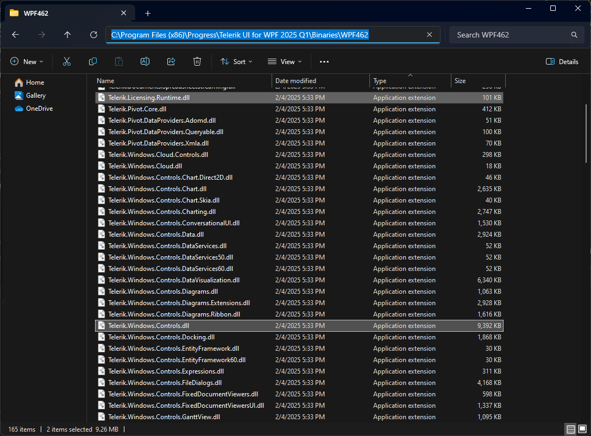
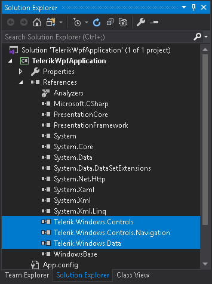

# First Steps With MSI or ZIP

This article describes the lifecycle of a Telerik application. This includes creating, deploying, redistributing, and upgrading an application with referenced Telerik dlls.

The topic shows what is the lifecycle when using the __.msi__ or __.zip__ file to get the dlls. As an alternative, you can use [NuGet packages]() or [Telerik UI for WPF Extension]().

## Creating a Project

To use the Telerik dlls, create a new WPF project using the Visual Studio project template from the __File --> New --> Project__ menu. 

Set a __Project name__ and __Location__ for the project. For this example, we will use `TelerikWPFApplication` for the project's name.

This will create an empty WPF project where you can reference the Telerik dlls.

## Referencing Telerik Assemblies

[Download the .zip file]() with the Telerik assemblies in a location of your choice. Or [download the .msi]() file and install it. This tutorial will show how to reference the Telerik dlls from the default installation folder.

Use the Visual Studio's Reference Manager to browse and reference the Telerik dlls. 

If you need to set a [Telerik theme]() different than the default one check the [Xaml vs. NoXaml]() and the [Setting a Theme]() articles.

## Installing a License Key

To use the Telerik WPF product you will need to install a valid license key. Otherwise, you will see warning messages and banners related to the licensing. See how to activate a license in the [Installing License Key]() article.

## Adding Telerik Controls

After you create the WPF project and reference the Telerik assemblies, add any UI and related code-behind, models, and styles. This example will show a fundamental setup, including a RadTabControl with few tabs defined in XAML.

#### __[XAML] Example 1: Adding Telerik control in the UI__
{{region msi-or-zip-setup-lifecycle-0}}
	<Window x:Class="TelerikWpfApplication.MainWindow"
		xmlns="http://schemas.microsoft.com/winfx/2006/xaml/presentation"
		xmlns:x="http://schemas.microsoft.com/winfx/2006/xaml"
		xmlns:d="http://schemas.microsoft.com/expression/blend/2008"
		xmlns:mc="http://schemas.openxmlformats.org/markup-compatibility/2006"
		xmlns:local="clr-namespace:TelerikWpfApplication" xmlns:telerik="http://schemas.telerik.com/2008/xaml/presentation"
		mc:Ignorable="d"
		Title="MainWindow" Height="450" Width="800">
		<Grid>
			<telerik:RadTabControl>
				<telerik:RadTabItem Header="Home" />
				<telerik:RadTabItem Header="Insert" />
				<telerik:RadTabItem Header="View" />
			</telerik:RadTabControl>
		</Grid>
	</Window>
{{endregion}}

## Deploying the Application

To deploy a WPF application, you can use several different approaches, like XCopy, ClickOnce, or Windows Installer deployment. Read more about this in the [Deploy a WPF Application](https://docs.microsoft.com/en-us/dotnet/desktop/wpf/app-development/deploying-a-wpf-application-wpf?view=netframeworkdesktop-4.8) MSDN article. 

## Redistributing Telerik Application

Several rules should be kept in mind when redistributing an application with Telerik dlls. Read more about this in the [Redistributing Telerik Assemblies]() article.

## Upgrading the Project

To upgrade the project, download the new version of the .msi or the .zip file and install it accordingly. Then remove the old Telerik references from the WPF project and [include the new ones](#referencing-telerik-assemblies). At this point, double-check if all the Telerik assemblies have the same version (for example, 2020.3.102) and if all or of the same type ([Xaml or NoXaml]()). To check this, right-click the .dll file (for example, Telerik.Windows.Controls.dll) and choose the __Properties__ option. 

Delete the __bin__ and __obj__ folders of the projects that reference Telerik dlls in the solution and then __Clean__, and __Rebuild__ them. This will ensure that no older Telerik dlls are cached and used during the compilation.

## See Also  
* [System Requirements]()
* [Download Product Files]()
* [Installing WPF Demos Application]()
