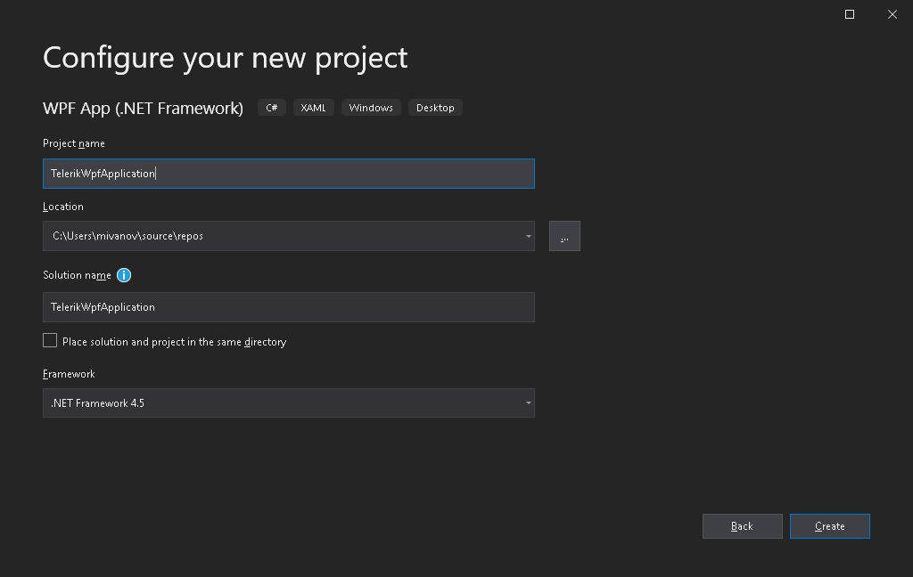
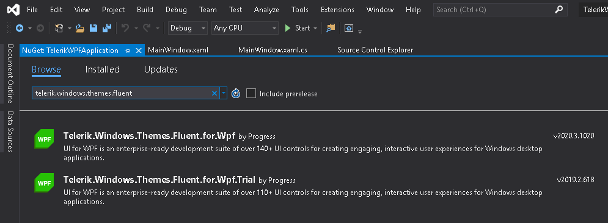
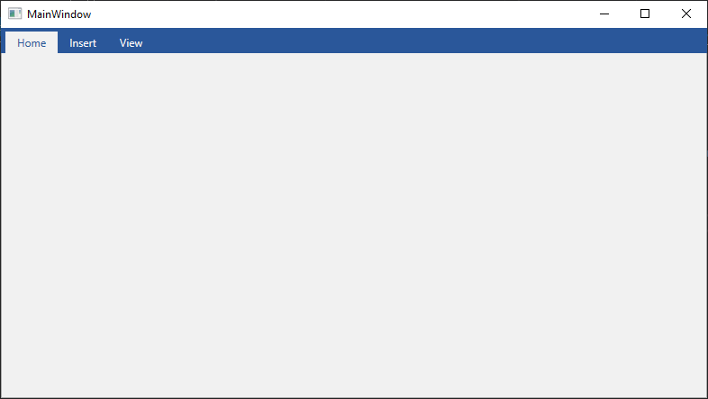
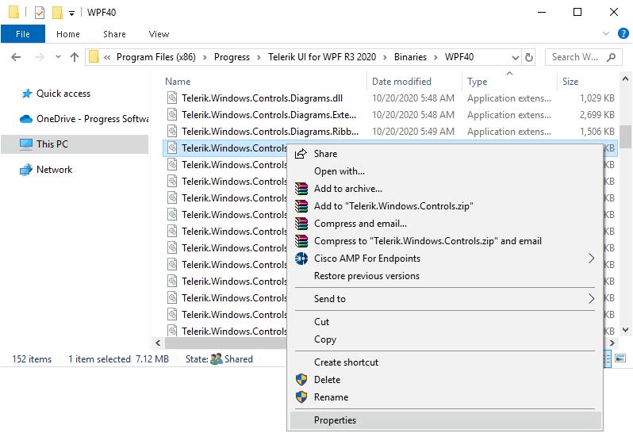

# First Steps With Telerik UI for WPF (Using Nuget Packages)

This article describes the lifecycle of a Telerik application when using NuGet packages. This includes creating, deploying, redistributing, and upgrading an application with referenced Telerik dlls.

## Creating a Project

To use the NuGet packages, create a new WPF project using the Visual Studio project template from the __File --> New --> Project__ menu. 

Set a __Project name__ and __Location__ for the project. For this example, we will use `TelerikWPFApplication` for the project's name.

This will create an empty WPF project where you can install the NuGet packages.

## Installing Nugets

This article shows how to connect to the Telerik NuGet server but you can also download the packages locally and use them offline. Read more in the [Installing UI for WPF from a NuGet package]() article.

To setup, the Telerik NuGet server, open the __Package Manager Settings__ menu in Visual Studio and create a new __package source__. Use `https://nuget.telerik.com/v3/index.json` as the __Source__. This step is described in details in the [Using the Telerik NuGet Server]() section of the NuGet article. Once you choose the Telerik package source in the Nuget manager, you will get prompted to login with your *telerik.com* account.

To install a Telerik dll, search for the name of the corresponding assembly in the search bar and then install it in the project.

There are two types of Telerik packages - [Xaml and NoXaml](). If the package name ends with `.Xaml` then the dlls are of the Xaml type. If doesn't contain this the dlls are NoXaml.

If you use [NoXaml]() dlls and the [implicit styles theming mechanism]() then you will need to install the package of the corresponding theme too. For example: `Telerik.Windows.Themes.Fluent`.

## Adding Telerik Controls

After you create the WPF project and install the NuGets, add any UI and related code-behind, models, and styles. This example will show a very basic setup which includes a RadTabControl with few tabs defined in XAML.

#### __[XAML] Example 1: Adding Telerik control in the UI__
{{region msi-or-zip-setup-lifecycle-0}}
	<Window x:Class="TelerikWpfApplication.MainWindow"
		xmlns="http://schemas.microsoft.com/winfx/2006/xaml/presentation"
		xmlns:x="http://schemas.microsoft.com/winfx/2006/xaml"
		xmlns:d="http://schemas.microsoft.com/expression/blend/2008"
		xmlns:mc="http://schemas.openxmlformats.org/markup-compatibility/2006"
		xmlns:local="clr-namespace:TelerikWpfApplication" xmlns:telerik="http://schemas.telerik.com/2008/xaml/presentation"
		mc:Ignorable="d"
		Title="MainWindow" Height="450" Width="800">
		<Grid>
			<telerik:RadTabControl>
				<telerik:RadTabItem Header="Home" />
				<telerik:RadTabItem Header="Insert" />
				<telerik:RadTabItem Header="View" />
			</telerik:RadTabControl>
		</Grid>
	</Window>
{{endregion}}

## Deploying the Application

To deploy a WPF application, you can use several different approaches, like XCopy, ClickOnce, or Windows Installer deployment. Read more about this in the [Deploy a WPF Application](https://docs.microsoft.com/en-us/dotnet/desktop/wpf/app-development/deploying-a-wpf-application-wpf?view=netframeworkdesktop-4.8) MSDN article. 

## Redistributing Telerik Application

Several rules should be kept in mind when redistributing an application with Telerik dlls. Read more about this in the [Redistributing Telerik Assemblies]() article.

## Upgrading the Project

To upgrade the project, open the Nuget package manager in Visual Studio and repeat the approach described in the [Installing Nugets](#installing-nugets) section. When you have the NuGets already installed, you can select a newer (or older) version from the drop-down menu and use the __Update__ button.

At this point, double-check if all the Telerik assemblies have the same version (for example, 2020.3.102) and if all or of the same type ([Xaml or NoXaml]()). To check this, right-click the .dll file (for example, Telerik.Windows.Controls.dll) and choose the __Properties__ option. 

Delete the __bin__ and __obj__ folders of the projects that reference Telerik dlls in the solution and then __Clean__, and __Rebuild__ them. This will ensure that no older Telerik dlls are cached and used during the compilation.

## See Also  
* [System Requirements]()
* [Download Product Files]()
* [Installing WPF Demos Application]()
