# First Steps with Telerik UI for WPF Using NuGet Packages

Use this article to set up a Telerik UI for WPF project with NuGet packages and confirm that the installation works. It covers project creation, package source selection, package installation, a basic verification step, upgrade guidance, and common setup issues.

## Before You Start

Before you install Telerik packages, confirm these prerequisites:

1. Install Visual Studio with the WPF development workload.
2. Verify that you can create and run a standard WPF application.
3. Make sure that your Telerik account has access to the required product version if you plan to use the Telerik NuGet server.

## Create the WPF Project

Create a new WPF project in Visual Studio:

1. Select **File** > **New** > **Project**.
2. Choose the **WPF Application** template.
3. Select **Next**.

**Create a new WPF project in Visual Studio.**
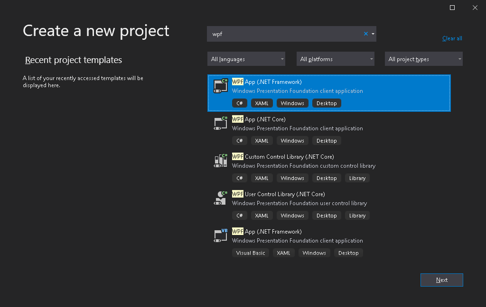

Then define the project details:

1. Enter a **Project name** and **Location**.
2. For this example, use `TelerikWpfApplication` as the project name.
3. Select **Create**.

**Set the project name and location for the new WPF project.**
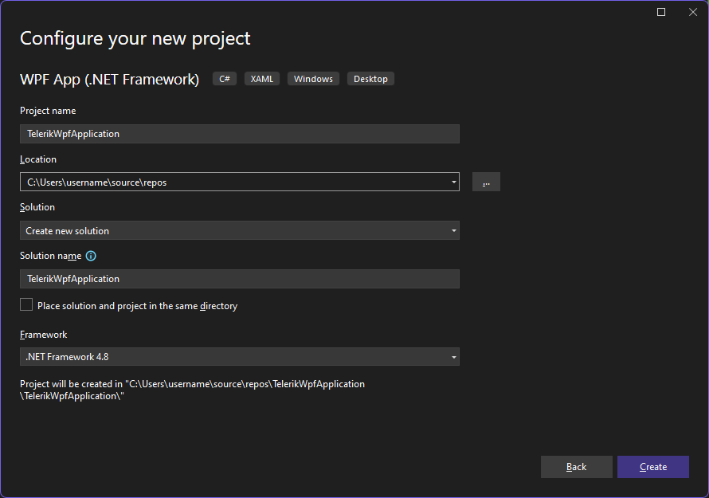

Visual Studio creates an empty WPF project that is ready for Telerik package installation.

**Open the newly created WPF project before you install Telerik packages.**
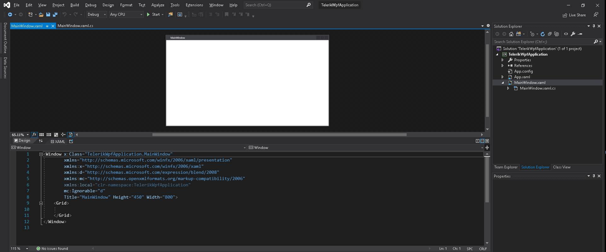

## Installing NuGets

You can install Telerik UI for WPF packages from the Telerik NuGet server. If you prefer an offline workflow, see [Install UI for WPF from a NuGet package]().

>important
> Starting with **Q3 2026**, all Telerik UI for WPF NuGet packages will be available on [NuGet.org](https://www.nuget.org/). If you install packages from NuGet.org, you do not need to configure the Telerik NuGet server.

### Configure the Telerik NuGet Server

If you want to install packages from the Telerik NuGet server, follow these steps:

1. Open **Tools** > **NuGet Package Manager** > **Package Manager Settings**.
2. Select **Package Sources**.
3. Add a new source that points to `https://nuget.telerik.com/v3/index.json`.
4. Save the new source and select it in the NuGet package manager.
5. When prompted for credentials, enter `api-key` as the user name and your Telerik NuGet API key as the password.

Generate the key from the [Telerik API Keys page](https://www.telerik.com/account/downloads/api-keys). For more detail about the feed setup, see [Use the Telerik NuGet server]().

### Install the Required Packages

Install the Telerik package for each control that the project uses:

1. Right-click the project and select **Manage NuGet Packages**.
2. Open the **Browse** tab.
3. Search for the package that contains the control you want to use.
4. Select the required version and install it.
5. Repeat for every Telerik control package that the project references.

For a `RadTabControl` example, install `Telerik.Windows.Controls.Navigation` or `Telerik.Windows.Controls.Navigation.Xaml`, depending on the package type that your project uses.

**Install the Telerik package that contains the control you want to use.**
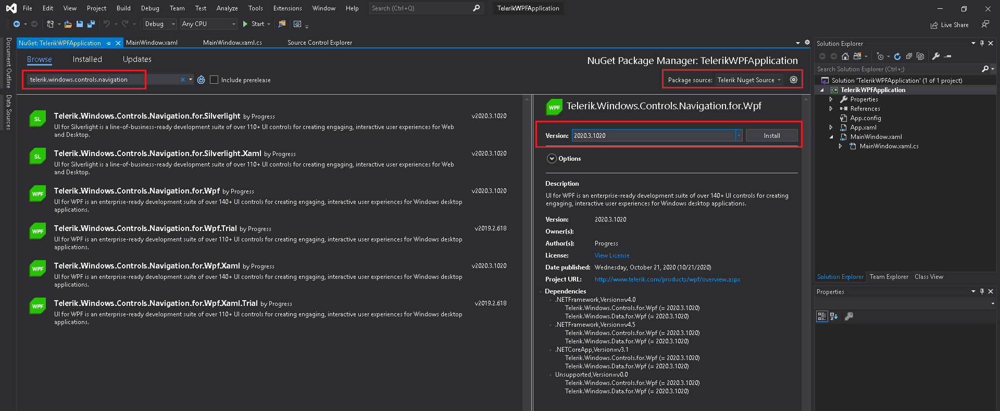

### Choose Between Xaml and NoXaml Packages

Telerik UI for WPF provides two package types:

- Use Xaml packages when the package name ends with `.Xaml`.
- Use NoXaml packages when the package name does not contain `.Xaml`.

Keep all Telerik packages in the same project on the same version and of the same package type. Mixing Xaml and NoXaml packages usually causes missing styles, designer issues, or build errors.

**The package list shows both Xaml and NoXaml variants for the same Telerik control.**
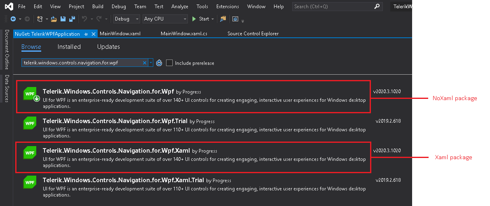

### Add a Theme Package for NoXaml Projects

If you use NoXaml packages together with the [implicit styles theming mechanism](), install the matching theme package too. For example, install `Telerik.Windows.Themes.Fluent` when you apply the Fluent theme.

**Install the matching theme package when the project uses NoXaml assemblies.**
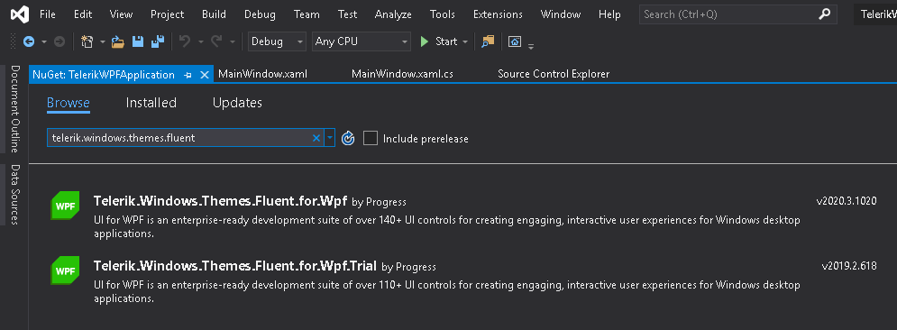

## Adding Telerik Controls

After you install the packages, add Telerik UI to the main window and build the project to confirm that the references resolve correctly. The following example adds a `RadTabControl` with three tabs.

**Example 1: Add a Telerik control to the main window.**
```xaml
<Window x:Class="TelerikWpfApplication.MainWindow"
        xmlns="http://schemas.microsoft.com/winfx/2006/xaml/presentation"
        xmlns:x="http://schemas.microsoft.com/winfx/2006/xaml"
        xmlns:d="http://schemas.microsoft.com/expression/blend/2008"
        xmlns:mc="http://schemas.openxmlformats.org/markup-compatibility/2006"
        xmlns:local="clr-namespace:TelerikWpfApplication" xmlns:telerik="http://schemas.telerik.com/2008/xaml/presentation"
        mc:Ignorable="d"
        Title="MainWindow"
        Height="450"
        Width="800">
    <Grid>
        <telerik:RadTabControl>
            <telerik:RadTabItem Header="Home" />
            <telerik:RadTabItem Header="Insert" />
            <telerik:RadTabItem Header="View" />
        </telerik:RadTabControl>
    </Grid>
</Window>
```

Build and run the project. If the window opens and the `RadTabControl` renders without missing assembly errors, the NuGet installation is working.

**A WPF window that displays a Telerik RadTabControl after package installation.**
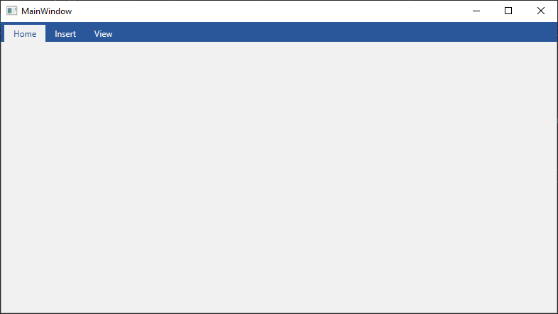

Use this quick verification checklist before you continue:

1. Build the project.
2. Confirm that the `telerik` XML namespace resolves in XAML.
3. Confirm that the required Telerik assemblies appear under **Dependencies** or **References**.
4. Run the application and verify that the Telerik control renders.

If the project uses NoXaml packages and the control appears without styling, add the required theme resources as described in [Choose between Xaml and NoXaml packages]() and [Implicit styles overview]().

## Deployment and Redistribution

When you deploy or redistribute a WPF application that uses Telerik UI for WPF, include the Telerik assemblies and theme assemblies that the project references. Use the following resources to plan that step:

- Review [Microsoft deployment guidance for WPF applications](https://docs.microsoft.com/en-us/dotnet/desktop/wpf/app-development/deploying-a-wpf-application-wpf?view=netframeworkdesktop-4.8) for XCopy, ClickOnce, and Windows Installer options.
- Review [Redistribute Telerik assemblies]() before you ship the application.
- Keep the deployed Telerik assemblies on matching versions to avoid runtime and styling issues.

## Upgrading the Project

When you upgrade Telerik packages, use the same package source and package type that the project already uses:

1. Open **Manage NuGet Packages** in Visual Studio.
2. Select the installed Telerik package.
3. Choose the target version from the version list.
4. Select **Update**.
5. Repeat until every Telerik package in the solution uses the same version.

**Select the Telerik package version that you want to install.**
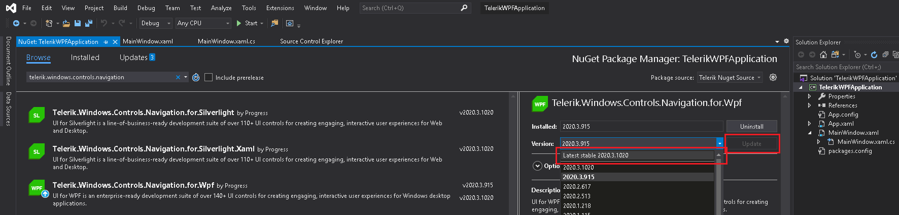

After the update, verify these items before you rebuild the solution:

1. All Telerik assemblies use the same version, for example `2020.3.102`.
2. All Telerik assemblies use the same package type, either Xaml or NoXaml.
3. Any NoXaml theme package uses the same version as the control assemblies.

To inspect an assembly version, right-click the `.dll` file, for example `Telerik.Windows.Controls.dll`, and select **Properties**.

**Open the assembly properties to confirm the installed Telerik version.**
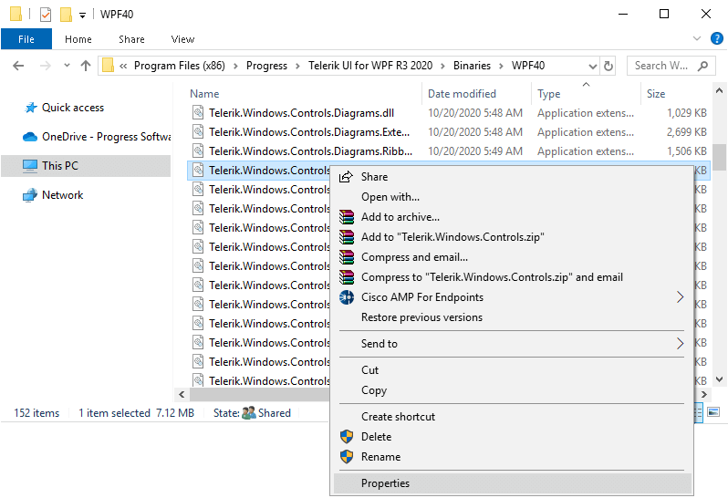

**Review the assembly details to confirm whether the package is a NoXaml build.**
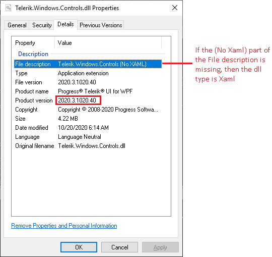

>warning
> If Visual Studio still resolves older Telerik assemblies after an upgrade, clean the build output before you continue.

Delete the `bin` and `obj` folders for the projects that reference Telerik assemblies, then run **Build** > **Clean Solution** and **Build** > **Rebuild Solution**. This step removes cached files that can keep older Telerik versions in the build output.

**Remove the generated build folders before rebuilding the solution.**
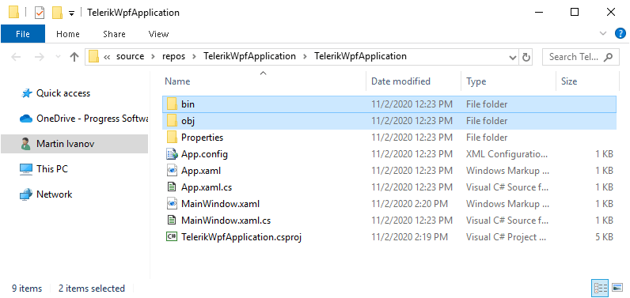

**Clean and rebuild the solution after the package update.**
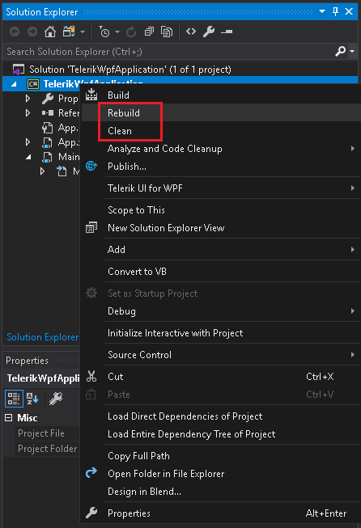

## Troubleshoot Common Issues

Use these checks when the project does not build or the control does not render as expected:

- If package source authentication fails, confirm that the user name is `api-key` and generate a new key from the Telerik account portal if needed.
- If the XAML designer or build reports missing Telerik assemblies, confirm that every Telerik package uses the same version.
- If the application uses NoXaml packages and the controls render without styling, install the matching theme package and load the required theme resources.
- If errors persist after an upgrade, delete the `bin` and `obj` folders, then clean and rebuild the solution.

## See Also
* [Install UI for WPF from a NuGet package]()
* [Use the Telerik NuGet server]()
* [Choose between Xaml and NoXaml packages]()
* [System requirements]()
* [Download product files]()
* [Install the WPF demos application]()
