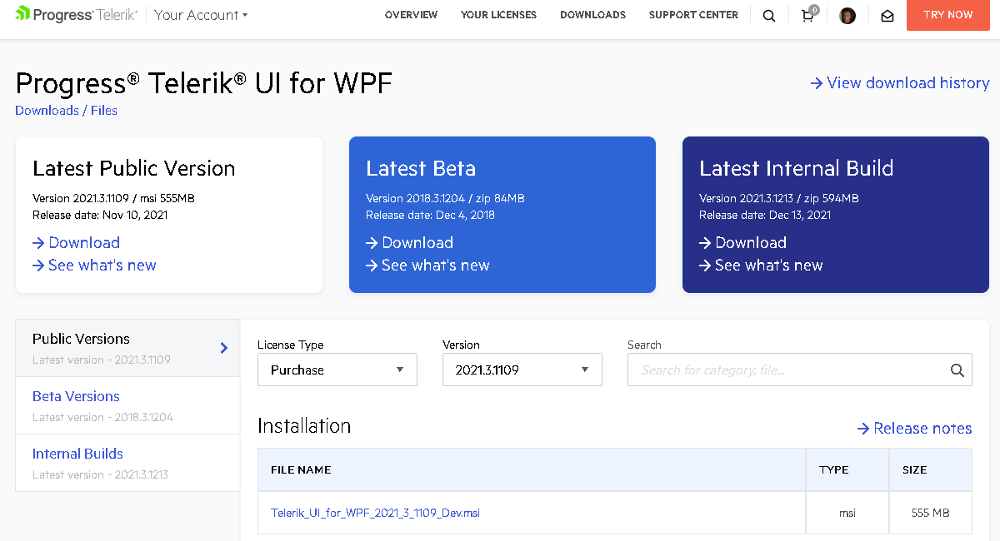
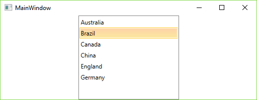

# First Steps

This article explains how to get the Telerik UI for WPF controls in your project and start using them quickly.

Once you have your first simple control up and running, take a look at the [next steps](#next-steps) section to start exploring the control functionality in more details.

For additional resources you can also review the Related Articles section on the right.

## Download the Controls

The easiest way to get the controls to your development machine is to use the [Progress Control Panel](https://www.telerik.com/download-trial-file/v2/control-panel) or to download the automated MSI installer from [your telerik.com account](https://www.telerik.com/account/product-download?product=RCWPF).

>caption Figure 1: Download automated (.msi) installer

> If you are not a customer, you can [download a free, fully functional trial](https://www.telerik.com/download-trial-file/v2-b/ui-for-wpf) and the same options will apply to you as well.

>tip The following article can help you choose the installation type that is most suitable for your needs and preferences: [Which File Do I Need to Install]().

## Creating Application with Telerik Visual Studio Extensions

The easiest way to create a Telerik UI for WPF project is to use **Visual Studio Extensions** which are distributed with the Telerik UI for WPF installer.

The Visual Studio Extensions can be accessed through the Telerik | Telerik UI for WPF menu which has different menu items depending on the selected project in Visual Studio. The extensions can be accessed through the context menu of a WPF Application as well.

1. Open [Microsoft Visual Studio]().

2. Create new Telerik WPF application.

	#### __Figure 2: Go to Telerik > Telerik  UI for WPF > Create New Telerik Project__
	
	
	#### __Figure 3: Creating new Telerik application__	
	

	>You can choose __.Net Framework 4.0__ or __.Net Framework 4.5__ for your application.

3. Choose the application template. The options are a blank template or one of the MS Office inspired application templates. Choose the Blank option.
	
	#### __Figure 4: Choosing an application template__
	

	At this point the project references only the common Telerik.Windows.Controls.dll. 

4. Configure the project using the Project Configuration Wizard. You can do that by going to Telerik > Telerik UI for WPF > Configure Project. When you open the wizard you can select the controls you are going to use from the list (or search them in the search box). Once you have selected them, click OK and it will add the required dlls and references to your project.

	#### __Figure 5: Adding references to the charting controls__
		

	> This step is optional and you will only need it if you use controls that are not defined in Telerik.Windows.Controls.dll.

## Add a Teleik Control to the Project

1. **Add a Telerik control** to the page, for example, a [RadListBox]():

	#### __[XAML] Example 1: Adding RadListBoxItems__
	{{region xaml-radlistbox-getting-started_1}}
		<telerik:RadListBox  Width="200" x:Name="radListBox">
			<telerik:RadListBoxItem Content="Australia" />
			<telerik:RadListBoxItem Content="Brazil" />
			<telerik:RadListBoxItem Content="Canada" />
			<telerik:RadListBoxItem Content="China" />
			<telerik:RadListBoxItem Content="England" />
			<telerik:RadListBoxItem Content="Germany" />
		</telerik:RadListBox>
	{{endregion}}

2. **Run the project** by pressing **F5**. You should see something like this:

	>caption Figure 6: The final result

	

## Next Steps

Now that you have the Telerik UI for WPF controls running in your project, you may want to explore their features, customize their behavior or change their appearance. Below you can find guidance on getting started with such tasks:

* [Explore control features]()
* [Change control appearance]()
* [Further information]()

## See Also

* [System Requirements]()
* [Download Product Files]()
* [Add Telerik Namespace]()
* [Progress Virtual Classroom](https://www.telerik.com/account/support/virtual-classroom)
