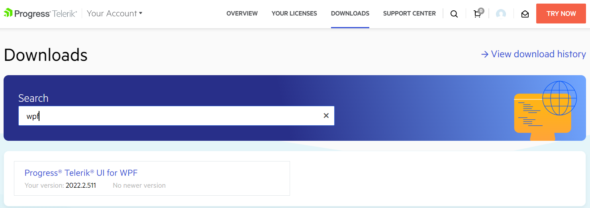
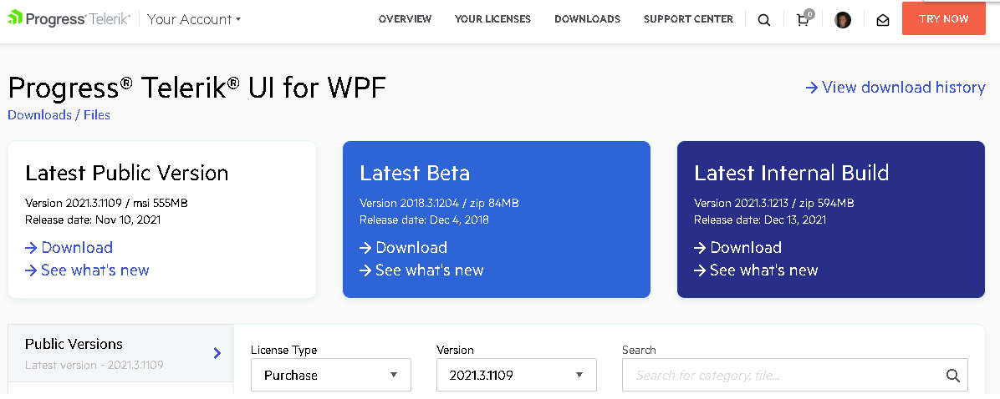
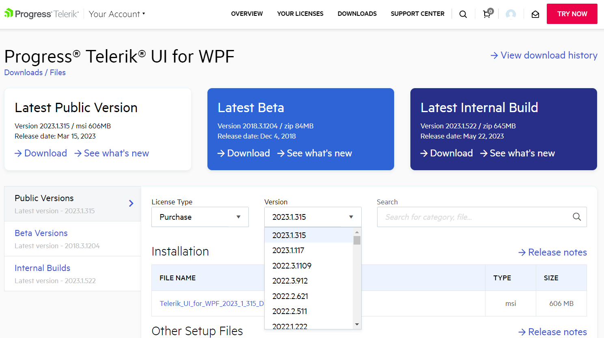

# Download Product Files

When you have an active trial or developer license, you can download the following files:

* Standalone installation
* Assemblies and themes only
* Latest internal builds
* Documentation files
* Old versions
* Source code – available only with a developer license

>Check the [Trial License Limitations]() topic for more details on the available licenses.

In order to download these you need to take the following steps or [click on this direct link](https://www.telerik.com/account/product-download?product=RCWPF).

1. Log into your [Telerik account](https://www.telerik.com/account/).

2. Click on the __Downloads__ tab:

	

3. Select __Telerik UI for WPF__ product title:
	
	

4. The next page allows you to download the Automatic Installation msi file, DLLs and themes, PDB files, NuGet Packages, documentation files, and Source code. 

	

Below you could find a list of the available files separated by category.

## Available Files

The following section lists the files that can be download from the Telerik UI for WPF download page. The download separates the files in several categories - "Installation", "Other Setup Files", "Documentation", "Resources" and "Source Code".

The following placeholder words will be used in the list to omit the need to add the concrete license type or product version:

* `[license]`&mdash;Could be Trial or Dev depending on the license you have.

* `[version]`&mdash;Replaces the version the file corresponds to. For example: "2024_2_423".

#### Installation

* `Telerik_UI_for_WPF_[version]_[license].msi`&mdash;Automatic installation, check [Installing Telerik UI for WPF from MSI file]() for more details.

#### Other Setup Files

* `Telerik_UI_for_WPF_[version]_[license]_Dlls.zip`&mdash;Used for manual installation, for more details check [Installing Telerik UI for WPF from ZIP file]().
* `Telerik_UI_for_WPF_[version]_Themes.zip`&mdash;Contains two folders containing the default styles and templates for the controls when using the [Xaml and NoXaml]().
* `Telerik_UI_for_WPF_[version]_[license]_PDBs.zip`
* `Telerik_UI_for_WPF_[version]_[license]\_NuGet_Xaml.zip`
* `Telerik_UI_for_WPF_[version]_[license]\_NuGet_NoXaml.zip`
* `Telerik_UI_for_WPF_[version]_[license]\_NuGet_Separate_Packages_Xaml.zip`
* `Telerik_UI_for_WPF_[version]_[license]\_NuGet_Separate_Packages_NoXaml.zip`

In versions prior Q1 2024, there is a .zip file with digitally signed version of the Telerik assembles - __Telerik_UI_for_WPF_[version]_[license]_Hotfix_DIGITALLY_SIGNED.zip__. With the Q1 2024 release __all Telerik dlls are digitally signed__ and there is no need of a separate package, which is why this .zip is no longer distributed.

>Check [Setting a theme]() topic for more information on the Xaml and NoXaml binaries.

>tip Check [Installing UI from a Nuget package]() for more details on using the provided packages.

### Documentation

This section contains the offline help documentation as well as the API Reference in a `PDF` format. The documentation covers the Telerik UI for WPF and [Document Processing](https://docs.telerik.com/devtools/document-processing/introduction) products.

* `Telerik_UI_for_WPF_[version].pdf`
* `Telerik_Document_Processing_[version].pdf`

### Resources

You could download the complete source code of the Telerik [WPF Demos application]() as well as the provided sample applications.

* `Telerik_UI_for_WPF_[version]_[license]_Demos.msi`
* `Telerik_UI_for_WPF_[version]_Demos_Source.zip`
* `CRM_WPF_[version]_[license]_Source.zip`
* `OutlookInspiredApp_WPF_[version]_[license]_Source.zip`
* `ColorThemeGenerator_WPF_[version]_[license]_Source.zip`
* `ERP_WPF_[version]_[license]_Source.zip`

### Source Code

* `Telerik_UI_for_WPF_[version]_Source.zip`&mdash;Complete source code of the Telerik UI for WPF product, available only with Developer license.
* `Telerik_UI_for_WPF_[version]_DPL_Source.zip`&mdash;Complete source code of the Telerik Document Processing product, available only with Developer license.

## Available versions

From the __Versions__ dropdown you can select an older version to download:

>important Please note that if you do not see the desired version you can contact our [sales team](mailto:sales@telerik.com) and they will enable the version for download.

## See Also  
 * [Installing Telerik UI for WPF from MSI File]()
 * [Installing Telerik UI for WPF from ZIP File]()
 * [Installing Telerik UI for WPF from a NuGet package]()
