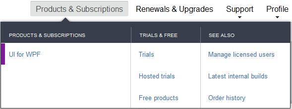
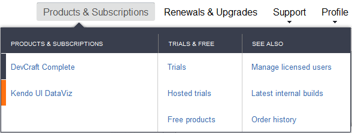
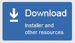
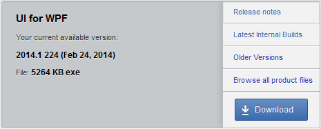
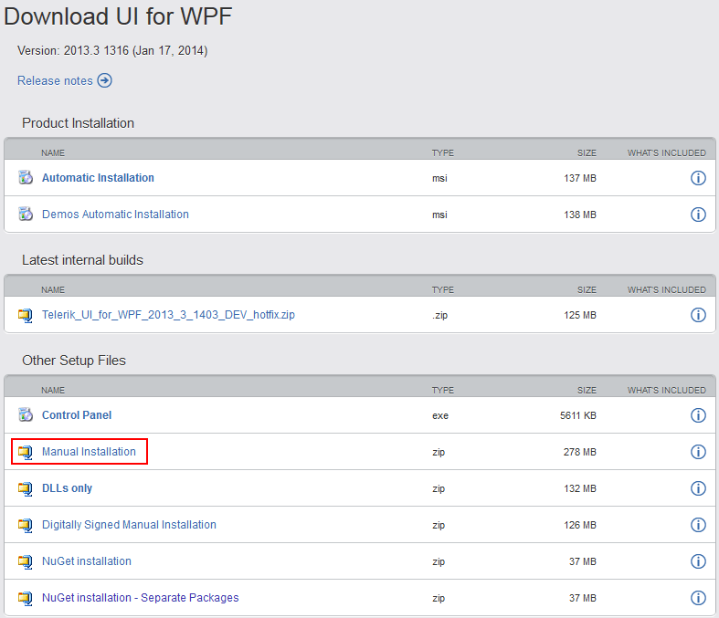

# Installing UI for WPF from ZIP File

The following topic describes what steps you should perform in order to install Telerik UI for WPF manually from a __ZIP__ file. The [ZIP](http://en.wikipedia.org/wiki/ZIP_%28file_format%29) is used for manual (advanced) installs and upgrading/updating purposes.

>tipFor more information about which installation package you need to install, read [here]().
      
>tipFor more information about the system requirements, read [here]().

With the Q1 2014 release we no longer provide the full ZIP package. Instead you could download the Hotfix ZIP and if needed download the Themes separately. In the following sections we will go through the download process for Q1 2014 release as well as the previous versions.

## From Q1 2014 afterwards

### Downloading ZIP Package

* Go to to the UI for WPF download page following the instructions in [Download Product Files]() topic.

* Download the ZIP file and extract it in the desired location.

### Exploring the Extracted Folders

Once the archived folders are extracted you will probably note the following folder structure:

* __Binaries__ - the standard binaries.              

* __Binaries.NoXaml__ - binaries without XAML.              

* __LicenseAgreements__

* __Themes.Implicit__ - implicit styles friendly XAML.
              
>importantWith the Q1 2014 release we no longer provide the Themes and pdb files within the installation package. You could download them separately from the UI for WPF download page in your [Telerik account](http://www.telerik.com/account.aspx).
              
>The WPF Demos application can be downloaded from the UI for WPF download page (in the [Telerik account](http://www.telerik.com/account.aspx)) as a separate ZIP file as well.
              
## Before Q1 2014

### Downloading ZIP Package

In order to download the ZIP file, follow the instructions below:

* Log into your [Telerik account](http://www.telerik.com/account.aspx).
              

* Click __Products  & Subscriptions__ and then select UI for WPF from the dropdown (or Trial downloads if you are a trial user).

>If you've purchased Telerik DevCraft Complete/Ultimate bundle, you will see it in the Products & Subscriptions dropdown.
>

* Click "Download Installer and other resources" button.

>Again, if you've purchased Telerik DevCraft Complete/Ultimate bundle, you will be redirected to a page with all the products in the suite.
>Scroll to "UI for WPF" product. Click "Browse all product files" to go to the details download page.
>

* Click the "Manual installation" link.

* Download the ZIP file and extract it in the desired location.

### Exploring the Extracted Folders

Once the archived folders are extracted you will probably note the following folder structure:

* __Binaries__ - the standard binaries.              

* __Binaries.NoXaml__ - binaries without XAML.              

* __LicenseAgreements__

* __Themes__ - the standard styles for all Telerik themes.              

* __Themes.Implicit__ - implicit styles friendly XAML.              

>You can install the Demos separately, downloading the 'Demos Automatic Installation" from your account.

## See Also

 * [Using the Hotfix (DLLs Only)]()

 * [Trial License Limitations]()

 * [Adding UI for WPF to the Visual Studio 2012 Toolbox]()
