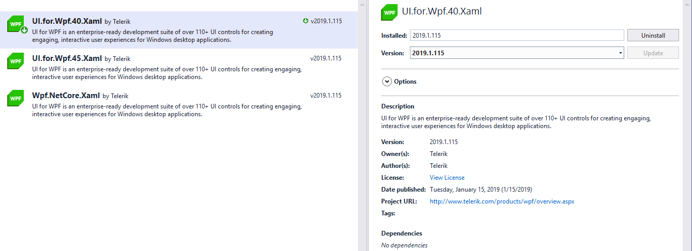
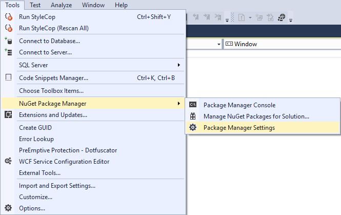
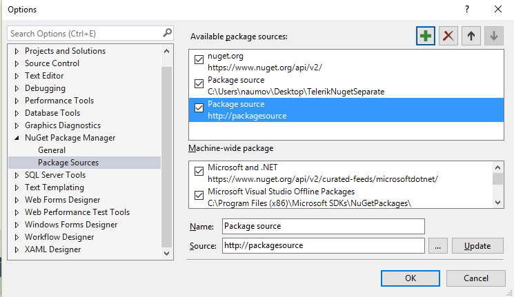
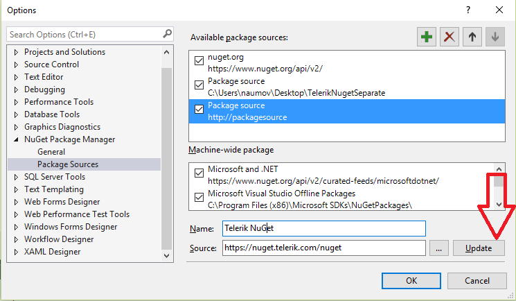
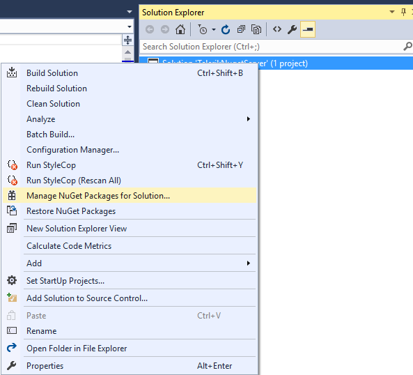
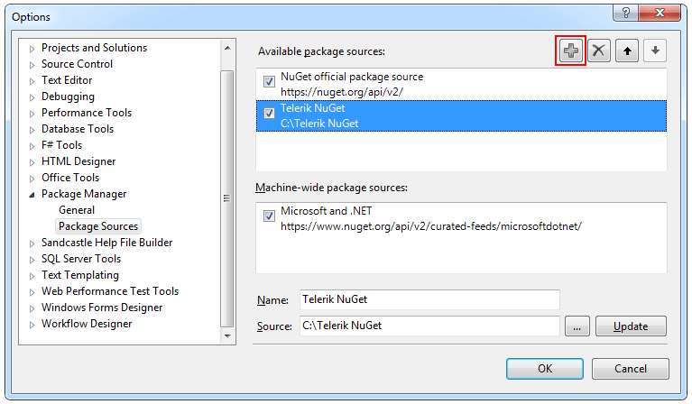
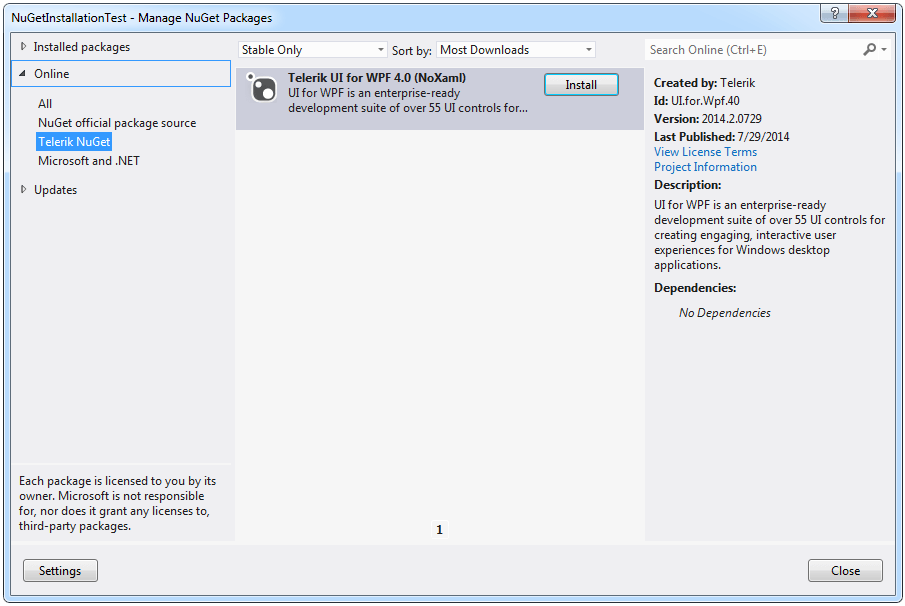
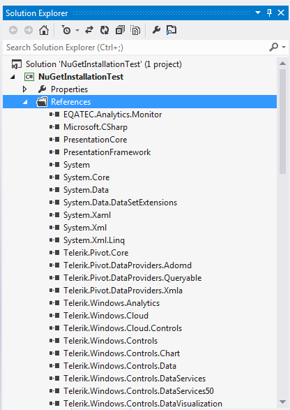
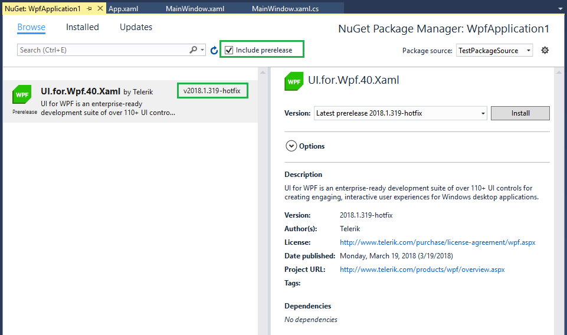

# Installing UI for WPF from a NuGet package

<iframe width="800" height="400" src="https://www.youtube.com/embed/c3m_BLMXNDk" frameborder="0" allow="accelerometer; autoplay; encrypted-media; gyroscope; picture-in-picture" allowfullscreen></iframe>

The following topic describes how you can install Telerik UI for WPF from a [NuGet package](http://www.nuget.org/).

## Available Packages

We provide separate packages for the different assemblies from the UI for WPF suite and a common NuGet package containing all the dlls. Below you can find some information about the different packages. 

* Nuget packages with the individual UI for WPF assemblies:

    These packages can be downloaded by [using the telerik NuGet server](#using-the-telerik-nuget-server) or by [using a local package source](#using-a-local-package-source) and they only download the references that the assembly depends on. Additionally, the separate nuget packages will detect the __Target Framework__ of your project and download the UI for WPF dlls with the correct version (.NET Framework dlls or .NET Core dlls (available, since __R1 2019__)).

* Nuget packages with all of the UI for WPF assemblies: 

    These packages are not available for download from the Telerik Nuget Server. To use them, check out the [using a local package source](#using-a-local-package-source) section.

    > The NuGet packages containing all of the UI for WPF dlls are available for the supported .NET Framework versions. Since __R1 2019__, a .NET Core 3 UI for WPF NuGet Package is also available.
    >

## Using the Telerik NuGet Server

Through the Telerik NuGet Server users can easily include the Telerik UI for WPF suite and update to the latest official version. The following steps will demonstrate how this can be done in Visual Studio:

1.Navigate to the Package Manager Settings menu.

2.Add a new source in the Package Sources section.

3.In the Source field fill the address of the Telerik NuGet Server and click Update.

4.The Telerik Server is added and ready to use. Click on the Manage NuGet Packages menu.

5.Set the Telerik Server as a package source. Enter user credentials (from your Telerik account) when prompted and search for the needed package.

>importantFor each NuGet package we provide two options. The Nuget packages that have __Xaml__ in their name will download the [Xaml](#xaml-assemblies) dlls and the ones that don't, will download the [NoXaml](#noxaml-assemblies) dlls. Mixing Xaml and NoXaml dlls in your projects is __not__ recommended.  

>Using this approach you can only use versions from **2016.3.1024** and later. If you need to use a previous version of the suite you will need to create a local package source as described in the next section.

## Using a Local Package Source

In order to set up a local package source, you can follow these steps:

* Go to to the [UI for WPF Downloads](https://www.telerik.com/account/product-download?product=RCWPF) page.

> You have 4 options when downloading the NuGet packages from your account. The files named __Telerik_UI_for_WPF_{version}_NuGet_{Xaml/NoXaml}_Dev.zip__ are available for the supported .NET versions and combine all UI for WPF assemblies in one NuGet. The files named __Telerik_UI_for_WPF_{version}_NuGet_Separate_Packages_{Xaml/NoXaml}_Dev.zip__ contain the separate NuGet packages of all UI for WPF assemblies.

* Download the needed NuGet .zip file(s) depending on whether you're using [Xaml or NoXaml]() binaries and extract it into the folder where your Telerik NuGet packages are located.

> If you haven’t set a Telerik NuGet folder, you can do it by clicking the __Settings__ button on the __“Manage NuGet Packages”__ dialog, then add the folder where you’ve extracted the .nupkg file (for example C://Telerik NuGet) as a new package source inside the __Options__ dialog:
>

Once you open the __“Manage NuGet Packages”__ dialog in Visual Studio (right-click Project References -> Manage NuGet Packages), you can select the Telerik NuGet option and the available packages there will be shown:

Click the “Install” button and the references will be automatically added to your project as shown below:

>tip Additionally, you can create a private NuGet Feed and deploy the Telerik NuGet packages there - for more details refer to [this blog post](http://blogs.telerik.com/careypayette/posts/13-03-11/power-your-projects-with-telerik---now-with-the-convenience-of-nuget).
  
## Installing Latest Internal Build NuGet Packages

You can install and test the Latest Internal Build (LIB) dlls provided on a weekly basis, via the Nuget Package Manager. The LIB nugets are __available only as .nupkg files__ that can be downloaded from your telerik.com account. This means that you will need to create a [local package source](#using-a-local-package-source) and copy the files there. You __cannot__ download LIB dlls via the online Telerik nuget server (https://nuget.telerik.com/nuget), because they are not available there.

When you set up the package source and place the NuGet files there, you can find them in the Nuget Package Manager. To see the LIB packages you will need also to check the __Include prerelease__ option. The LIB packages have the __-hotfix__ postfix in the version field.

          
## See Also

 * [Which File Do I Need to Install?]()

 * [Installing UI for WPF from MSI File]()

 * [Installing UI for WPF from ZIP File]()
