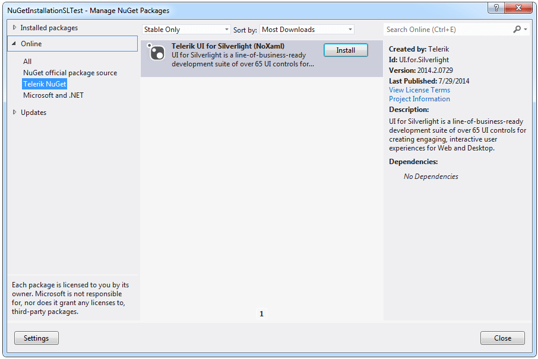
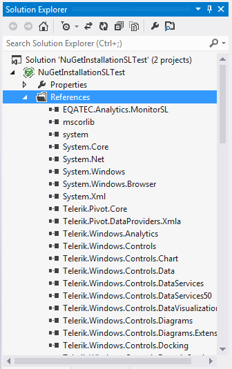
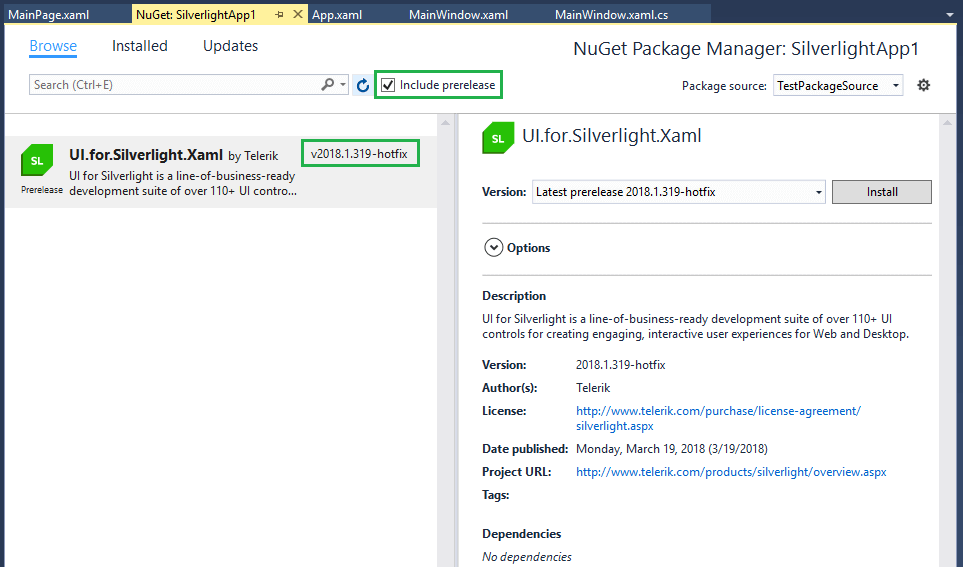
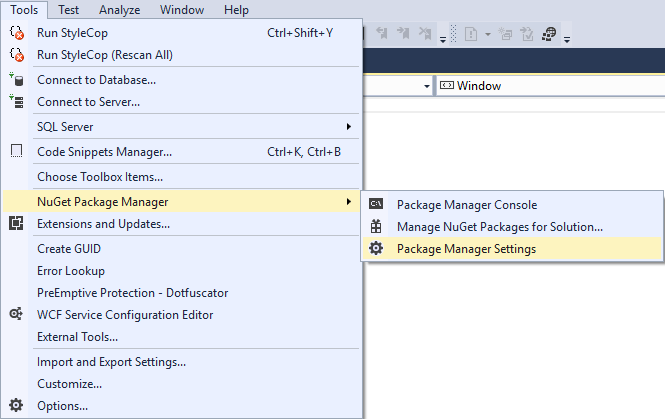
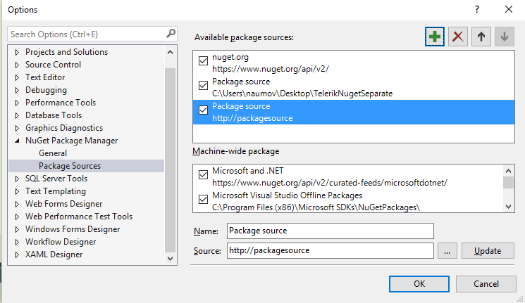
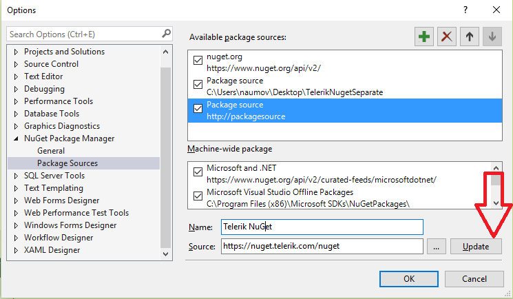
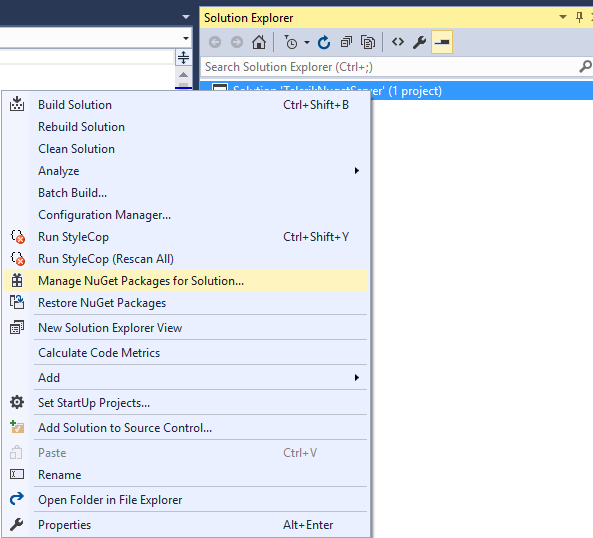
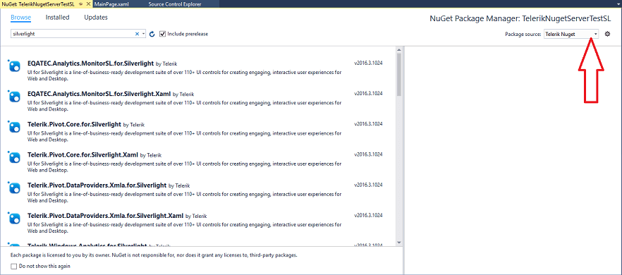

# Installing UI for Silverlight from a NuGet package

<iframe width="800" height="400" src="https://www.youtube.com/embed/c3m_BLMXNDk" frameborder="0" allow="accelerometer; autoplay; encrypted-media; gyroscope; picture-in-picture" allowfullscreen></iframe>

The following topic describes what steps you should perform in order to install Telerik UI for Silverlight from a [NuGet package](http://www.nuget.org/).
   
We’re providing a common NuGet package containing all the assemblies from the UI for Silverlight suite as well as separate packages for the different assemblies. It is up to you to decide which one is more suitable for your project. 

>importantThe provided NuGet packages contain either __NoXaml binaries__ or __XAML binaries__. Check the [Setting a Theme (Using  Implicit Styles)]() help topic for more details on the NoXaml binaries and Implicit Styles.
 
We will go through the following sections: 

* [Downloading the NuGet packages](#downloading-the-nuget-packages)

* [Installing Silverlight Controls Package](#installing-silverlight-controls-package)

* [Installing Latest Internal Build NuGet Packages](#installing-latest-internal-build-nuget-packages)

* [Add the Telerik NuGet Server](#add-the-telerik-nuget-server)

## Downloading the NuGet packages

In order to download the latest NuGet packages, follow the instructions below:

*  Go to to the UI for Silverlight download page following the instructions in [Download Product Files]() topic.
          
* Download the needed NuGet .zip file depending on whether you're using Xaml or NoXaml binaries and extract it into the folder where your Telerik NuGet packages are located.

## Installing Silverlight Controls Package
      
The next steps show how to install the complete NuGet package which includes all the assemblies.The approach is the same for the separate packages. 

Once you open the __“Manage NuGet Packages”__ dialog in Visual Studio (right-click Project References -> Manage NuGet Packages), you can select the Telerik NuGet folder and the available packages there will be shown: 

>If you haven’t set the Telerik NuGet folder until now, you can do it by clicking __Settings__ button on the __“Manage NuGet Packages”__ dialog, then add the folder where you’ve extracted the .nupkg file (for example C://Telerik NuGet) as a new package source inside the __Options__ dialog:
>

Click the “Install” button and the references will be automatically added to your project as shown below:

You can now use the Telerik Silverlight controls in your project. 

>tipAdditionally, you can create a private NuGet Feed and deploy the Telerik NuGet packages there - for more details refer to [this blog post](http://blogs.telerik.com/careypayette/posts/13-03-11/power-your-projects-with-telerik---now-with-the-convenience-of-nuget).

## Installing Latest Internal Build NuGet Packages

You can install and test the Latest Internal Build (LIB) dlls provided on a weekly basis, via the Nuget Package Manager. You can see how to set up the nugets in a local nuget source (package source) in the [Installing Silverlight Controls Package](#installing-silverlight-controls-package) section of this article. 

> The LIB nugets are __available only as .nupkg files__ that can be downloaded from your telerik.com account. This means that you will need to create a local package source and copy the files there. You cannot download LIB dlls via the online telerik nuget server (https://nuget.telerik.com/nuget) because they are not available there.

When you set up the package source and place the nuget files there, you can find them in the Nuget Package Manager. To see the LIB packages you will need also to check the __Include prerelease__ option. The LIB packages have the __-hotfix__ postfix in the version field.

## Add the Telerik NuGet Server

Through the Telerik NuGet Server users can easily include the Telerik UI for Silverlight suite and update to latest official version without having to log into their Telerik account. The following steps will demonstrate how this can be done in Visual Studio.

1.Navigate to the Package Manager Settings menu.

2.Add new source in the Package Sources section.

3.In the Source field fill the address of the Telerik NuGet Server and click Update

4.The Telerik Server is added and ready to use. Click on the Manage NuGet Packages menu.

5.Set the Telerik Server as a package source. Enter user credentials when prompted and search for the needed package.

## See Also

 * [Which File Do I Need to Install?]()

 * [Installing UI for Silverlight from MSI File]()

 * [Installing UI for Silverlight from ZIP File]()
