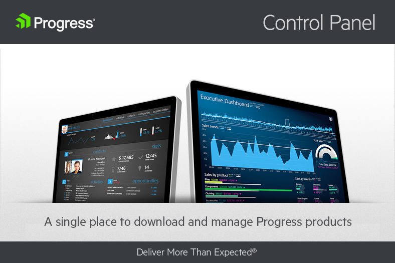
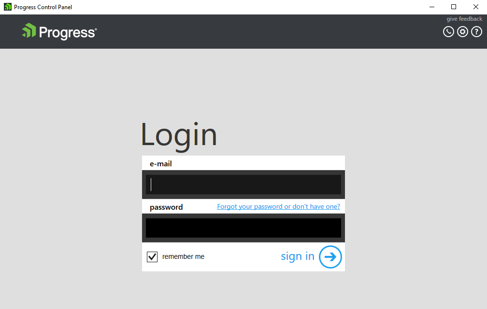
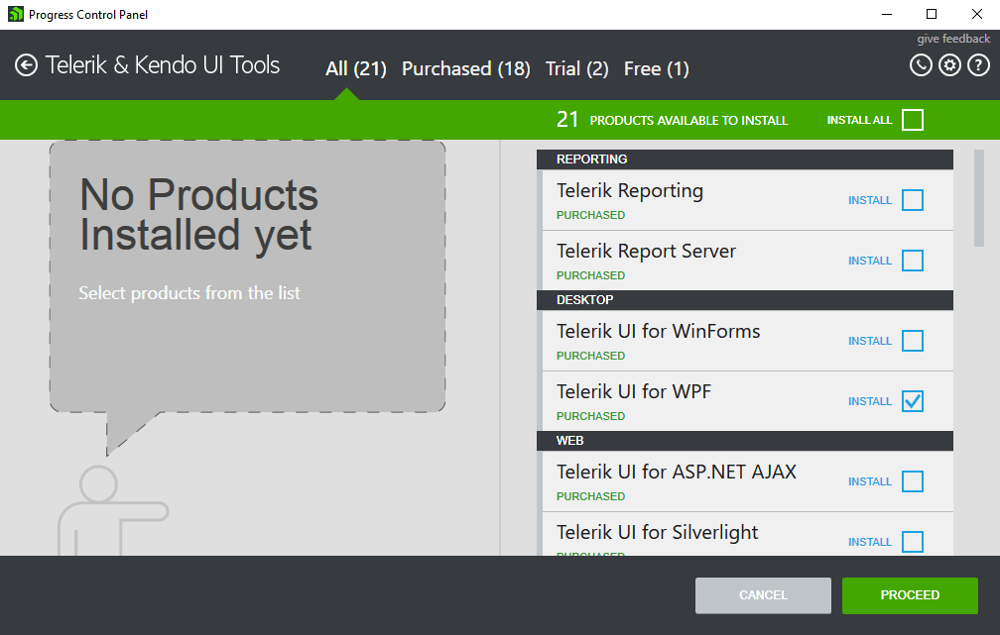
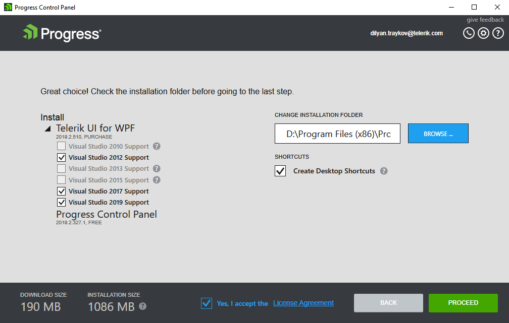
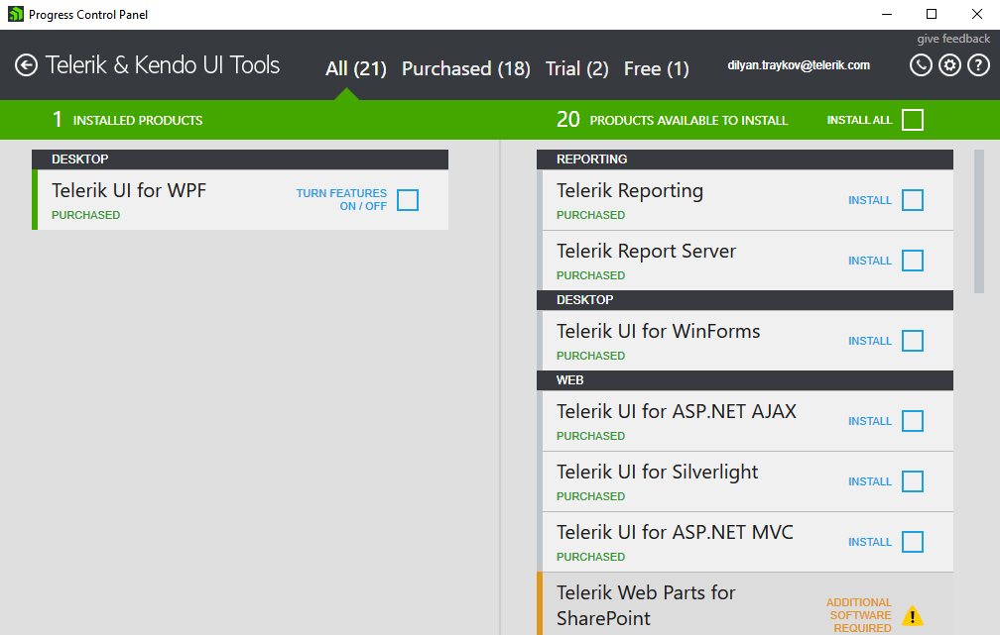

# Installing from Progress Control Panel

The Telerik UI for {{ site.framework_name }} controls can also be installed via the **Progress Control Panel**.

> Note that the recommended installation approach is to use the [Telerik NuGet packages]()

## Downloading and Log-in

To start, download the Progress Control Panel from the following [page](https://www.telerik.com/download-trial-file/v2/control-panel) and run the downloaded `.exe` file. You will soon be presented with the login screen where you need to provide your Telerik account credentials to sign in.

__The Progress Control Panel Login Screen__  

## Selecting Products to Install

Afterwards, you will be presented with a screen containing sections for **All** products, **Purchased** products, **Trial** products, and **Free** products. These sections each have a split screen view - the left contains installed products that can be updated and the right contains products that can be installed.

You can continue by selecting the **Telerik UI for {{ site.framework_name }}** suite. Once you click the checkbox, the option to proceed or cancel will be displayed.

__The Progress Control Panel List of Available Products__

## Configurating Installation

Once you click **Proceed**, you will then be given the opportunity to review your choice and make changes to the installation folder. When you're ready to proceed, accept the license agreements and click **Proceed** once more. If you forgot something or checked the wrong box, click **Back** and correct your selection.

__The Progress Control Panel Installation Configuration Page__

When you click Proceed, the Progress Control Panel will download the necessary files for installation and then install them to the location you selected.

## Next Steps

After the installation is complete, you will be returned to the main screen to install or update more products.

__The Progress Control Panel with Telerik UI for WPF Installed__

You can now start [creating your first Telerik UI for WPF project](#creating-a-project).

## See Also  
* [First Steps]()
* [Explore Control Features]()

