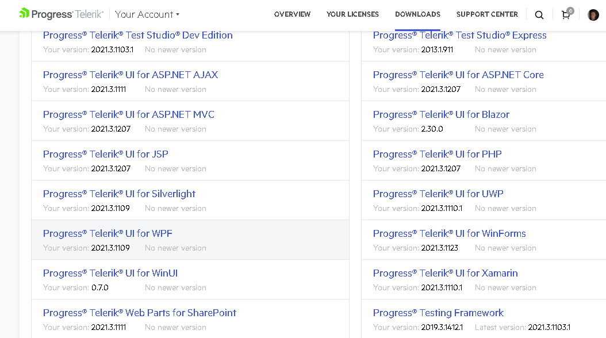
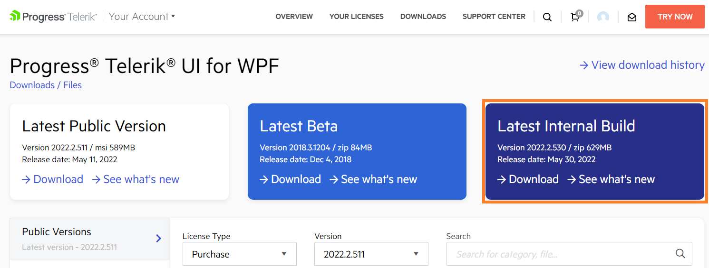
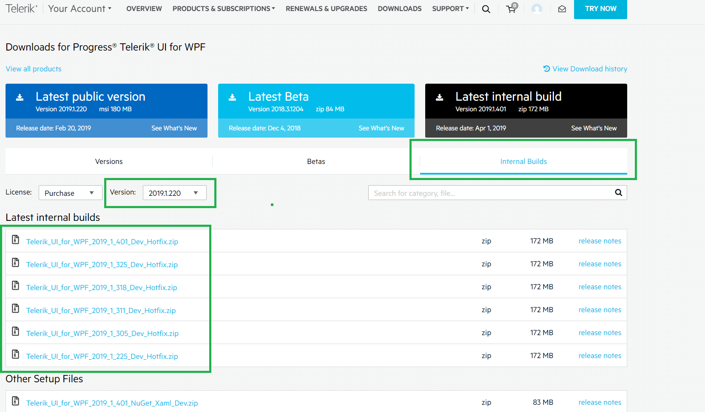
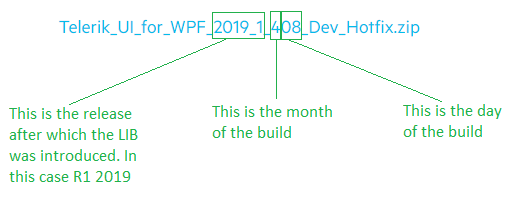

# Latest Internal Build

This article describes what is LIB and how to download it.

## What is LIB

The Latest Internal Build (LIB) is a weekly distribution of the UI for {{ site.framework_name }} assemblies, built against the latest development environment. It contains all the newest bug fixes. And it is released on a weekly basis. 

The purpose of the LIB is to allow the users to test the latest bug fixes. So, if you have experienced any problem with the current official distributions there is a possibility that the issue has already been addressed in the latest internal build. 

>important The LIB are intended for development only and are not recommended for production purposes as these distributions have not gone through the complete QA process.

>tip Features are usually not included in the LIB.

## How to Download it

The LIB is __available as a NuGet__ package. Read how to get it in the [Installing Latest Internal Build NuGet Packages](#installing-latest-internal-build-nuget-packages)[Installing Latest Internal Build NuGet Packages]() section of the documentation.

Alternatively you can __download the LIB assemblies__ from [your telerik.com account](https://www.telerik.com/account/).

1. Open the Download page of your telerik.com account.
2. Find the Telerik UI for WPF product and open its download page.

	
	
3. Click on the __Latest internal build button__. This will download an archive with the UI for {{ site.framework_name }} __assemblies__.
	
	
	
To get a specific version of the LIB, open the __Internal Bulds tab__ on the download page. And select a version from the list.

## Version Number Breakdown

The numbers in the name of the dlls are determined by the source code build date. In other words, the version number corresponds to the date when the dlls were built.

The following image shows the name of the LIB dlls generated on 8th of April (4th month), after the R1 2019 release.

            
## See Also  
 * [Trial License Limitations]()
 * [Adding UI for WPF to the Visual Studio Toolbox]()
 * [Creating an Application and Adding UI for WPF]()
 * [Upgrading Telerik UI Trial to Telerik UI Developer License or Newer Version]()
