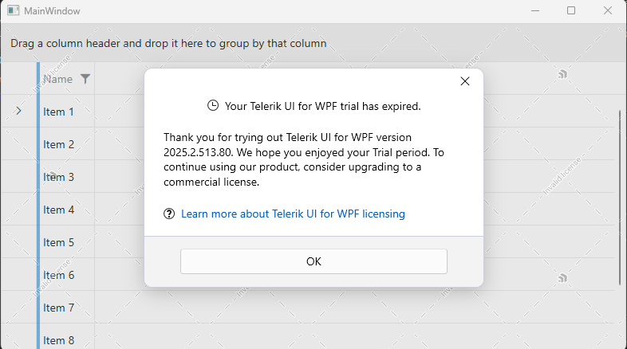

# Trial License Limitations

The following topic explains the main differences between the licenses available for Telerik UI for WPF and the limitations of the __Trial__ license.

Currently there are two main types of licenses used for UI for WPF - __Developer__ and __Trial__. The license is applied through a license key installed on the developer's machine. See how to install a license key in the corresponding [help article]().

The free __Trial__ license of Telerik UI for WPF gives access to all functionalities of the product and it will work for an unlimited time. However, once the trial period expires a trial message banner along with a watermakr overlay will be displayed. 

During the active trial the following popup will display on startup of the application.

After the trial expires, the following message box and watermark overlay are displayed.

## See Also  
 * [Adding UI for WPF to the Visual Studio Toolbox]() 
 * [Namespace Declaration]()
