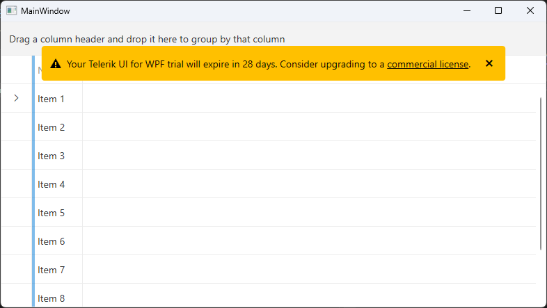

# Trial License Limitations

The following topic will explain you the main differences between the licenses available for the Telerik UI for WPF and the limitations of the __Trial License__.

Currently there are two types of licenses used for UI for WPF:

* __Developer License__

* __Trial License__

## Developer License

Developer licenses come with modified DLLs, which work without license keys. If you have a Developer license for one or more of the Telerik components, you only need to ensure that you are using the developer build when downloading the control(s). These builds have the __Dev__ abbreviation in their file names.

If your application is displaying a license key error, this means that you are using a trial version of the product. Log in to your [telerik.com](https://www.telerik.com/account/) account and download the developer build. To update your project, please take a look at the [Upgrading Trial to Developer License]()article. To get a license key, see the [Installing License Key]() article.

## Trial License

The free trial licenses of all Telerik products are fully functional and will work for an unlimited time but with a trial message displayed in a popup dialog and a watermark overlay banner that is displayed until the dialog is closed. 

The trial message states that the application uses a trial version of Telerik UI for WPF and prompts you to purchase a developer license. 

## See Also  
 * [Adding UI for WPF to the Visual Studio Toolbox]() 
 * [Namespace Declaration]()
