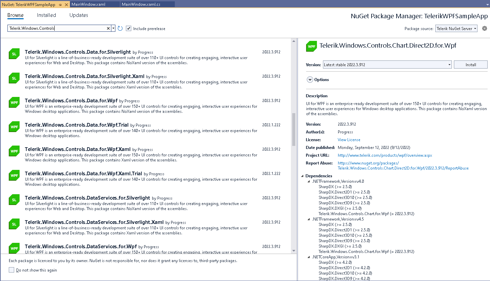

# Available NuGet Packages

Telerik UI for WPF comes with a several different packages that can be installed via the Telerik server or from a local package source.

The Telerik dlls are built against different versions of .NET starting from .NET 4.6.2 to the latest official .NET. The dlls can be separated into two categories - [Xaml and NoXaml](). This creates a rich set of assemblies that can be downloaded which are also available as nuget packages. 

The packages can be downloaded as `.nupkg` files which can be used to [setup a local package source]() or alternatively the [online Telerik package source]() can be used. These two different options contain slightly different set of packages. This article targets to list and describe the packages.

## NuGet Local Packages

The Telerik UI for WPF product provides `.nupkg` files that can be downloaded from [your telerik.com account](https://www.telerik.com/account/product-download?product=RCWPF). The download page has the following .zip files.

### Full Packages

* `Telerik_UI_for_WPF_<version number>_Dev_NuGet_Xaml.zip`&mdash;Contains `.nupkg` files for the following __full packages__:
	* `Telerik.UI.for.Wpf.462.Xaml`
	* `Telerik.UI.for.Wpf.60.Xaml`
	* `Telerik.UI.for.Wpf.80.Xaml`

	Each of these packages contains the all Telerik UI for WPF (Xaml) dlls for the corresponding .NET framework. _The number _462__ means __.NET 4.6.2__, __60__ means __.NET 6_ and so on. The __.Xaml__ part at the ending of the package name indicates that it contains the [Xaml]() version of the Telerik assemblies.
	
* `Telerik_UI_for_WPF_<version number>_Dev_NuGet_NoXaml.zip`&mdash;Contains `.nupkg` files for the following __full packages__:	
	* `Telerik.UI.for.Wpf.462`	
	* `Telerik.UI.for.Wpf.60`
	* `Telerik.UI.for.Wpf.80`
	
	Each of these packages contains the all Telerik UI for WPF (NoXaml) dlls for the corresponding .NET framework. Compared to the previous set of packages, the names here don't end with __.Xaml__ which indicates that they contain the [NoXaml]() version of the Telerik assemblies.
	
### Separate Packages

* `Telerik_UI_for_WPF_<version number>_Dev_NuGet_Separate_Packages_Xaml.zip`&mdash;This file contains __separate packages__ for each Telerik assembly.
	* `Telerik.Windows.Controls.for.Wpf.Xaml`
	* `Telerik.Windows.Controls.Navigation.for.Wpf.Xaml`
	* `Telerik.Windows.Controls.GridView.for.Wpf.Xaml`
	* `Telerik.Windows.Controls.RichTextBox.for.Wpf.Xaml`
	* etc.
	
	Each of these packages contain the corresponding Telerik ([Xaml]()) dll for all available .NET versions (.462, .6, .8). In case the dll is dependent on another Telerik dll, the required package will be installed automatically.
	
* `Telerik_UI_for_WPF_<version number>_Dev_NuGet_Separate_Packages_NoXaml.zip`&mdash;This file contains __separate packages__ for each Telerik assembly.
	* `Telerik.Windows.Controls.for.Wpf`
	* `Telerik.Windows.Controls.Navigation.for.Wpf`
	* `Telerik.Windows.Controls.GridView.for.Wpf`
	* `Telerik.Windows.Controls.RichTextBox.for.Wpf`
	* `Telerik.Windows.Themes.Fluent.for.Wpf`
	* `Telerik.Windows.Themes.Material.for.Wpf`
	* etc.
	
	Each of these packages contain the corresponding Telerik ([NoXaml]()) dll for all available .NET versions (.462, .6, .8). In case the dll is dependent on another Telerik dll, the required package will be installed automatically.	
	
## Telerik NuGet Server Packages

There is an [online package source]() that can be used to get Telerik nugets. The packages on the server are almost identical to [local](#nuget-local-package-files) ones. 

### Full Packages

The onlie package source contains full packages only for the .NET and later assemblies.

* `Telerik.UI.for.Wpf.60`
* `Telerik.UI.for.Wpf.60.Xaml`
* `Telerik.UI.for.Wpf.80`
* `Telerik.UI.for.Wpf.80.Xaml`

These packages contain all Telerik dlls for the corresponding .NET version. The package names ending with __.Xaml__ contain the [Xaml]() version of the Telerik dlls. The ones without .Xaml in the name have the __NoXaml__ version.

### Separate Packages

* `Telerik.Windows.Controls.for.Wpf.Xaml`
* `Telerik.Windows.Controls.for.Wpf`
* `Telerik.Windows.Controls.GridView.for.Wpf.Xaml`
* `Telerik.Windows.Controls.GridView.for.Wpf`
* `Telerik.Windows.Controls.Navigation.for.Wpf.Xaml`
* `Telerik.Windows.Controls.Navigation.for.Wpf`
* `Telerik.Windows.Themes.Fluent.for.Wpf` (theme dll)
* `Telerik.Windows.Themes.Material.for.Wpf` (theme dll)
* `Telerik.Windows.Controls.for.Wpf.fr` (localization resource)
* `Telerik.Windows.Controls.for.Wpf.de` (localization resource)
* etc.

Each of these packages contain all .NET versions of the corresponding Telerik dll. The package names ending with __.Xaml__ contain the [Xaml]() version of the Telerik dlls. The ones without .Xaml in the name have the __NoXaml__ version.

The __oldest nuget package__ that can be found in the __Telerik NuGet Feed__ is __2016.3.1024__.
	
## NuGet Packages and Controls Localization

The Telerik controls have a built-in [localization]() support. To enable this, the corresponding satellite assemblies should be presented in the folder where the Telerik assemblies are installed. These assemblies are available when you install the product using the __full NuGet packages__. The __separate packages__ don't include the satellite assemblies. To support localization properly, these dlls should be installed. To do so, use also the separate packages with the language resources.

The separate package with the language resources is named `Telerik.Windows.Controls.for.Wpf.<language code>`. For example, `Telerik.Windows.Controls.for.Wpf.fr` will include the French resources. `Telerik.Windows.Controls.for.Wpf.de` will include the German resources, and so on. 
