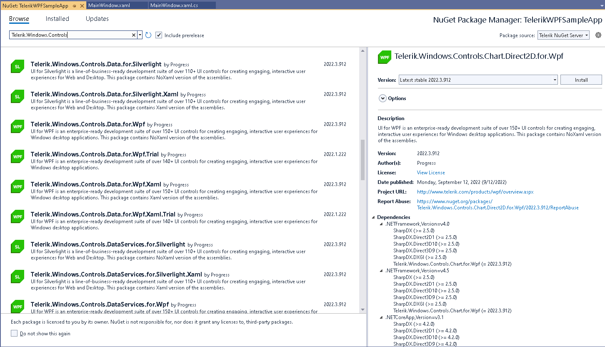

# Available NuGet Packages

Telerik UI for WPF comes with several different packages that can be installed via the Telerik server or from a local package source.

The Telerik dlls are built against different versions of .NET starting from .NET 4.6.2 to the latest official .NET. The dlls can be separated into two categories - [Xaml and NoXaml](). This creates a rich set of assemblies that can be downloaded which are also available as nuget packages. 

The packages can be downloaded as `.nupkg` files which can be used to [setup a local package source]() or alternatively the [online Telerik package source]() can be used. These two different options contain a slightly different set of packages. This article aims to list and describe the packages.

## NuGet Local Packages

The Telerik UI for WPF product provides `.nupkg` files that can be downloaded from [your telerik.com account](https://www.telerik.com/account/product-download?product=RCWPF). The download page has the following .zip files.

### Full Packages (Local)

The `Telerik_UI_for_WPF_<version number>__NuGet_Separate_Packages_<Xaml or NoXaml>.zip` file contains the separate `.nupkg` package files, along with one big full package that references all separate packages. 

The full package is named `Telerik.UI.for.Wpf.AllControls.<Xaml or NoXaml>.<version number>`
	
### Separate Packages (Local)

* `Telerik_UI_for_WPF_<version number>_NuGet_Separate_Packages_Xaml.zip`&mdash;This file contains __separate packages__ for each Telerik assembly.
	* `Telerik.Windows.Controls.for.Wpf.Xaml`
	* `Telerik.Windows.Controls.Navigation.for.Wpf.Xaml`
	* `Telerik.Windows.Controls.GridView.for.Wpf.Xaml`
	* `Telerik.Windows.Controls.RichTextBox.for.Wpf.Xaml`
	* etc.
	
	Each of these packages contain the corresponding Telerik ([Xaml]()) dll for all available .NET versions (.462, .8). In case the dll is dependent on another Telerik dll, the required package will be installed automatically.
	
* `Telerik_UI_for_WPF_<version number>_Dev_NuGet_Separate_Packages_NoXaml.zip`&mdash;This file contains __separate packages__ for each Telerik assembly.
	* `Telerik.Windows.Controls.for.Wpf`
	* `Telerik.Windows.Controls.Navigation.for.Wpf`
	* `Telerik.Windows.Controls.GridView.for.Wpf`
	* `Telerik.Windows.Controls.RichTextBox.for.Wpf`
	* `Telerik.Windows.Themes.Fluent.for.Wpf`
	* `Telerik.Windows.Themes.Material.for.Wpf`
	* etc.

	Each of these packages contain the corresponding Telerik ([NoXaml]()) dll for all available .NET versions (.462, .8). In case the dll is dependent on another Telerik dll, the required package will be installed automatically.
	
## Telerik NuGet Server Packages

>important Starting with the **Q3 2026** release, all Telerik UI for WPF NuGet packages will also be available on <a href="https://www.nuget.org/" target="_blank">NuGet.org</a>. If you use NuGet.org, you will not need to configure the Telerik NuGet server.

There is an [online package source]() that can be used to get Telerik nugets. The packages on the server are almost identical to [local](#nuget-local-packages) ones. 

### Full Packages (Server)

* `Telerik.UI.for.Wpf.AllControls.NoXaml`
* `Telerik.UI.for.Wpf.AllControls.Xaml`

### Separate Packages (Server)

* `Telerik.Windows.Controls.for.Wpf.Xaml` (includes localization resources)
* `Telerik.Windows.Controls.for.Wpf` (includes localization resources)
* `Telerik.Windows.Controls.GridView.for.Wpf.Xaml`
* `Telerik.Windows.Controls.GridView.for.Wpf`
* `Telerik.Windows.Controls.Navigation.for.Wpf.Xaml`
* `Telerik.Windows.Controls.Navigation.for.Wpf`
* `Telerik.Windows.Themes.Fluent.for.Wpf` (theme dll)
* `Telerik.Windows.Themes.Material.for.Wpf` (theme dll)
* etc.

Each of these packages contain all .NET versions of the corresponding Telerik dll. The package names ending with __.Xaml__ contain the [Xaml]() version of the Telerik dlls. The ones without .Xaml in the name have the __NoXaml__ version.

The __oldest nuget package__ that can be found in the __Telerik NuGet Feed__ is __2016.3.1024__.
	
## NuGet Packages and Controls Localization

The Telerik UI for WPF controls provide built-in [localization]() support through satellite assemblies. These assemblies contain translated resources for the supported languages and must be present in your project for localization to work.

### Getting Localization Assemblies via NuGet

Starting with the __Q2 2026__ release, the localization satellite assemblies are bundled directly in the `Telerik.Windows.Controls.for.Wpf` NuGet package (or `Telerik.Windows.Controls.for.Wpf.Xaml` for Xaml builds). Installing this package automatically provides the satellite assemblies for all supported languages (for example, `Telerik.Windows.Controls.for.Wpf.de.dll` for German, French, Spanish, etc.).

For releases __prior to Q2 2026__, localization assemblies are distributed as separate NuGet packages named by language code below. Install the package for each language you need to support in your application:

* `Telerik.Windows.Controls.for.Wpf.de` (German)
* `Telerik.Windows.Controls.for.Wpf.fr` (French)
* `Telerik.Windows.Controls.for.Wpf.es` (Spanish)
* etc.

>tip To enable localization in your project, ensure the satellite assemblies are deployed alongside the main Telerik assemblies. For more information, see the [Localization]() article.

