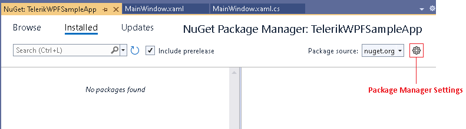
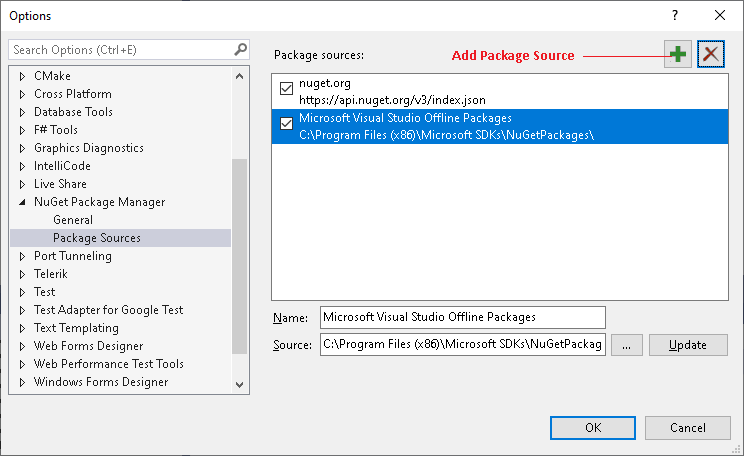
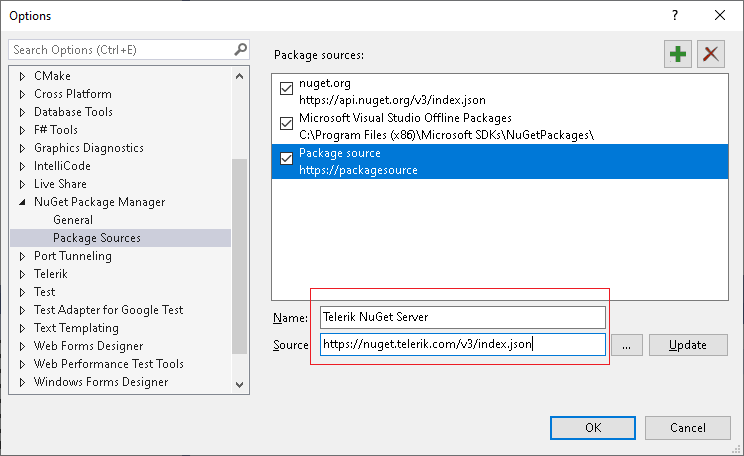
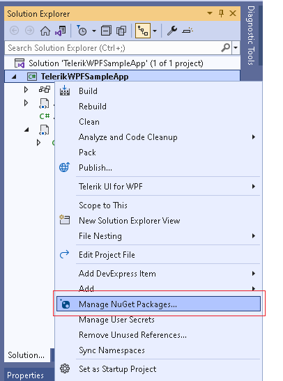
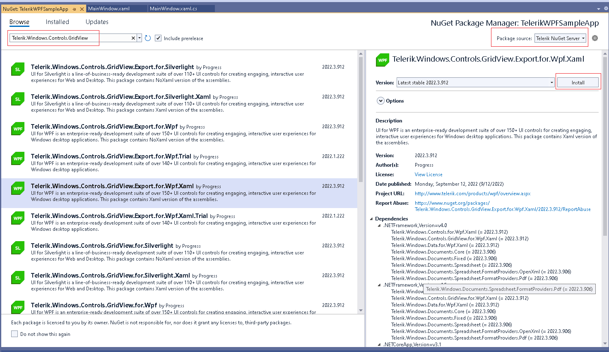

# Installing UI for WPF from NuGet Package

Telerik UI for WPF provides a set of nuget packages that can be used to easily install and upgrade Telerik projects.

This article describes how to set-up and use the nuget packages.

## Step 1: Adding NuGet Package Source 

The Telerik NuGet packages are available as downloadable `.nupkg` files that can be used in a local package source, and they also can be installed from the online Telerik NuGet server. The [Setting the NuGet Package Source]() article show how to setup local and online package sources.

This example shows how to install Telerik packages using the online server. This requires you to have an account in telerik.com and also a licensed (or trial) version of the product.

1. Navigate to the Package Manager Settings menu in Visual Studio.

	
	
1. Add a new source in the Package Sources section.
	
	
	
1. In the Source field fill the address of the Telerik NuGet Server and click OK. The address is: https://nuget.telerik.com/v3/index.json

	

1. The Telerik Server is added and ready to use.

## Step 2: Installing NuGet Packages

The following steps show how to search and install nuget packages in the Telerik package source.

1. Select your solution or project and click on the "Manage NuGet Packages" menu.

	
	
1. Set the Telerik server as the current package source. This will prompt you to enter Telerik credentials. The exact credentials are `api-key` as the username and a NuGet API Key as the password. You can generate a key via the [API Keys](https://www.telerik.com/account/downloads/api-keys) page in your telerik.com account.

1. Install the package. Some packages depend on other ones in the server, so they will be installed automatically if needed.

	

>tip Read more about the different NuGet packages in the [Available NuGet Packages]() article.