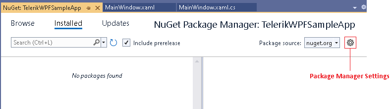
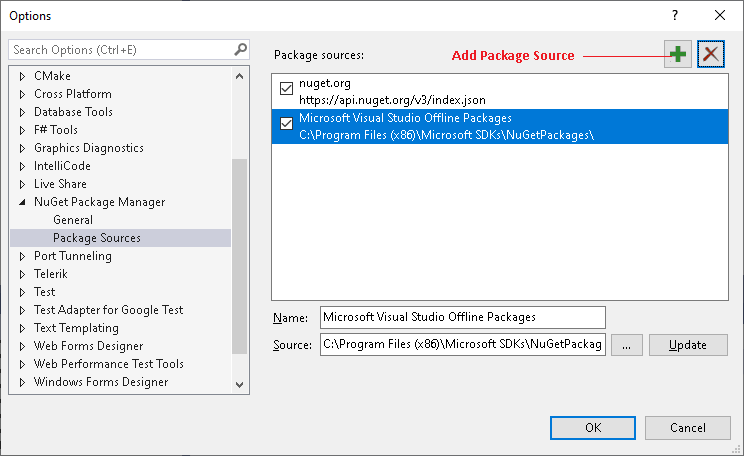
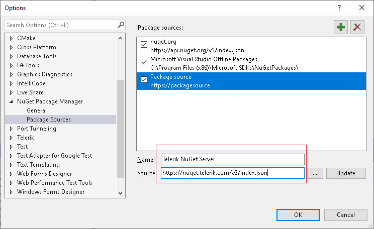
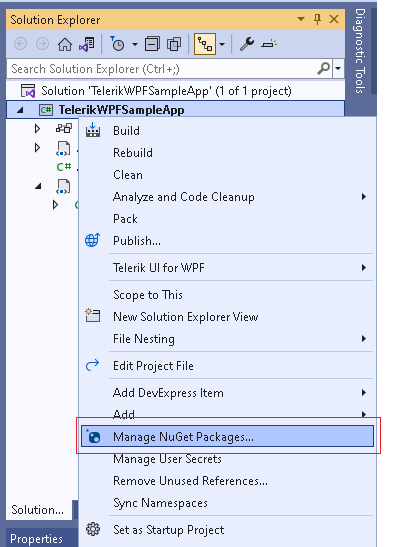
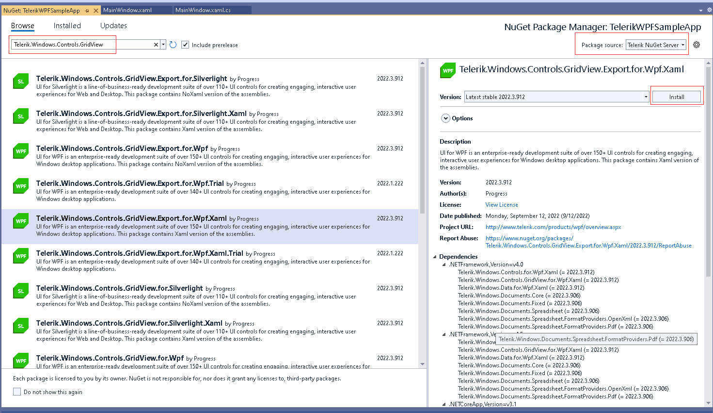

# Install Telerik UI for WPF from NuGet Packages

Use Telerik UI for WPF NuGet packages to install, update, and manage Telerik assemblies in your project. This article explains how to configure the Telerik NuGet feed, authenticate correctly, and install the packages that your project needs.

>important The Telerik NuGet server does not use your Telerik account email and password for package authentication. When Visual Studio prompts for credentials, enter `api-key` as the user name and your Telerik NuGet API key as the password.

## Before You Start

Before you configure the feed, confirm the following prerequisites:

* You can create and run a standard WPF application in Visual Studio.
* Your Telerik account has an active trial or commercial license for Telerik UI for WPF.
* If you want to use the Telerik NuGet server, you have a Telerik NuGet API key from the [API Keys](https://www.telerik.com/account/downloads/api-keys) page.

The Telerik packages are available in two main ways:

* From the online Telerik NuGet server.
* As downloaded `.nupkg` files in a local package source.

This article focuses on the Telerik NuGet server. For broader feed setup guidance, see [Use the Telerik NuGet server]().

>note Starting with **Q3 2026**, Telerik UI for WPF NuGet packages are also available on [NuGet.org](https://www.nuget.org/). If you install packages from NuGet.org, you do not need to authenticate against the Telerik NuGet server.

## Step 1: Add the Telerik NuGet Package Source

1. Navigate to the Package Manager Settings menu in Visual Studio.

	
	
1. Add a new source in the Package Sources section.
	
	
	
1. In the **Source** field, enter `https://nuget.telerik.com/v3/index.json`, and then select **OK**.

	

1. Confirm that the Telerik source appears in the package sources list.

## Step 2: Authenticate to the Telerik NuGet Server

When you select the Telerik feed for the first time, Visual Studio prompts you for credentials.

Use the following values:

* **User name**: `api-key`
* **Password**: Your Telerik NuGet API key

Generate the key from the [API Keys](https://www.telerik.com/account/downloads/api-keys) page in your Telerik account.

>warning Do not enter your Telerik account email and password here. Creating a Telerik account is not enough to authenticate to the NuGet feed. You must use a NuGet API key, and the account must have an active trial or commercial license.

## Step 3: Install NuGet Packages

The following steps show how to search for and install Telerik packages from the configured source.

1. Select your solution or project and click on the "Manage NuGet Packages" menu.

	
	
1. Set the Telerik server as the current package source.

1. Search for the Telerik package that contains the control you want to use.

1. Select the required version and install the package.

Some packages depend on other Telerik assemblies, so NuGet installs those dependencies automatically when needed.

	

For example, if your project uses `RadTabControl`, install `Telerik.Windows.Controls.Navigation` or `Telerik.Windows.Controls.Navigation.Xaml`, depending on whether the project uses NoXaml or Xaml packages.

>tip Read more about the package list in [Available NuGet Packages]() and the package type differences in [Xaml vs. NoXaml]().

## If You Created an Account but Still Cannot Log In

If you created a Telerik account and Visual Studio still cannot access the feed, check the following:

* Make sure that you are using `api-key` as the user name instead of your Telerik account email.
* Make sure that you are using a Telerik NuGet API key as the password instead of your Telerik account password.
* Verify that the Telerik account has an active trial or commercial license for Telerik UI for WPF.
* Generate a new API key from the [API Keys](https://www.telerik.com/account/downloads/api-keys) page and try again.
* Confirm that the package source URL is exactly `https://nuget.telerik.com/v3/index.json`.

If authentication still fails, download the `.nupkg` files and install them through a local package source.

## Verify the Installation

After you install the package:

1. Confirm that the Telerik assemblies appear under **Dependencies** or **References**.
2. Add a Telerik control in XAML.
3. Build and run the project.

If the project builds and the Telerik control renders correctly, the NuGet installation is complete.

## See Also

* [Use the Telerik NuGet server]()
* [Available NuGet Packages]()
* [Xaml vs. NoXaml]()