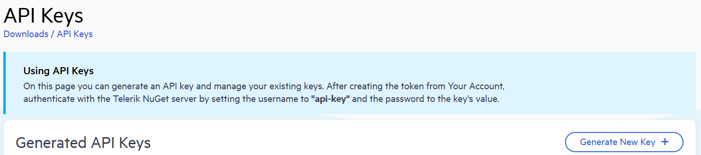
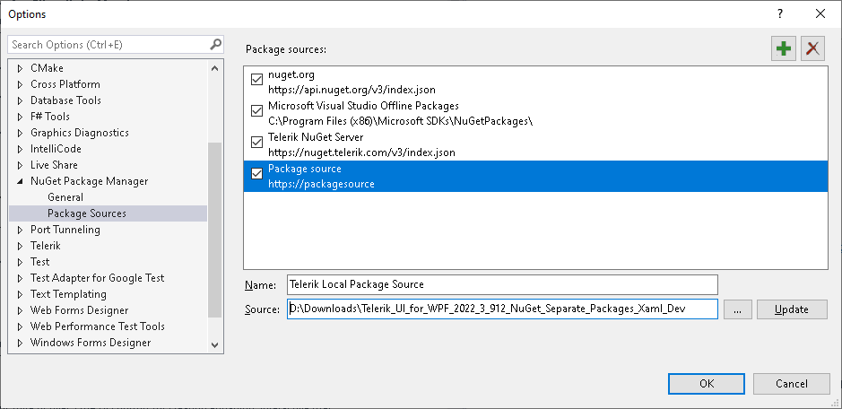

# Setting NuGet Package Source

The Telerik NuGet packages are available as `.nupkg` files that can be downloaded in a local package source, and also can be installed from the online Telerik NuGet server. 

## Using the Telerik NuGet Server as Package Source

The Telerik server is an online package source that can be accessed through Visual Studio's Nuget Package Manager in order to easily install and upgrade Telerik assemblies. The NuGet server resides at: [https://nuget.telerik.com/v3/index.json](https://nuget.telerik.com/v3/index.json). 

> The NuGet v2 server at https://nuget.telerik.com/nuget was sunset in November 2024. The new v3 protocol offers faster package searches and restores, improved security, and more reliable infrastructure. To redirect your feed to the NuGet v3 protocol, all you have to do is to change  your NuGet package source URL to https://nuget.telerik.com/v3/index.json. 

As the Telerik NuGet server requires authentication, the first step is to obtain an API key that you will use instead of a password.

1. Go to the [API Keys](https://www.telerik.com/account/downloads/api-keys) page in your Telerik account.
1. Click Generate New Key +.

	

1. In the Key Note field, add a note that describes the API key.
1. Click Generate Key.
1. Select Copy and Close. Once you close the window, you can no longer copy the generated key. For security reasons, the API Keys page displays only a portion of the key.
1. Store the generated NuGet API key as you will need it in the next steps. Whenever you need to authenticate your system with the Telerik NuGet server, use `api-key` as the username and your generated API key as the password.

> API keys expire after two years. Telerik will send you an email when a key is about to expire, but we recommend that you set your own calendar reminder with information about where you used that key: file paths, project links, AzDO and GitHub Action variable names, and so on.

The following steps show how to setup the package source in Visual Studio. 

1. Navigate to the Package Manager Settings menu in Visual Studio.
	
	

1. Add a new source in the Package Sources section.

	
	
1. In the Source field fill the address of the Telerik NuGet Server and click OK. The address is: [https://nuget.telerik.com/v3/index.json](https://nuget.telerik.com/v3/index.json)

	
	
1. The Telerik Server is added and ready to use. 

Selecting the Telerik's source as the __Package source__ in Visual Studio will prompt you to enter your credentials. Use `api-key` as the username and your generated API key as the password.

Using this approach you can only use versions from __2016.3.1024 and later__. If you need to use a previous version of the suite you will need to create a [local package source](#using-a-local-package-source).

### Reset Store Credentials

If you previously stored credentials for the Telerik NuGet server, you need to reset them to be able to authenticate with your new API key. Here are the steps you need to follow:

1. Remove the saved credentials in the [Windows Credential Manager](https://support.microsoft.com/en-us/windows/credential-manager-in-windows-1b5c916a-6a16-889f-8581-fc16e8165ac0). These credentials will appear as `nuget.telerik.com` or `VSCredentials_nuget.telerik.com` entries.
1. Remove the Telerik NuGet package source from Visual Studio.
1. If you have added the Telerik package source by using the .NET CLI, try to remove it by running the following commands:
   
   * [dotnet nuget list source](https://learn.microsoft.com/en-us/dotnet/core/tools/dotnet-nuget-list-source)
   * [dotnet nuget remove source](https://learn.microsoft.com/en-us/dotnet/core/tools/dotnet-nuget-remove-source)

1. Check if you have any credentials stored in `%AppData%\NuGet\Nuget.Config`. If so, remove them.
1. Try to reset the Visual Studio user data by [forcing NuGet to ask for authentication](https://stackoverflow.com/questions/43550797/how-to-force-nuget-to-ask-for-authentication-when-connecting-to-a-private-feed).
1. Restart Visual Studio.
1. Add the Telerik NuGet package source again through Visual Studio or .NET CLI.

## Using a Local Package Source

The Telerik packages are available as `.nupkg` files that can be downloaded from your telerik.com account. The following steps describe what to download and how to setup the package source:

1. Go to the [UI for WPF Downloads](https://www.telerik.com/account/product-download?product=RCWPF) page.
1. Download the .zip file with the NuGet packages and extract it into the folder where your package source will be hosted.

	You will find 4 .zip files with nuget packages on the download page. These contains two different package types (full and separate) each containing two different types of Telerik dlls ([Xaml and NoXaml]()).
	
	* `Telerik_UI_for_WPF_{version}_Dev_NuGet_{Xaml/NoXaml}.zip` are available for the supported .NET versions and combine all UI for WPF assemblies in one NuGet.
	
	* `Telerik_UI_for_WPF_{version}_Dev_NuGet_Separate_Packages_{Xaml/NoXaml}.zip` contains the separate NuGet packages of all UI for WPF assemblies. These are useful if you don't want to include all Telerik assemblies in your project, but only the ones you are referencing.	
	
1. Navigate to the "Package Manager Settings" menu.
	
	

1. Add a new source in the "Package Sources" section.

	
	
1. In the "Source" field use the path to the folder where you extracted the .zip file with the .nupkg files (step 2). Then click OK.

	

1. The Telerik server is added and ready to use. 

## Selecting the Package Source in Visual Studio

Once you created the package source as described in the previous sections of this article, you will need to select it in the Visual Studio's NuGet Package Manager.

1. Open your project in Visual Studio and select it.
1. Click on the "Manage NuGet Packages" menu.
1. Select the source from the "Package source" drop down.
	
	

1. Search and install a package.

Selecting the Telerik's source as the __Package source__ in Visual Studio will prompt you to enter your __telerik.com credentials__ (email and password).

## Additional Resources

* The following blog shows how to create a private NuGet Feed and deploy the Telerik NuGet packages there: http://blogs.telerik.com/careypayette/posts/13-03-11/power-your-projects-with-telerik---now-with-the-convenience-of-nuget.

* The following video demonstrates how to add the Telerik NuGet Feed to your NuGet Package Sources:

	<iframe width="800" height="400" src="https://www.youtube.com/embed/c3m_BLMXNDk" frameborder="0" allow="accelerometer; autoplay; encrypted-media; gyroscope; picture-in-picture; fullscreen"></iframe>

## See Also  
* [Available NuGet Packages]()
