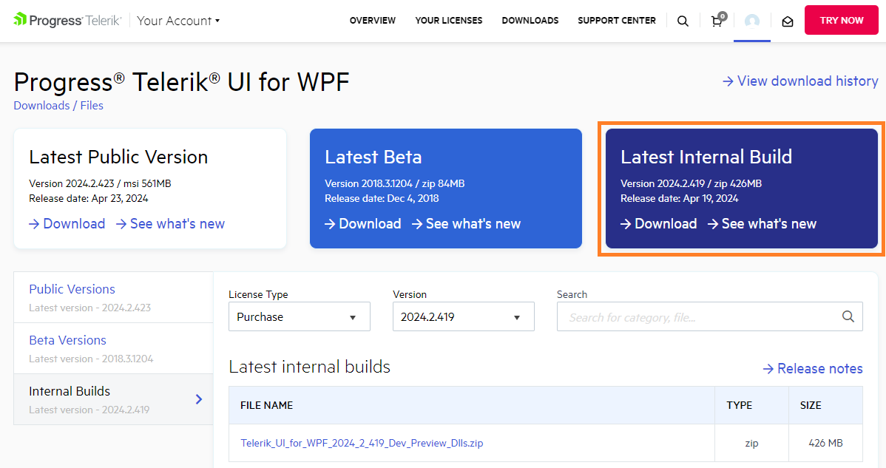
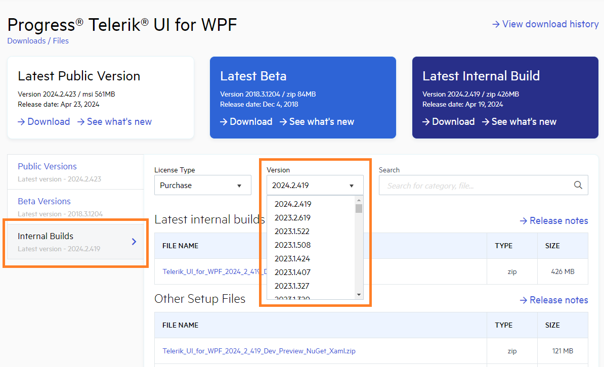
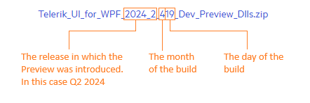

# Preview Release

The Preview is a minor release of the Telerik UI for WPF assemblies, that is uploaded between the major releases (Q1, Q2, Q3 and Q4). The Preview is released on demand so its frequency vary from none to several versions between two major releases. The purpose of the Preview is to allow the users to test the latest bug fixes before the major release. 

## Downloading the Preview Release

The Preview is __available as a NuGet__ package. Alternatively, you can __download the Preview assemblies__ from [your telerik.com account](https://www.telerik.com/account/).

1. Go to the Telerik UI for WPF product [download page](https://www.telerik.com/account/product-download?product=RCWPF). 
	
2. Click on the __Download__ button in the __Latest Preview__ banner. This will download an archive with the UI for {{ site.framework_name }} __assemblies__.

	

	To get a specific version of the Preview, open the __Previews__ tab on the download page. Then, select a version from the list.

	

## Version Number Breakdown

The numbers in the name of the dlls are determined by the source code build date. In other words, the version number corresponds to the date when the dlls were built.

The following image shows the name of the Preview dlls generated on 19th of April (4th month), in the 2024 Q2 release sprint.

 
## See Also  
* [Installing UI for WPF from NuGet Package]()
* [Trial License Limitations]()  
