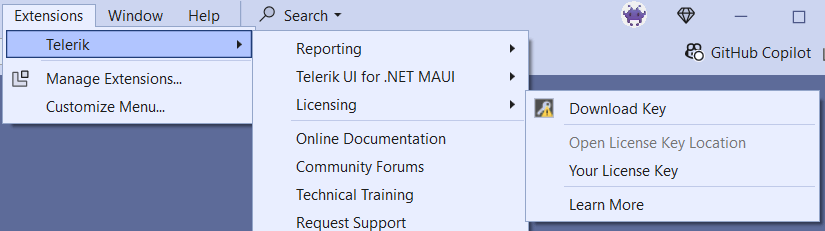

# Installing Your License Key

Starting with the 2025 Q1 release, the UI components from the WPF library require activation through a license key (trial or commercial). This article describes how to download your personal license key and use it to activate the WPF UI components. An invalid license results in [errors and warnings]() during build and run-time indicators such as watermarks and banners.

To download a license key for Telerik UI for WPF, you must have either a developer or trial license. If you are new to Telerik UI for WPF, sign up for a [free trial](https://www.telerik.com/try/ui-for-wpf) first, and then follow the steps below.

Depending on your development environment and preferences, you can install your license key in either of the following ways:

* [*Automatic installation*](#automatic-license-key-installation) for projects with NuGet references&mdash;suitable for developers using Telerik productivity tools like the Telerik extensions for Visual Studio and the Progress Control Panel.
* [*Manual installation*](#manual-license-key-installation) for projects with NuGet references&mdash;suitable for trial users and developers who prefer to manage their projects and Telerik product versions manually.
* [*Manual installation for projects using assembly references (no NuGet packages)*](#adding-a-license-to-projects-using-telerik-assembly-references-no-nuget-packages)&mdash;suitable for developers who cannot use NuGet references in their projects and use the Telerik DLLs instead.

## Automatic License Key Installation

Telerik provides tools that automatically provision your license key. These tools include the [Telerik UI for WPF Visual Studio extensions]() and the [Progress Control Panel](https://docs.telerik.com/controlpanel/introduction).

### Installing a License Key with the VS Extensions

To install your license key by using the [Telerik UI for WPF Visual Studio extensions]():

1. Open Visual Studio.
1. Go to **Extensions** > **Telerik** > **Licensing** > **Download Key**.

  

The Visual Studio extension puts the file in your home directory (`%appdata%\Telerik`), which activates the WPF components.

### Installing a License Key with the Progress Control Panel

To install your Telerik License Key by using the [Progress Control Panel](https://docs.telerik.com/controlpanel/introduction), start the application. It automatically downloads your license key file to your home directory (`%appdata%\Telerik`), which activates the WPF components.

## Manual License Key Installation

To manually download and install a license key for Telerik UI for WPF:

1. Go to the [License Keys](https://www.telerik.com/account/your-licenses/license-keys) page in your Telerik account.

1. Click the __Download License Key__ button.

	

1. Copy the downloaded `telerik-license.txt` license key file to your home directory (`%appdata%\Telerik`). This makes it available for all projects developed on the local machine.

Alternatively, copy the `telerik-license.txt` license key file to the root folder of your project. This makes the license key available only to this project. Do not commit the file to source control as this is your personal license key.

When you build the project, the `Telerik.Licensing` NuGet package automatically locates the license file and uses it to activate the product. If your project doesn’t use NuGet packages, see [Adding a License Key to Projects without NuGet References](#adding-a-license-key-to-projects-without-nuget-references).

## Adding a License to Projects Using Telerik Assembly References (no NuGet packages)

Telerik strongly recommends the use of NuGet packages whenever possible. Only include the license key as a code snippet when NuGet packages are not an option.

If you add the Telerik components to your project by referencing the Telerik assemblies, you must add the license to the project as a code snippet:

1. Go to the [License Keys](https://www.telerik.com/account/your-licenses/license-keys) page in your Telerik account.

1. On the Progress® Telerik® UI for WPF row, click the __View key__ link in the __SCRIPT KEY__ column.

1. Copy the C# code snippet into a new file, for example, `TelerikLicense.cs`.

1. Add the `TelerikLicense.cs` file to your project.

>Do not publish the license key code snippet in publicly accessible repositories. This is your personal license key.

## Updating Your License Key

Whenever you purchase a new Telerik UI for WPF license or renew an existing one, always download and install a new license key by using the [automatic](#automatic-license-key-installation) or the [manual](#manual-license-key-installation) approach. The new license key includes information about all previous license purchases. This process is referred to as a license key update.

## See Also

* [License Activation Errors and Warnings]()
* [Adding the License Key to CI Services]()
* [Frequently Asked Questions about Your UI for WPF License Key]()
