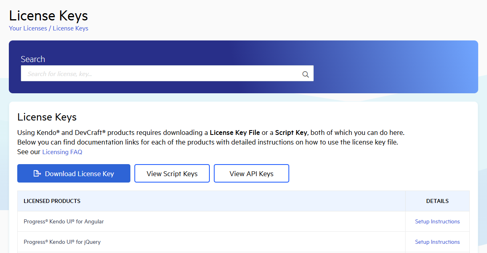

# Installing License Key

Starting with the 2025 Q1 release, the UI components from the WPF library require activation through a license key (trial or commercial). This article describes how to download your personal license key and use it to activate the WPF UI components.

An invalid license results in [errors and warnings]() during build and run-time indicators such as watermarks and banners.

## Downloading the License Key

To download a license key for Telerik UI for WPF, you must have either a developer or trial license. If you are new to Telerik UI for WPF, sign up for a [free trial](https://www.telerik.com/try/ui-for-wpf) first, and then follow the steps below.

1. Go to the [License Keys](https://www.telerik.com/account/your-licenses/license-keys) page in your Telerik account.

1. Click the __Download License Key__ button.
 
	

> The [Progress Control Panel](https://www.telerik.com/download-trial-file/v2/control-panel), [automated MSI installer](), and the [Visual Studio Extensions]() will automatically download and store your license key in the `%appdata%\Telerik` directory. This makes it available for all projects developed on the local machine.	

## Activating the UI for WPF Components

To activate the UI for WPF components:

* Copy the [downloaded](#downloading-the-license-key) `telerik-license.txt` license key file to your home directory (`%appdata%\Telerik`). This makes it available for all projects developed on the local machine.	

* Alternatively, copy the `telerik-license.txt` license key file to the root folder of your project. This makes the license key available only to this project. Do not commit the file to source control as this is your personal license key.

When you build the project, the `Telerik.Licensing` NuGet package automatically locates the license file and uses it to activate the product. If your project doesn’t use NuGet packages, see [Adding a License Key to Projects without NuGet References](#adding-a-license-key-to-projects-without-nuget-references).

## Adding a License Key to Projects without NuGet References

Telerik strongly recommends the use of NuGet packages whenever possible. Only include the license key as a code snippet when NuGet packages are not an option.

If you cannot use NuGet packages in your project, add the license as a code snippet:

1. Go to the [License Keys](https://www.telerik.com/account/your-licenses/license-keys) page in your Telerik account.

1. On the Progress® Telerik® UI for WPF row, click the __View key__ link in the __SCRIPT KEY__ column. 

1. Copy the C# code snippet into a new file, for example, `TelerikLicense.cs`. 

1. Add the `TelerikLicense.cs` file to your project. 

	Do not publish the license key code snippet in publicly accessible repositories. This is your personal license key.

## Updating Your License Key

Whenever you purchase a new Telerik UI for WPF license or renew an existing one, always [download a new license key](#downloading-the-license-key). The new license key includes information about all previous license purchases. This process is referred to as a license key update. Once you have the new license key, use it to [activate the components](#activating-the-ui-for-wpf-components).

## See Also  
* [License Activation Errors and Warnings]()
* [Adding the License Key to CI Services]()
* [Frequently Asked Questions about Your UI for WPF License Key]()