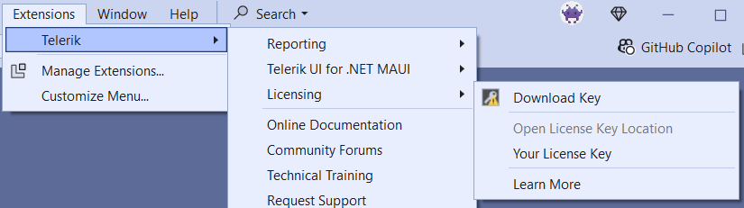
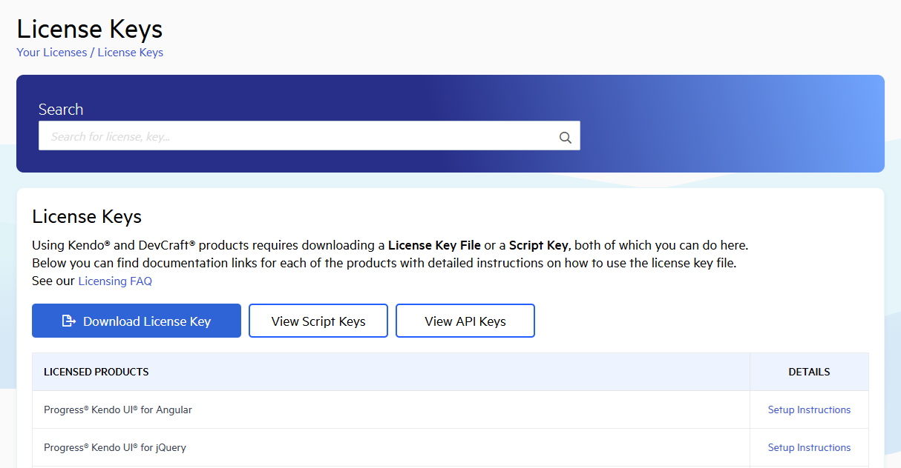

# Installing Your License Key

Starting with the 2025 Q1 release, Telerik UI for WPF requires activation through a license key. To activate a NuGet-based project successfully, you must do two things: install the `Telerik.Licensing` package and make the license key available to the account or environment that builds the application. If either part is missing, the build can log [errors and warnings]() and the application can show watermarks or banners at run time.

To download a license key for Telerik UI for WPF, you must have either a developer or trial license. If you are new to Telerik UI for WPF, start with a [free trial](https://www.telerik.com/try/ui-for-wpf), and then follow the steps in this article.

## Before You Start

Before you install the license key:

* Download your license key from the [License Keys](https://www.telerik.com/account/your-licenses/license-keys) page in your Telerik account.
* If your project uses NuGet packages, install the `Telerik.Licensing` package. This is a required step.
* If Telerik UI for WPF is referenced in a class library, install `Telerik.Licensing` in the application project that consumes the class library too.
* If the build runs under a service account, CI agent, or another user profile, do not rely on `%appdata%\Telerik` alone. Use a project-level or environment-based setup instead.

## Choose the Right Installation Approach

Depending on your development environment and preferences, you can install your license key in either of the following ways:

| Scenario | Recommended approach |
|---|---|
| Local development machine with Telerik productivity tools | Use [automatic installation](#automatic-license-key-installation). |
| Local development machine without Telerik productivity tools, including older Visual Studio setups such as VS2017 | Use [manual installation for NuGet projects](#manual-license-key-installation). |
| CI server, build agent, Windows service account, or other shared environment | Use a [service-oriented setup](#use-a-service-oriented-setup-for-ci-and-shared-environments). |
| Project that uses Telerik assembly references instead of NuGet packages | Use [assembly-reference installation](#adding-a-license-to-projects-using-telerik-assembly-references-no-nuget-packages). |

## Automatic License Key Installation

Telerik provides tools that automatically provision your license key. These tools include the [Telerik UI for WPF Visual Studio extensions]() and the [Progress Control Panel](https://docs.telerik.com/controlpanel/introduction).

>important Automatic installation downloads the `telerik-license.txt` file for you, but NuGet-based projects still require the `Telerik.Licensing` package.

### Installing a License Key with the VS Extensions

To install your license key by using the [Telerik UI for WPF Visual Studio extensions]():

1. Open Visual Studio.
1. Go to **Extensions** > **Telerik** > **Licensing** > **Download Key**.

  

The Visual Studio extension puts the file in your home directory as `%appdata%\Telerik\telerik-license.txt`.

### Installing a License Key with the Progress Control Panel

To install your license key by using the [Progress Control Panel](https://docs.telerik.com/controlpanel/introduction), start the application. It automatically downloads the `telerik-license.txt` file to `%appdata%\Telerik`.

## Manual License Key Installation

Use this approach when you do not use Telerik productivity tools or when you want explicit control over the setup. This is also the recommended path for developers working in environments where automatic tooling may not be part of the workflow.

To manually download and install a license key for Telerik UI for WPF:

1. Go to the [License Keys](https://www.telerik.com/account/your-licenses/license-keys) page in your Telerik account.

1. Click the __Download License Key__ button.

	

1. Install the `Telerik.Licensing` NuGet package in the project that starts the build or application.

__Example 1: Add the Telerik.Licensing package to a project__

```xml
<PackageReference Include="Telerik.Licensing" Version="1.*" />
```

In Visual Studio, you can also install the package by right-clicking the project, selecting **Manage NuGet Packages**, searching for `Telerik.Licensing`, and installing it in the executable or startup project.

1. Copy the downloaded `telerik-license.txt` license key file to one of the following locations:

	* `%appdata%\Telerik\telerik-license.txt` to make it available for the current Windows user on the local machine.
	* The project root folder to make it available only to that project.

Do not commit the file to source control. This file contains your personal license key.

When you build the project, the `Telerik.Licensing` package locates the license file and uses it to activate the product. If your project doesn’t use NuGet packages, see the next section in this article.

>important When Telerik UI for WPF components are used in a class library, install `Telerik.Licensing` in the consuming application project too. Installing it only in the class library is not enough.

## When Copying the File to %appdata%\Telerik Does Not Work

Copying `telerik-license.txt` to `%appdata%\Telerik` works only when the application or build runs under the same Windows user profile that owns that folder.

If the license is still not found, check the following:

* The file name is exactly `telerik-license.txt`.
* The file is stored under the current user profile, not under a different user or administrator account.
* The project includes the `Telerik.Licensing` package.
* If the Telerik controls are referenced from a class library, the main application project also includes `Telerik.Licensing`.
* If the build runs from CI, a Windows service, or another shared account, the license key is provided through a project-level location or an environment variable instead of a personal profile folder.

If `%appdata%\Telerik` is not suitable for your setup, place the file in the project root or use the environment-based approach described in the next section.

## Use a Service-Oriented Setup for CI and Shared Environments

For build servers, CI pipelines, service accounts, and other shared environments, use an environment-based setup instead of a personal profile folder.

The recommended options are:

* Set the `TELERIK_LICENSE` environment variable to the contents of the license key file.
* Set `TELERIK_LICENSE_PATH` to the location of a secure `telerik-license.txt` file.
* Store the key in the project directory only when that approach matches your security requirements.

This approach is better suited for non-interactive environments because it does not depend on a specific user profile such as `%appdata%\Telerik`.

>note For CI and shared service environments, you can use any valid team license key in the secure environment setup. On local development machines, each developer should use the key associated with their own account.

For step-by-step CI examples, see [Adding the License Key to CI Services]().

## Adding a License to Projects Using Telerik Assembly References (no NuGet packages)

Telerik strongly recommends the use of NuGet packages whenever possible. Only include the license key as a code snippet when NuGet packages are not an option.

If you add the Telerik components to your project by referencing the Telerik assemblies, you must add the license to the project as a code snippet:

1. Go to the [License Keys](https://www.telerik.com/account/your-licenses/license-keys) page in your Telerik account.

1. Click on the _View Script Keys_ button.

1. In the drop down menu select __Progress® Telerik® UI for WPF__.

1. Copy the C# code snippet into a new file, for example, `TelerikLicense.cs`. The code snippet contains an assembly attribute called `EvidenceAttribute` that holds information about the license key.

1. Add the `TelerikLicense.cs` file to your project.

__TelerikLicense.cs file content example__
```csharp
[assembly: global::Telerik.Licensing.EvidenceAttribute("your-wpf-script-key-here")]
```

If you use multiple Telerik products in the same application, for example WPF, WinForms, and Reporting, add the script keys for all products.

__TelerikLicense.cs file content with multiple script keys__
```csharp
[assembly: global::Telerik.Licensing.EvidenceAttribute("your-WPF-script-key-here")]
[assembly: global::Telerik.Licensing.EvidenceAttribute("your-WINFORMS-script-key-here")]
[assembly: global::Telerik.Licensing.EvidenceAttribute("your-REPORTING-script-key-here")]
```

>warning Do not publish the license key code snippet in publicly accessible repositories. This is your personal license key.

## Updating Your License Key

Whenever you purchase a new Telerik UI for WPF license or renew an existing one, always download and install a new license key by using the [automatic](#automatic-license-key-installation) or the [manual](#manual-license-key-installation) approach. The new license key includes information about all previous license purchases. This process is referred to as a license key update.

## See Also

* [License Activation Errors and Warnings]()
* [No License Found - Troubleshooting]()
* [Adding the License Key to CI Services]()
* [Frequently Asked Questions about Your UI for WPF License Key]()
