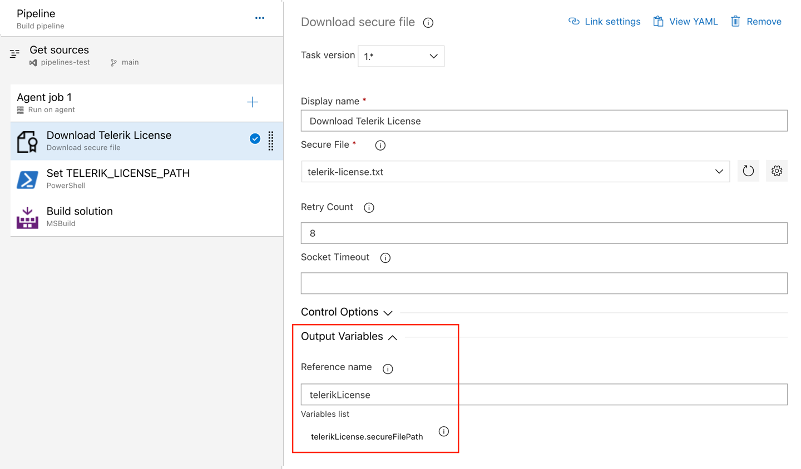
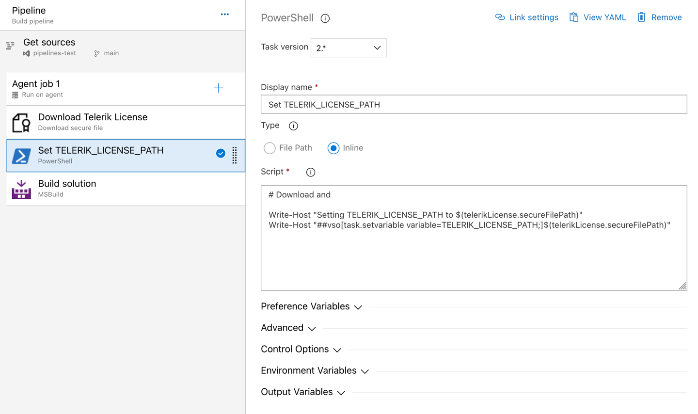

# Adding the License Key to CI/CD Services

This article describes how to set up and activate your Telerik UI for WPF [license key]() across a few popular CI/CD services by using environment variables.

When working with CI/CD platforms, always add the `Telerik.Licensing` NuGet package as a project dependency. This package activates the Telerik UI for WPF components at build time by using the provided license key.

> If you cannot use NuGet packages in your project, you can add the license key as an assembly attribute as shown in the [Installing License Key]() article.

The license activation process in a CI/CD environment involves the following steps:

1. [Download a license key]() from your [Telerik account](https://www.telerik.com/account/your-licenses/license-keys).

1. Add the `Telerik.Licensing` NuGet package as a project dependency: `<PackageReference Include="Telerik.Licensing" Version="1.*" />`

1. [Create an environment variable](#creating-an-environment-variable) named `TELERIK_LICENSE` and add your UI for WPF license key as a value. Alternatively, use the [Azure Secure files approach](link-to-section).

## Creating an Environment Variable

The recommended approach for providing your license key to the `Telerik.Licensing` NuGet package is to use environment variables. Each CI/CD platform has a different process for setting environment variables and this article lists only some of the most popular examples.

### GitHub Actions

1. Create a new [Repository Secret](https://docs.github.com/en/actions/reference/encrypted-secrets#creating-encrypted-secrets-for-a-repository) or an [Organization Secret](https://docs.github.com/en/actions/reference/encrypted-secrets#creating-encrypted-secrets-for-an-organization).

1. Set the name of the secret to `TELERIK_LICENSE` and paste the contents of the license file as a value.

1. After running `npm install` or `yarn`, add a build step to activate the license:

	```YML
		env:
			TELERIK_LICENSE: ${{ "{{ secrets.TELERIK_LICENSE }}" }}
	```

### Azure Pipelines

1. Create a new [secret variable](https://learn.microsoft.com/en-us/azure/devops/pipelines/process/variables?view=azure-devops&tabs=yaml%2Cbatch#secret-variables) named `TELERIK_LICENSE`.

1. Paste the contents of the license key file as a value.

	> Always consider the Variable size limit—if you are using a [Variable Group](https://learn.microsoft.com/en-us/azure/devops/pipelines/library/variable-groups?view=azure-devops&tabs=azure-pipelines-ui%2Cyaml), the license key will typically exceed the character limit for the variable values. The only way to have a long value in the Variable Group is to [link it from Azure Key Vault](https://learn.microsoft.com/en-us/azure/devops/pipelines/library/link-variable-groups-to-key-vaults?view=azure-devops). If you cannot use a Key Vault, then use a normal pipeline variable instead or use the [Secure files approach instead](link-to-section).

## Using Secure Files on Azure DevOps

[Secure files](https://learn.microsoft.com/en-us/azure/devops/pipelines/library/secure-files?view=azure-devops) are an alternative approach for sharing the license key file in Azure Pipelines that does not have the size limitations of environment variables.

You have two options for the file-based approach. Set the `TELERIK_LICENSE_PATH` variable or add a file named `telerik-license.txt` to the project directory or a parent directory.

>Make sure to reference Telerik.Licensing v.1.4.10 or later.

### YAML Pipeline

With a YAML pipeline, you can use the [DownloadSecureFile@1](https://learn.microsoft.com/en-us/azure/devops/pipelines/tasks/reference/download-secure-file-v1?view=azure-pipelines) task, then use `$(name.secureFilePath)` to reference it. For example:

```yaml
   - task: DownloadSecureFile@1
    name: DownloadTelerikLicenseFile # defining the 'name' is important
    displayName: 'Download Telerik License Key File'
    inputs:
      secureFile: 'telerik-license.txt'

  - task: MSBuild@1
    displayName: 'Build Project'
    inputs:
      solution: 'myapp.csproj'
      platform: Any CPU
      configuration: Release
      msbuildArguments: '/p:RestorePackages=false'
    env:
      # use the name.secureFilePath value to set TELERIK_LICENSE_PATH
      TELERIK_LICENSE_PATH: $(DownloadTelerikLicenseFile.secureFilePath)
```

### Classic Pipeline

With a classic pipeline, use the “Download secure file” task and a PowerShell script to set `TELERIK_LICENSE_PATH` to the secure file path.

1. Add a “Download secure file” task and set the output variable's name to `telerikLicense`.
	
 	

1. Add a PowerShell task and set the `TELERIK_LICENSE_PATH` variable to the `secureFilePath` property of the output variable.
	
 	

The script to set the environment variable is quoted below:

```powershell
	Write-Host "Setting TELERIK_LICENSE_PATH to $(telerikLicense.secureFilePath)"
	Write-Host "##vso[task.setvariable variable=TELERIK_LICENSE_PATH;]$(telerikLicense.secureFilePath)"
```

Alternatively, copy the file into the repository directory:

```powershell
	echo "Copying $(telerikLicense.secureFilePath) to $(Build.Repository.LocalPath)/telerik-license.txt"
	Copy-Item -Path $(telerikLicense.secureFilePath) -Destination "$(Build.Repository.LocalPath)/telerik-license.txt" -Force
```

## See Also  
* [License Activation Errors and Warnings]()
* [Setting Up Your License Key]()
* [Frequently Asked Questions about Your UI for WPF License Key]()
