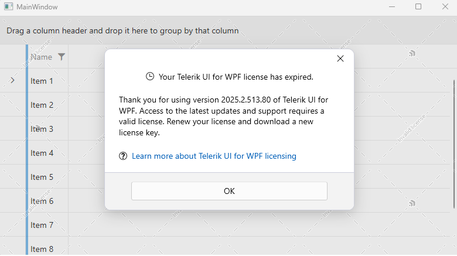
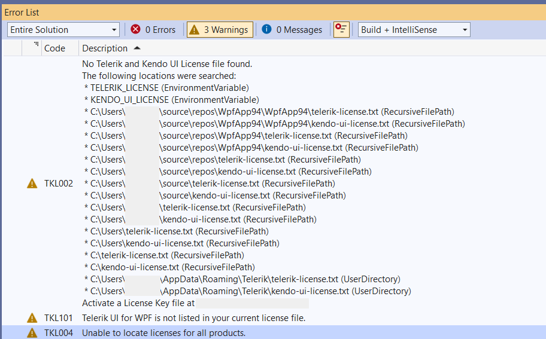
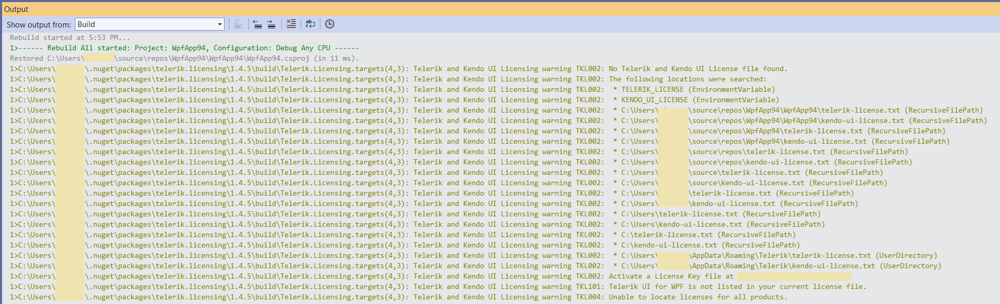

# License Activation Errors and Warnings

Starting with the 2025 Q1 release, using Telerik UI for WPF without a license or with an invalid license causes specific license warnings and errors. This article defines what an invalid license is, explains what is causing it, and describes the related license warnings and errors.

A missing, expired, or invalid license will result in:

* A watermark appearing on application startup.

* A modal dialog appearing on application startup. Clicking the __OK__ button of the dialog closes the dialog and removes the banner until the next application startup.

	

* A warning message similar to the following appearing in the build log:
	
	
	
	

## Invalid License

An invalid license can be caused by any of the following:

* Using an expired subscription license&mdash;subscription licenses expire at the end of the subscription term.

* Using a perpetual license for product versions released outside the validity period of your license.

* Using an expired trial license.

* A missing license for Telerik UI for WPF.

* Not installing a license key in your application.

* Not updating the license key after renewing your Telerik UI for WPF license.

## License Warnings and Errors

When using Telerik UI for WPF in a project with an expired or missing license, the `Telerik.Licensing` build task will indicate the following errors or conditions:

| Condition or Error | Message Code | Solution |
| ------------------ | ------------ | -------- |
| `No Telerik and Kendo UI License file found` | TKL002 | [Install a license key]() to activate the UI components and remove the error message. |
| `Corrupted Telerik and Kendo UI License Key content` | TKL003 | [Download a new license key](#downloading-the-license-key) and install it to activate the UI components and remove the error message. |
| `Unable to locate licenses for all products` | TKL004 | Your license is not valid for all Telerik and Kendo products added to your project. If you have already purchased the required license, then [update your license key](#downloading-the-license-key). |
| `Telerik UI for WPF is not listed in your current license file` | TKL101 | Review the purchase options for the listed products. Alternatively, remove the references to the listed packages from `package.json.` |
| `Your perpetual license is invalid` | TKL102 | You are using a product version released outside the validity period of your perpetual license. To remove the error message, do either of the following: <ul><li>Renew your subscription and [download a new license key](#downloading-the-license-key).</li><li>Downgrade to a product version included in your perpetual license as indicated in the message.</li></ul> |
| `Your subscription license has expired` | TKL103; TKL104 | Renew your subscription and [download a new license key](#downloading-the-license-key). |
| `Your trial license has expired` | TKL105 | Purchase a commercial license to continue using the product. |
| `No Telerik or Kendo UI product references detected in project` | TKL001 | If you use Telerik products and see this message, update the `Telerik.Licensing` package to version 1.4.6 or later. If you do not use Telerik products, remove the `Telerik.Licensing` NuGet reference from your project. |

## See Also  
* [Setting Up Your License Key]()
* [Frequently Asked Questions about Your UI for WPF License Key]()
* [Adding the License Key to CI Services]()
