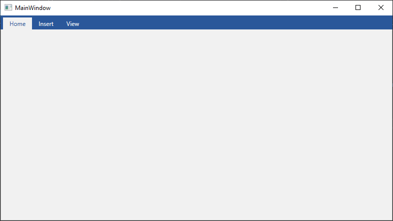
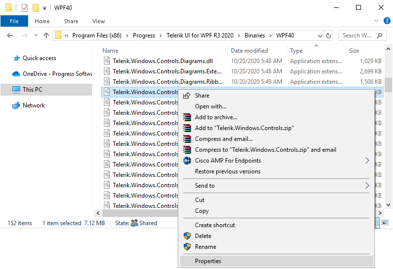
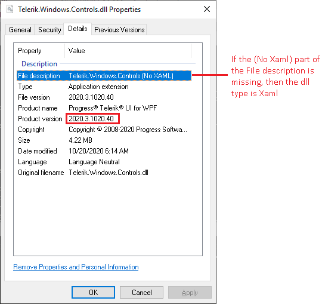
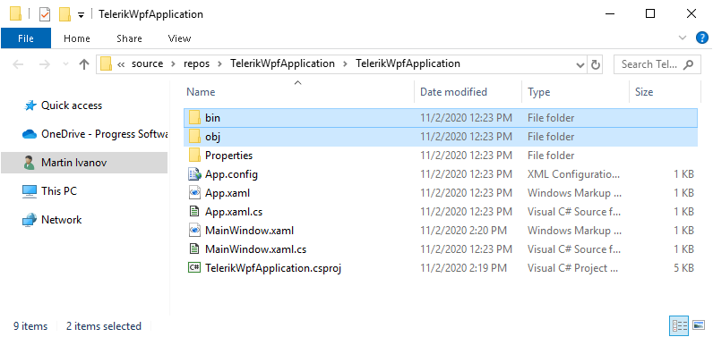
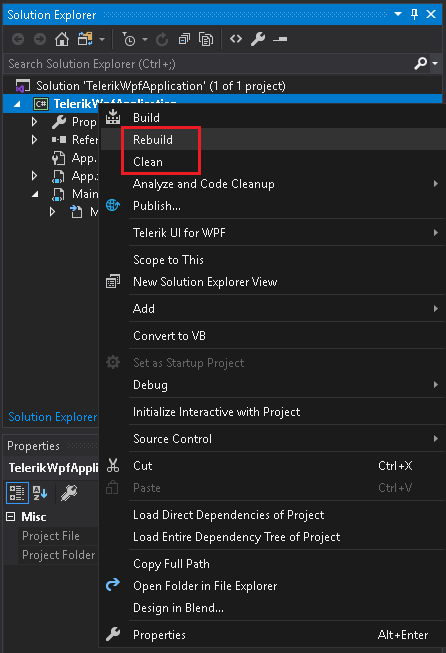

# Telerik Application Lifecyle Using Telerik UI for WPF Extension 

This article describes the lifecycle of a Telerik application. This includes creating, deploying, redistributing and upgrading an application with referenced Telerik dlls.

The topic shows what is the lifecycle when using the Telerik UI for WPF Extension to reference Telerik dlls. As an alternative, you can use [MSI or Zip files](), or [NuGet]() as shown in the corresponding articles in this documentation section.

## Creating a Project

To create a project open a Visual Studio solution and use the __Telerik UI for WPF__ option from the Telerik UI for WPF Extension menu to reach the __Create New Telerik Project__ option. This will start a wizard that helps you to configure a new Telerik WPF project. Follow it and you will get a new project with referenced Telerik dlls. Read more about the exact steps in the [Create Project]() article from the Visual Studio Extensions section.

> If you already have a WPF project you can add Telerik assemblies using the [Convert Project Wizard]() of the extension.

## Configurating a Telerik Project

To add and remove Telerik dlls or change the [Telerik theme]() you can use the [Project Configuration Wizard]().

## Adding Telerik Controls

After you create the WPF project and install the nugets, add any UI and related code-behind, models, and styles. This example will show a very basic setup which includes a RadTabControl with few tabs defined in XAML.

#### __[XAML] Example 1: Adding Telerik control in the UI__
{{region msi-or-zip-setup-lifecycle-0}}
	<Window x:Class="TelerikWpfApplication.MainWindow"
		xmlns="http://schemas.microsoft.com/winfx/2006/xaml/presentation"
		xmlns:x="http://schemas.microsoft.com/winfx/2006/xaml"
		xmlns:d="http://schemas.microsoft.com/expression/blend/2008"
		xmlns:mc="http://schemas.openxmlformats.org/markup-compatibility/2006"
		xmlns:local="clr-namespace:TelerikWpfApplication" xmlns:telerik="http://schemas.telerik.com/2008/xaml/presentation"
		mc:Ignorable="d"
		Title="MainWindow" Height="450" Width="800">
		<Grid>
			<telerik:RadTabControl>
				<telerik:RadTabItem Header="Home" />
				<telerik:RadTabItem Header="Insert" />
				<telerik:RadTabItem Header="View" />
			</telerik:RadTabControl>
		</Grid>
	</Window>
{{endregion}}

## Deploying the Application

To deploy a WPF application, you can use several different approaches, like XCopy, ClickOnce or Windows Installer deployment. Read more about this in the [Deploy a WPF Application](https://docs.microsoft.com/en-us/dotnet/desktop/wpf/app-development/deploying-a-wpf-application-wpf?view=netframeworkdesktop-4.8) MSDN article. 

## Redistributing Telerik Application

There are several rules that should be kept in mind when redistributing an application with Telerik dlls. Read more about this in the [Redistributing Telerik Assemblies]() article.

## Upgrading the Project

To upgrade the project you can use the __Upgrade Project__ option from the Telerik UI for WPF Extension menu in Visual Studio. Read more about the exact steps in the [Upgrade Project]() article from the Visual Studio Extensions section.

After the upgrade, double check if all the Telerik assemblies have the same version (for example, 2020.3.102) and if all or of the same type ([Xaml or NoXaml]()). To check this, right click the .dll file (for example, Telerik.Windows.Controls.dll) and choose the __Properties__ option. 

Delete the __bin__ and __obj__ folders of the projects that reference Telerik dlls in the solution and then __Clean__, and __Rebuild__ them. This will ensure that no older Telerik dlls are cached and used during the compilation.

## See Also  
* [System Requirements]()
* [Download Product Files]()
* [Installing WPF Demos Application]()