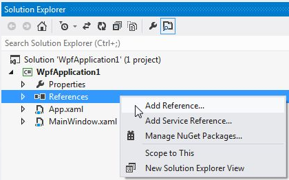

# Namespace Declaration

The following topic will show you how to manually declare a namespace in XAML.

Almost all Telerik controls can be found in a special URI namespace. You can use only this namespace to access all controls from Telerik assemblies that you are referring in your application. You cannot access controls from assemblies that you are not referring.
        
>There are only few controls which are in another namespace. These are RadPivotGrid and RadPivotFieldList and their namespace is: xmlns:pivot="http://schemas.telerik.com/2008/xaml/presentation/pivot"
        	
* Create a new [WPF Application]().
    	
* Add references to the __Telerik DLLs__ in the Solution Explorer.

* Open the __MainWindow.xaml__.
   	
* Go to the __Window__ tag and write: 
          	
#### __XAML__

{{region installation-adding-application-namespace-declaration-wpf_0}}
	xmlns:telerik="http://schemas.telerik.com/2008/xaml/presentation"
{{endregion}}

Or you can select from the IntelliSense in XAML:

* The result should be similar to this.

#### __XAML__

{{region installation-adding-application-namespace-declaration-wpf_1}}
	<Window x:Class="WpfApplication1.MainWindow"
	        xmlns="http://schemas.microsoft.com/winfx/2006/xaml/presentation"
	        xmlns:x="http://schemas.microsoft.com/winfx/2006/xaml"
	        xmlns:telerik="http://schemas.telerik.com/2008/xaml/presentation"
	        Title="MainWindow" Height="350" Width="525">
	    <Grid>
	    </Grid>
	</Window>
{{endregion}}

* Now you should be able to declare any controls existing in this namespace and which is in the assemblies you have added in your project. An example of RadTreeView declaration is shown below.

#### __XAML__

{{region installation-adding-application-namespace-declaration-wpf_2}}
	<Window x:Class="WpfApplication1.MainWindow"
	        xmlns="http://schemas.microsoft.com/winfx/2006/xaml/presentation"
	        xmlns:x="http://schemas.microsoft.com/winfx/2006/xaml"
	        xmlns:telerik="http://schemas.telerik.com/2008/xaml/presentation"
	        Title="MainWindow" Height="350" Width="525">
	    <Grid>
	        <telerik:RadTreeView/>
	    </Grid>
	</Window>
{{endregion}}

>If you wonder which control in which assembly belongs to, read the main topic about [Controls Dependencies]().

## See Also

 * [Using IntelliSense in Visual Studio]()

 * [Upgrading Telerik UI Trial to Telerik UI Developer License or Newer Version]()
