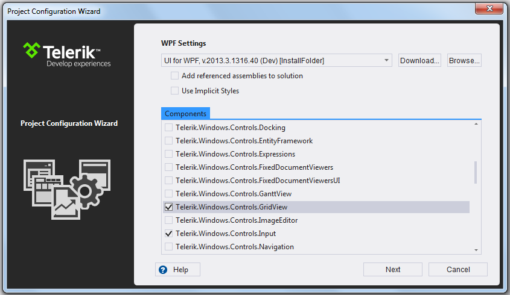

# Creating an Application and Adding UI for WPF

The following topic describes what steps you should perform in order to add the Telerik RadControls for Silverlight in your application. There are two ways to do this - first one is to install RadControls Extensions for VisualStudio which is the easiest and preferrable way. The second one is by adding the necessary assemblies as references in your application. No matter which of the two manners you will choose, you will be able to use the Toolbox to create your application.
      
## Creating Application with Visual Studio Extensions installed

* Open [Microsoft Visual Studio 2012]().().

* Create new RadControlsWpf Application:

>You can choose __.Net Framework 4.0__ or __.Net Framework 4.5__ for your application.

* On the next step you can choose which assemblies to add to your application. For example if you intend to use __RadGridView__ in your application you can check __Telerik.Windows.Controls.GridView__ assembly and all other required dlls will be checked automatically.

* After doing this your application should look like this:

#### __XAML__

{{region installation-adding-to-application-create-application-and-adding-control_1}}
	<UserControl x:Class="RadControlsSilverlightApp1.MainPage"
			xmlns="http://schemas.microsoft.com/winfx/2006/xaml/presentation" 
			xmlns:x="http://schemas.microsoft.com/winfx/2006/xaml"
			xmlns:d="http://schemas.microsoft.com/expression/blend/2008" 
			xmlns:mc="http://schemas.openxmlformats.org/markup-compatibility/2006"
			xmlns:telerik="http://schemas.telerik.com/2008/xaml/presentation"
			mc:Ignorable="d" d:DesignWidth="640" d:DesignHeight="480">
		<Grid x:Name="LayoutRoot">
		</Grid>
	</UserControl>
{{endregion}}

## Creating Application without Visual Studio Extensions installed

* Open [Microsoft Visual Studio 2012]().().
          	
* Create a new WPF Application.

>You can choose __.Net Framework 4.0__ or __.Net Framework 4.5__ for your application.

## Dragging Controls from Visual Studio Toolbox

* Add the WPF RadControls to your [toolbox]().

>If you wonder which control in which assembly belongs to, read the main topic about [Controls Dependencies]().

* Open MainPage.xaml of the project you have previously created.

* Select any control in the Visual Studio toolbox.

* Drag and drop the control in the appropriate place in xaml. The result of this operation should be similar to this.

#### __XAML__

{{region installation-adding-to-application-create-application-and-adding-control-wpf_0}}
	<Window x:Class="WpfApplication1.Window1"
	    xmlns="http://schemas.microsoft.com/winfx/2006/xaml/presentation"
	    xmlns:x="http://schemas.microsoft.com/winfx/2006/xaml"
	    xmlns:telerik="http://schemas.telerik.com/2008/xaml/presentation"
	    Title="Window1" Height="300" Width="300">
	    <Grid>
	        <telerik:RadTreeView></telerik:RadTreeView>
	    </Grid>
	</Window>
{{endregion}}

>Note that after dropping a control, Visual Studio automatically creates a namespace that points to the appropriate assembly. If you want to manually set up a namespace take a look at the [Namespace Declaration]() topic.

## See Also

 * [Namespace Declaration]()

 * [Using IntelliSense in Visual Studio]()

 * [Upgrading Telerik UI Trial to Telerik UI Developer License or Newer Version]()
