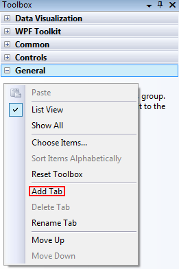
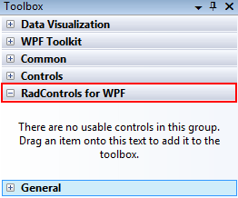
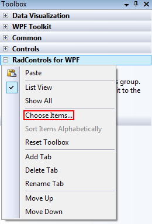
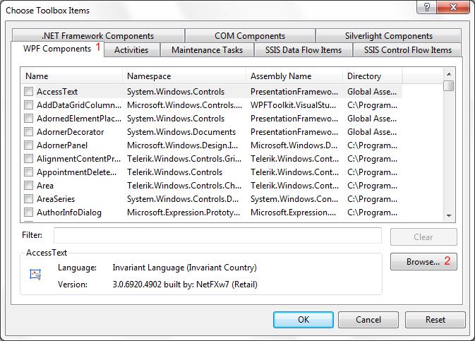
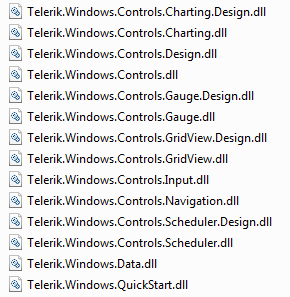
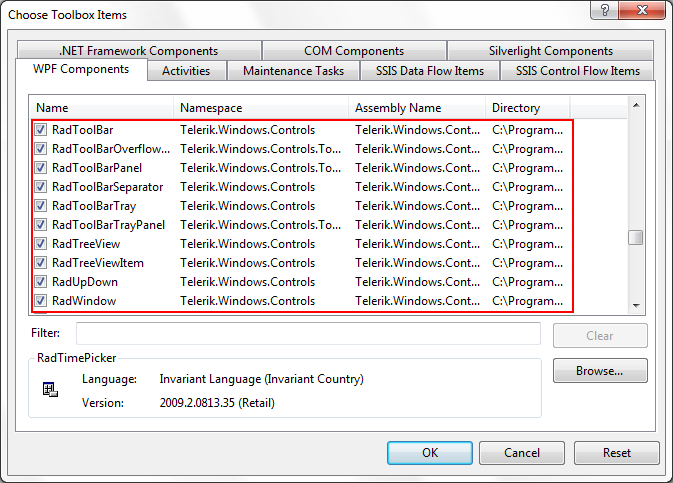
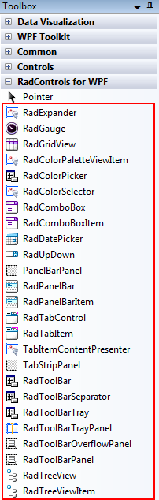

# Adding UI for WPF to the Visual Studio 2008 Toolbox

The following tutorial will show you how to add the UI for WPF controls to Visual Studio 2008 toolbox.

>Installing UI for WPF from a __MSI__gives you the ability to install the controls automatically in the Visual Studio toolbox.

## Adding UI for WPF to Visual Studio 2008 Toolbox

To manually add Telerik UI for WPF to the Toolbox follow the steps below:

* Open your application in Visual Studio 2008.

* Expand the Toolbox (View->Toolbox or use the shortcut Ctrl+Alt+X).

* Right mouse button click in the toolbox area and choose "Add Tab" from the context menu.

* Add a new tab with name "UI for WPF".

* Select the "UI for WPF" tab in the toolbox. Right mouse button click and select "Choose Items...".

* In the "Choose Toolbox Items" dialog, go to the "WPF Components" tab and press the "Browse..." button.

* Navigate to the folder where the DLL files are located. Select the DLL you want to import and press OK or hit Enter.

>If you wonder which control in which assembly belongs to, read the main topic about [Controls Dependencies]().

* Press OK to include the controls in your toolbox, or filter the controls you want to add.

* Again expand your toolbox. You will see the newly added controls in the "UI for WPF" section.

# See Also

 * [Creating an Application and Adding UI for WPF]()

 * [Namespace Declaration]()

 * [Using IntelliSense in Visual Studio]()
